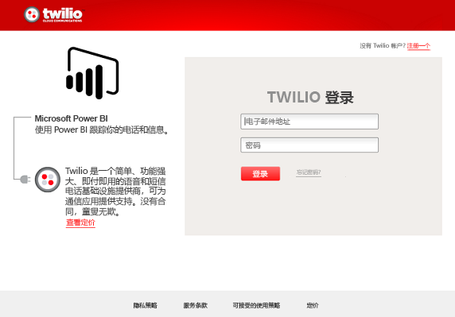
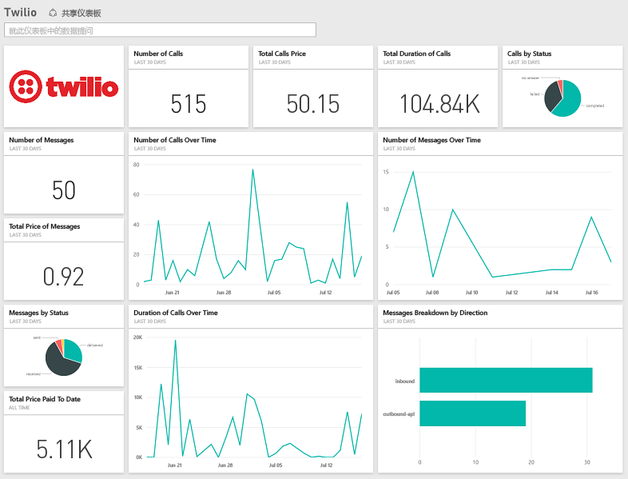

# 使用 Power BI 连接到 Twilio
适用于 Power BI 的 Microsoft Twilio 内容包允许将数据导入 Power BI 并创建全新的 [Twilio 仪表板](https://powerbi.microsoft.com/integrations/twilio) 和报表，呈现你对数据的见解。 你还可以对 Power BI 创建的数据集创建报表和仪表板。 数据将每天刷新一次，因此你看到的始终都是最新数据。

连接到适用于 Power BI 的 [Twilio 内容包](https://app.powerbi.com/getdata/services/twilio)。

## 如何连接
1. 选择左侧导航窗格底部的**获取数据**。
   
    
2. 在**服务**框中，选择**获取**。
   
    
3. 选择 **Twilio** \> **获取**。
   
   
4. 对于**身份验证方法**，请选择**oAuth2** \>“登录”。 出现提示时，请提供你的 Twilio 凭据并授权 Power BI 应用程序访问你的数据。
   
   
5. 此操作将开始从你的 Twilio 帐户导入数据，且你的仪表板将使用过去 30 天的调用和消息使用情况进行填充。 
   
   

**下一步？**

* 尝试在仪表板顶部的[在“问答”框中提问](service-q-and-a.md)
* 在仪表板中[更改磁贴](service-dashboard-edit-tile.md)。
* [选择磁贴](service-dashboard-tiles.md)以打开基础报表。
* 虽然数据集将按计划每日刷新，你可以更改刷新计划或根据需要使用**立即刷新**来尝试刷新

## 包含的内容
有关最近 30 天内的所有调用和消息事务的详细信息。 你可以执行有关此数据的各种类型的分析和聚合运算。

你可能想要密切关注的一组已经聚合的统计信息。 此数据集包括：

        All Time Calls Count  
        All Time Calls Duration  
        All Time Calls Price  
        All Time Messages Price  
        All Time Messages Count  
        All Time Count of Phone Numbers  
        All Time Price of Phone Numbers  
        All Time Twilio Client Calls Price  
        All Time Twilio Client Calls Duration  
        All Time Twilio Client Calls Count  
        All Time Total Price  
        All Time Inbound Calls Price  
        All Time Inbound Calls Duration  
        All Time Inbound Calls Count  
        All Time Outbound Calls Price  
        All Time Outbound Calls Duration  
        All Time Outbound Calls Count  
        This Month Calls Price  
        This Month Calls Duration  
        This Month Calls Count  
        This Month Messages Count  
        This Month Messages Price  
        This Month Count of Phone Numbers  
        This Month Price of Phone Numbers  
        This Month Twilio Client Calls Price  
        This Month Twilio Client Calls Duration  
        This Month Twilio Client Calls Count  
        This Month Total Price  
        This Month Inbound Calls Price  
        This Month Inbound Calls Duration  
        This Month Inbound Calls Count  
        This Month Outbound Calls Price  
        This Month Outbound Calls Duration  
        This Month Outbound Calls Count  
        This Month Inbound Messages Price  
        This Month Inbound Messages Count  
        This Month Outbound Messages Price  
        This Month Outbound Messages Count

## 故障排除
如果你在过去 30 天内的数据量十分巨大（成百上千个事务），则数据检索步骤可能会失败。 我们已经注意到该问题并正在努力解决它。 同时，如果遇到此问题，请使用 Power BI 页面顶部的支持链接告诉我们，我们将与你联系进行进一步调查。

## 后续步骤
[Power BI 入门](service-get-started.md)

[在 Power BI 中获取数据](service-get-data.md)

