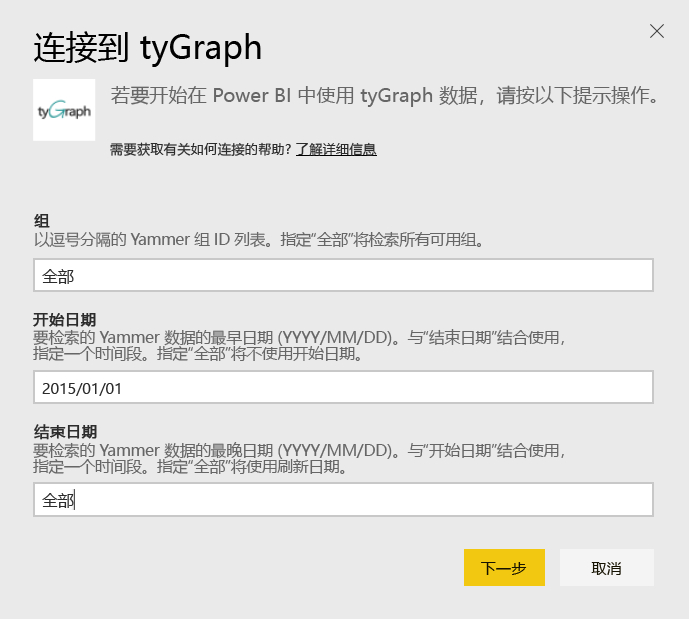
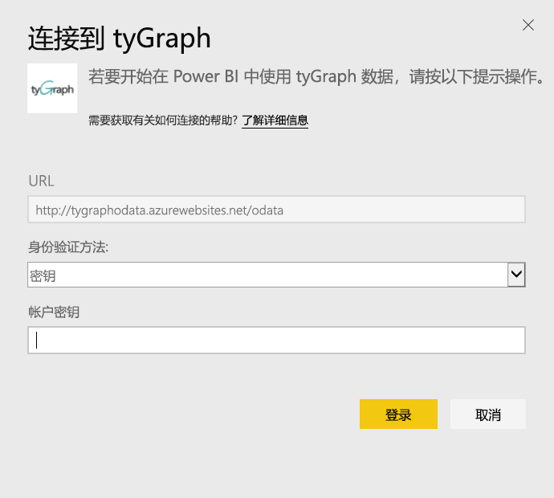
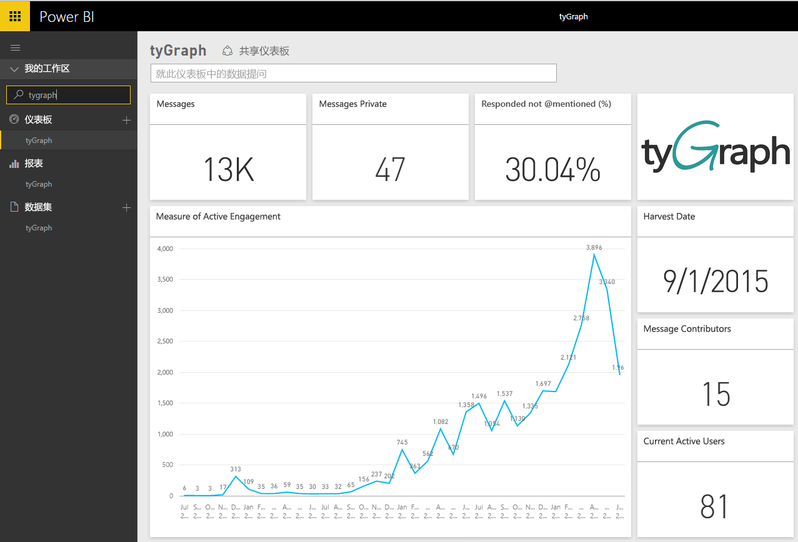
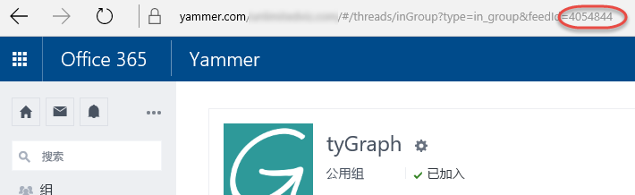

# 使用 Power BI 连接到 tyGraph
通过 Power BI 内容包可视化和浏览 Power BI 中的 tyGraph 数据。 首先，连接到你的 tyGraph 帐户并加载仪表板、报表和数据集。 现成内容包括见解，比如积极参与度（MAE 评分）和排名靠前的参与者。 进一步自定义它，以突出显示你最关注的信息。  将根据你设置的计划自动刷新数据。

连接到 [Power BI 的 tyGraph](https://app.powerbi.com/getdata/services/tygraph)。

## 如何连接
1. 选择左侧导航窗格底部的**获取数据**。
   
   
2. 在**服务**框中，选择**获取**。
   
   
3. 选择 **tyGraph** \> **获取**。
   
   
4. 指定你想要连接到的组和时间范围，否则指定“全部”以导入所有数据。 请注意应该使用的日期格式 (YYYY/MM/DD)。 有关详细信息，请参阅下面的[查找这些参数](#FindingParams)。
   
   
5. 提供 tyGraph 密钥进行连接。 请参阅以下有关查找此值的详细信息。
   
    **如果你是经过 Yammer 验证的管理员**  
    成功创建 tyGraph 帐户后，API 密钥将通过电子邮件发送给你。 如果你再也找不到密钥，则可以通过向 support@unlimitedviz.com 发送一封电子邮件来请求新的密钥。 如果你还没有 tyGraph 帐户，你可以在 [http://www.tygraph.com/](http://www.tygraph.com/) 开始试用。 
   
    **如果你不是经过 Yammer 验证的管理员**
   
    TyGraph 内容包需要由经过 Yammer 验证的管理员创建的 tyGraph 帐户。 创建账户后，可以向同一组织内的用户颁发补充密钥。 如果你的经过验证的管理员尚未创建 tyGraph 帐户，请联系他们并让他们创建账户。 如果他们有帐户，你可以通过向 <support@unlimitedviz.com> 发送电子邮件来请求密钥。
   
    
6. 身份验证成功后，导入过程将自动开始。 导入完成后，在导航窗格中将会出现新的仪表板、报表和模型。 选择仪表板查看已导入的数据。
   
    

**下一步？**

* 尝试在仪表板顶部的[在“问答”框中提问](power-bi-q-and-a.md)
* 在仪表板中[更改磁贴](service-dashboard-edit-tile.md)。
* [选择磁贴](service-dashboard-tiles.md)以打开基础报表。
* 虽然数据集将按计划每日刷新，你可以更改刷新计划或根据需要使用**立即刷新**来尝试刷新

## 查找参数
你可以导入你具有访问权限的所有组的数据，或者你可以选择指定子集。 你还可以按日期创建数据的子集。 你可以创建多个 tyGraph 仪表板来监视特定成对的组和/或日期。 这些参数的详细信息如下。

**组**

tyGraph API 可以按特定组 ID 筛选数据。 这些都通过以逗号分隔的列表提供给内容包。 

    Example: 2427647,946595,1154464

在 Yammer 中，你可以通过导航到该组的数据源并检查 URL 来确定特定组的组 ID。

在上面的示例中，Yammer 组 ID 是 4054844

**开始日期**

开始日期允许限制返回数据的最早值。 仅在该日期当天或之后创建的数据才会被加载进内容包。 开始日期的格式是 YYYY/MM/DD。 

    Example: 2013/10/29

在上面的示例中，在 2013 年 10 月 29 日及以后创建的所有数据都将被加载进内容包。 

**结束日期**结束日期允许你限制返回数据的最晚值。 它可以与开始日期结合使用来加载一个日期范围内的数据。 仅在该日期当天或之前创建的数据才会被加载进内容包。 结束日期的格式是 YYYY/MM/DD。 

    Example: 2014/10/20

在上面的示例中，在 2014 年 10 月 20 日及以前创建的所有数据都将被加载进内容包。 

## 后续步骤
[Power BI 入门](service-get-started.md)

[在 Power BI 中获取数据](service-get-data.md)

