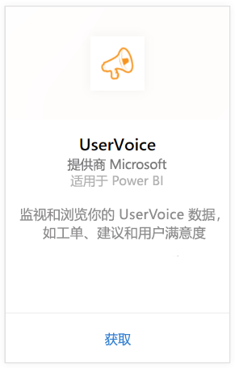
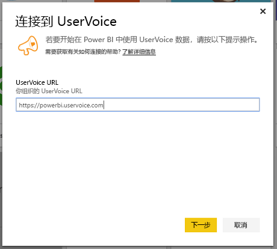
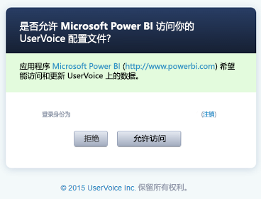
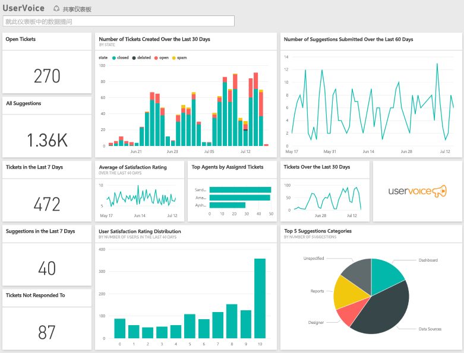

# 使用 Power BI 连接到 UserVoice
借助 Power BI 和 UserVoice 内容包，可轻松跟踪和浏览你的 UserVoice 数据。 Power BI 可以检索你的数据，包括票证和满意度，然后基于该数据生成全新的仪表板和报表。

连接到适用于 Power BI 的 [UserVoice 内容包](https://app.powerbi.com/getdata/services/uservoice)。

>[!NOTE]
>连接到 Power BI 内容包需要管理员帐户。 此内容包还利用 UserVoice API，并会增加 UserVoice 限制的使用情况。 请参阅以下详细信息。

## 如何连接
1. 选择左侧导航窗格底部的**获取数据**。
   
   
2. 在**服务**框中，选择**获取**。
   
    
3. 选择 **UserVoice**，然后选择**获取**。
   
   
4. 出现提示时，输入你的 UserVoice URL。 URL 需要完全遵循以下模式 https://fabrikam.uservoice.com 并将“fabrikam”替换为你的产品或服务名称。
   
   >[!NOTE]
   >末尾没有尾部斜杠，并且连接使用的是 https。
   
   
5. 出现提示时，输入 UserVoice 凭据，然后按照 UserVoice 身份验证过程执行。 如果你已经在浏览器中登录到 UserVoice，可能不会出现凭据提示。 通过单击“允许访问”授予 Power BI 应用程序访问数据的权限。
   
   >[!NOTE]
   >你的 UserVoice 帐户需要管理员凭据。
   
   
6. Power BI 会检索 UserVoice 数据，并为你创建随时可用的仪表板和报表。 Power BI 将检索下列数据：你的所有建议，所有开放票证，最近 30 天创建的票证，包括已关闭的票证和所有用户满意度。
   
   

**下一步？**

* 尝试在仪表板顶部的[在“问答”框中提问](service-q-and-a.md)
* 在仪表板中[更改磁贴](service-dashboard-edit-tile.md)。
* [选择磁贴](service-dashboard-tiles.md)以打开基础报表。
* 虽然数据集将按计划每日刷新，你可以更改刷新计划或根据需要使用**立即刷新**来尝试刷新

## 故障排除
**“参数验证失败，请确保所有参数都是有效的”**

如果键入 UserVoice URL 后看到此错误。 请确保满足以下要求：

* URL 完全采用这种模式“https://fabrikam.uservoice.com”，并将“fabrikam”替换为正确的 UserVoice URL 前缀。
* 请确保所有字母均为小写。
* 请确保 URL 采用的是 http**s**。
* 请确保此 URL 的末尾没有尾随正斜杠。

**“登录失败”**

在使用 UserVoice 凭据进行登陆后，若出现“登录失败”，则表明所使用的帐户无权从你的帐户中检索 UserVoice 数据。 验证其是否为管理员帐户，然后重试。

“**很抱歉，出现了错误**”

如果在加载数据时收到此错误消息，请确保你的 UserVoice 帐户尚未超过其每月的 API 使用配额。 如果一切正常，请尝试重新连接。 如果问题仍然存在，请联系 Power BI 支持：[https://community.powerbi.com](https://community.powerbi.com/)。

**其他**  

Power BI UserVoice 内容包使用 UserVoice 的 API 检索数据。 请确保监视你的 API 使用情况，以便使其不超出限制。 如果你的 UserVoice 帐户中拥有大量数据，将 API 使用情况影响降到最低的建议是：根据需要，将当前默认的刷新频率（每天一次）更改为仅在工作日或每隔一天刷新一次。 另一个建议是：只让一名管理员创建内容包并将其共享给团队中的其他人，而不是让组织内的每个管理员都来创建其自己的内容包，为 API 带来不必要的额外负载。

## 后续步骤
[Power BI 入门](service-get-started.md)

[在 Power BI 中获取数据](service-get-data.md)

