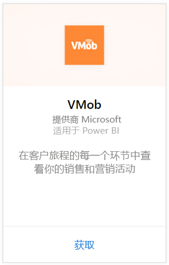
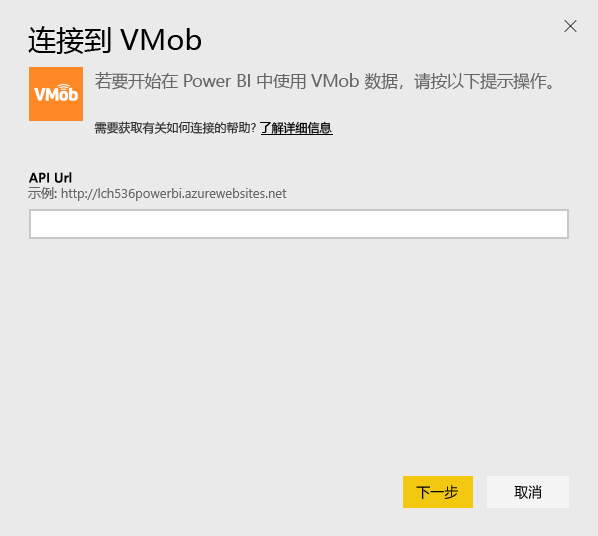
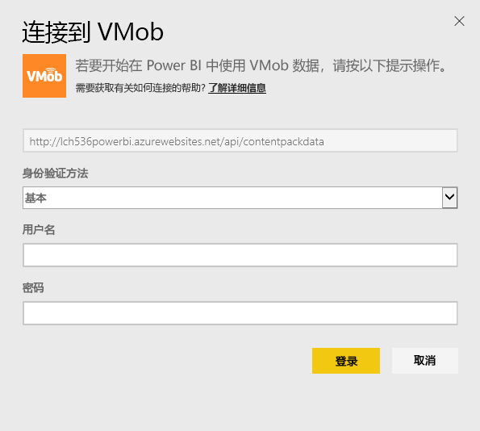
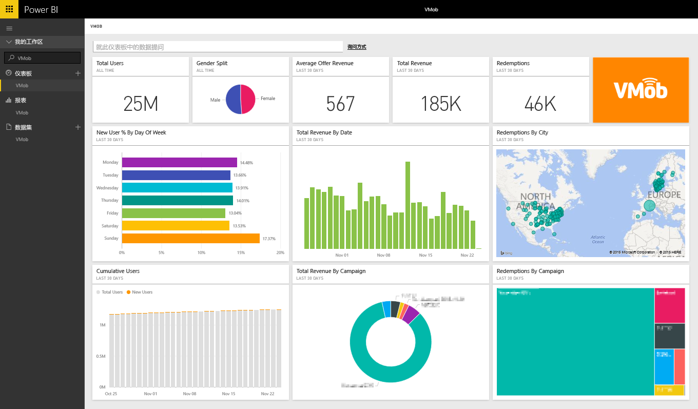

# 使用 Power BI 连接到 VMob
借助 Power BI 和 VMob 内容包，可轻松跟踪和浏览你的 VMob 数据。 Power BI 将检索下列数据：过去 30 天中任何时间的用户统计信息、过去 30 天的零售 KPI 以及过去 30 天的市场活动效果。

连接到适用于 Power BI 的 [VMob 内容包](https://app.powerbi.com/getdata/services/vmob)。

## 如何连接
1. 选择左侧导航窗格底部的**获取数据**。
   
    
2. 在**服务**框中，选择**获取**。
   
   
3. 选择 **VMob**\>**获取**。
   
   
4. 出现提示时，输入你的 VMob URL，然后单击下一步按钮。 此 URL 由 VMob 单独提供。
   
    
5. 在身份验证方法下拉列表中选择**基本**选项，输入你的 VMob 用户名和密码，然后单击**登录**按钮。
   
    
6. 之后将自动开始导入过程，并且 Power BI 将检索你的 VMob 数据，以便为你创建可用的仪表板和报表。
   
   

**下一步？**

* 尝试在仪表板顶部的[在“问答”框中提问](power-bi-q-and-a.md)
* 在仪表板中[更改磁贴](service-dashboard-edit-tile.md)。
* [选择磁贴](service-dashboard-tiles.md)以打开基础报表。
* 虽然数据集将按计划每日刷新，你可以更改刷新计划或根据需要使用**立即刷新**来尝试刷新

## 后续步骤
[Power BI 入门](service-get-started.md)

[在 Power BI 中获取数据](service-get-data.md)

