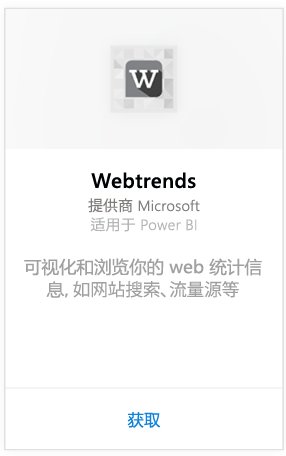
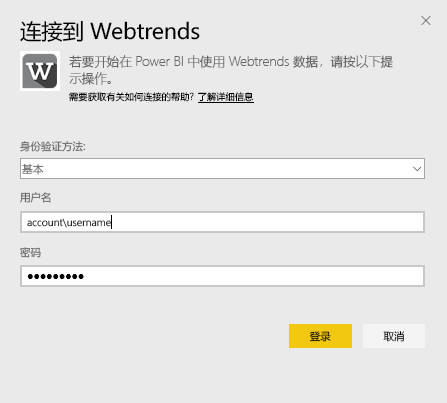
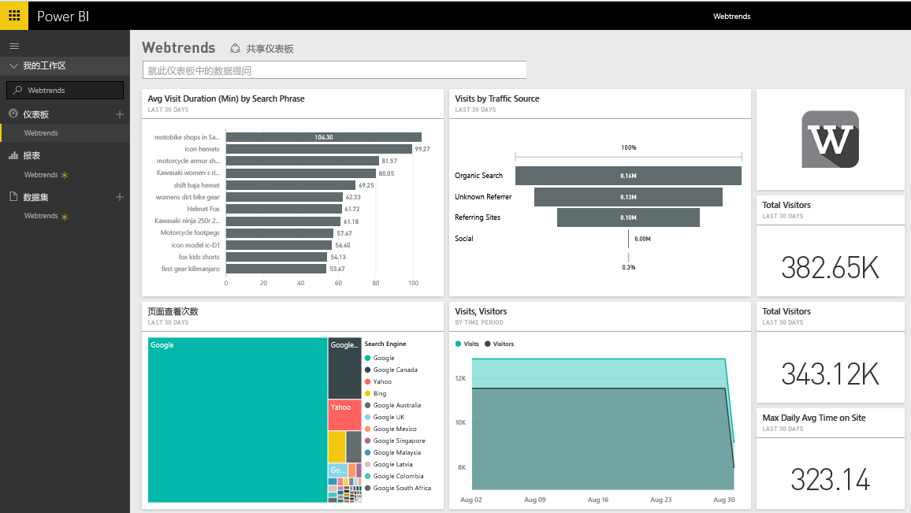
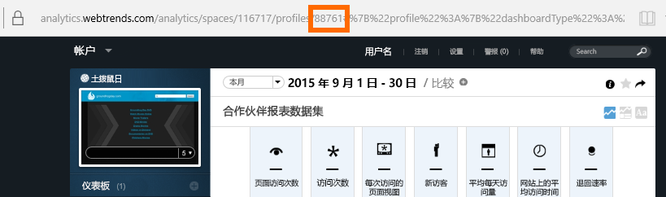
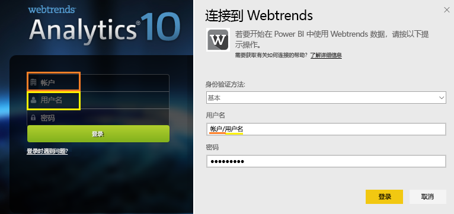

# 使用 Power BI 连接到 Webtrends
适用于 Power BI 的 Webtrends 内容包包括各种现成指标，如（按流量源）网页浏览总数和访问总数。 首先通过连接到 Webtrends 帐户将 Power BI 中的 Webtrends 数据可视化。 可以使用提供的仪表板和报表，或自定义它们以突出显示你最关注的信息。  此数据将每天自动刷新一次。

连接到[适用于 Power BI 的 Webtrends 内容包。](https://app.powerbi.com/getdata/services/webtrends)

## 连接方式
1. 选择左侧导航窗格底部的**获取数据**。
   
   
2. 在**服务**框中，选择**获取**。
   
   
3. 选择 **Webtrends** \> **获取**。
   
   
4. 此内容包会连接到特定的 Webtrends 配置文件 ID。 请参阅下面有关[查找此参数](#FindingParams)的详细信息。
   
   
5. 提供 Webtrends 凭据进行连接。 请注意，用户名字段应该为帐户和用户名。 请参阅以下[详细信息](#FindingParams)。
   
   
6. 审批后，导入过程将自动开始。 导入完成后，在导航窗格中将会出现新的仪表板、报表和模型。 选择仪表板查看已导入的数据。
   
   

**下一步？**

* 尝试在仪表板顶部的[在“问答”框中提问](power-bi-q-and-a.md)
* 在仪表板中[更改磁贴](service-dashboard-edit-tile.md)。
* [选择磁贴](service-dashboard-tiles.md)以打开基础报表。
* 虽然数据集将按计划每日刷新，你可以更改刷新计划或根据需要使用**立即刷新**来尝试刷新

## 包含的内容

Webtrends 内容包从下列报表中提取数据：  

| 报表名称 | 报表 ID |
| --- | --- |
| 关键指标 | |
| 网站搜索 |34awBVEP0P6 |
| 退出页面 |7FshY8eP0P6 |
| 下一页 |CTd5rpeP0P6 |
| 上一页 |aSdOeaUgnP6 |
| 网站页面 |oOEWQj3sUo6 |
| 网站广告点击率 |41df19b6d9f |
| 城市 |aUuHskcP0P6 |
| 国家/地区 |JHWXJNcP0P6 |
| 访问者 |xPcmTDDP0P6 |
| 访问持续时间 |U5KAyqdP0P6 |
| 搜索短语 |IKYEDxIP0P6 |
| 流量源 |JmttAoIP0P6 |
| 搜索引擎 |yGz3gAGP0P6 |
| 进入页 |i6LrkNVRUo6 |

>[!NOTE]
>对于 SharePoint 配置文件，指标名称可能与 Webtrends 用户界面中显示的稍有不同。 执行下列映射以保持 SharePoint 和 Web 配置文件之间的一致性：   

    - 会话数 = 访问数  
    - 新用户数 = 新访问者数  
    - 每个会话的查看数 = 每次访问的页面浏览数  
    - 平均每日用户持续时间 = 每个访问者访问该站点的平均时间  

## 系统要求
此内容包需要具有对 Webtrends 配置文件的访问权限，且已启用[正确的报表集](#Included)。

## 查找参数
选择配置文件后，你可以在 URL 中找到你的 Webtrends 配置文件 ID：

你的凭据将与登录到 Webtrends 时输入的凭据相同，但是帐户和用户名应该在同一行，用反斜杠分隔：

## 故障排除
提供凭据后，加载此内容包时可能会遇到问题。 如果在加载期间看到“糟糕”消息，请查看以下故障排除建议。 如果仍遇到问题，请在 https://support.powerbi.com 提交支持票证

1. 正在使用正确的配置文件 ID，有关详细信息，请参阅[查找参数](#FindingParams)。
2. 具有访问权限的用户已在[“包含的内容”](#Included)部分列出

## 后续步骤
[Power BI 入门](service-get-started.md)

[Power BI - 基本概念](service-basic-concepts.md)

