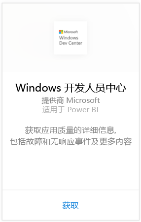
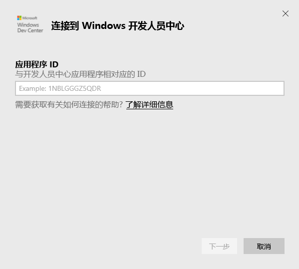
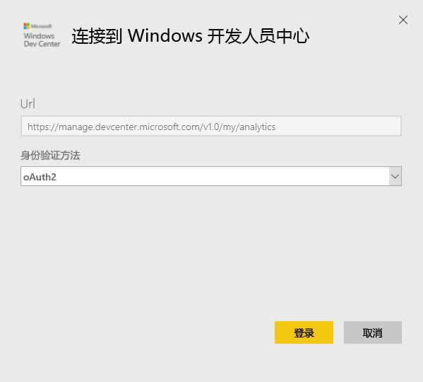
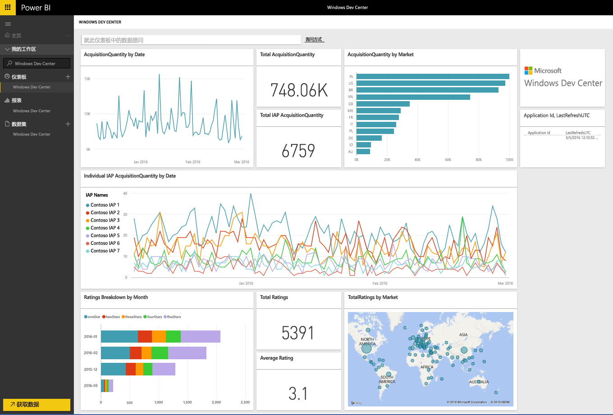
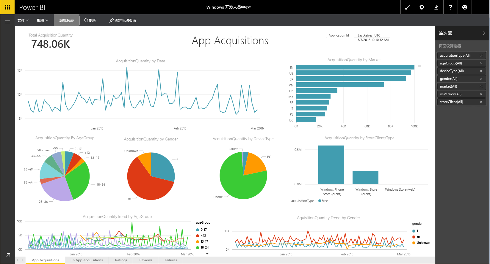

# 使用 Power BI 连接到 Windows 开发人员中心
使用 Power BI 内容包在 Power BI 中浏览和监视 Windows 开发人员中心应用分析数据。 此数据将每天自动刷新一次。

连接到 Power BI 的 [Windows 开发人员中心内容包](https://app.powerbi.com/getdata/services/devcenter)。

## 如何连接
1. 选择左侧导航窗格底部的**获取数据**。
   
   
2. 在**服务**框中，选择**获取**。
   
   
3. 选择 **Windows 开发人员中心** \> **获取**。
   
   
4. 输入你拥有的应用的应用程序 ID，并单击“下一步”。 请参阅下面有关[查找这些参数](#FindingParams)的详细信息。
   
   
5. 对于**身份验证方法**，选择**oAuth2** \> **登录**。 出现提示时，输入与你的 Windows 开发人员中心帐户关联的 Azure Active Directory 凭据（[系统要求](#Requirements)中提供了更多详细信息）。
   
    
   
    
6. 审批后，导入过程将自动开始。 导入完成后，在导航窗格中将会出现新的仪表板、报表和模型。 选择仪表板以查看导入的数据，并选择磁贴以导航到基础报表。
   
    
   
    

**下一步？**

* 尝试在仪表板顶部的[在“问答”框中提问](power-bi-q-and-a.md)
* 在仪表板中[更改磁贴](service-dashboard-edit-tile.md)。
* [选择磁贴](service-dashboard-tiles.md)以打开基础报表。
* 虽然数据集将按计划每日刷新，你可以更改刷新计划或根据需要使用**立即刷新**来尝试刷新

## 包含的内容
开发人员中心 Power BI 内容包包括你的应用的分析数据、IAP 采集、评级、评价和应用健康状况。 数据限于过去 3 个月。 并且其时间范围不断变化，因此包含的日期会随着数据集刷新而更新。

## 系统要求
此内容包需要已发布到 Windows 应用商店的至少一个应用和一个 Windows 开发人员中心帐户（[此处](https://msdn.microsoft.com/windows/uwp/publish/manage-account-users)提供了更多详细）。

## 查找参数
可在“应用管理”之下转到“应用标识”页，以查找应用的应用程序 ID。

应用程序 ID 位于你的 Windows 10 Store URL 的末尾处，https://www.microsoft.com/store/apps/ **{applicationId}**

## 后续步骤
[Power BI 入门](service-get-started.md)

[在 Power BI 中获取数据](service-get-data.md)

