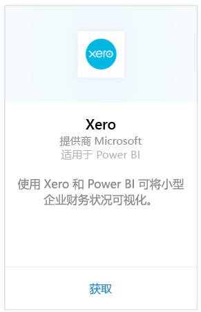
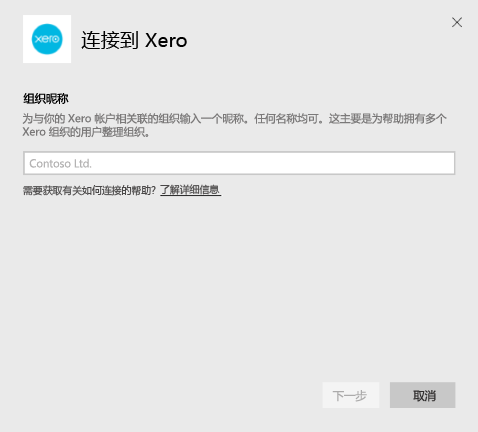
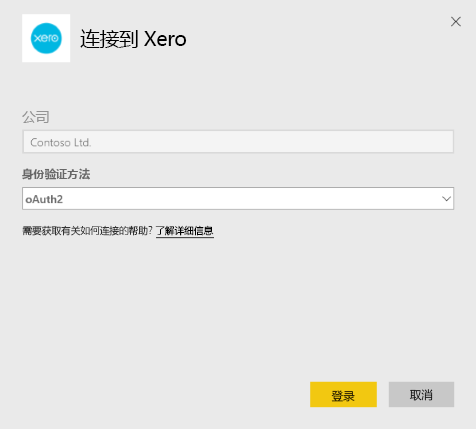
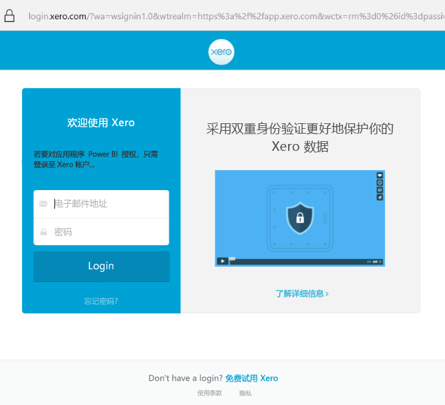
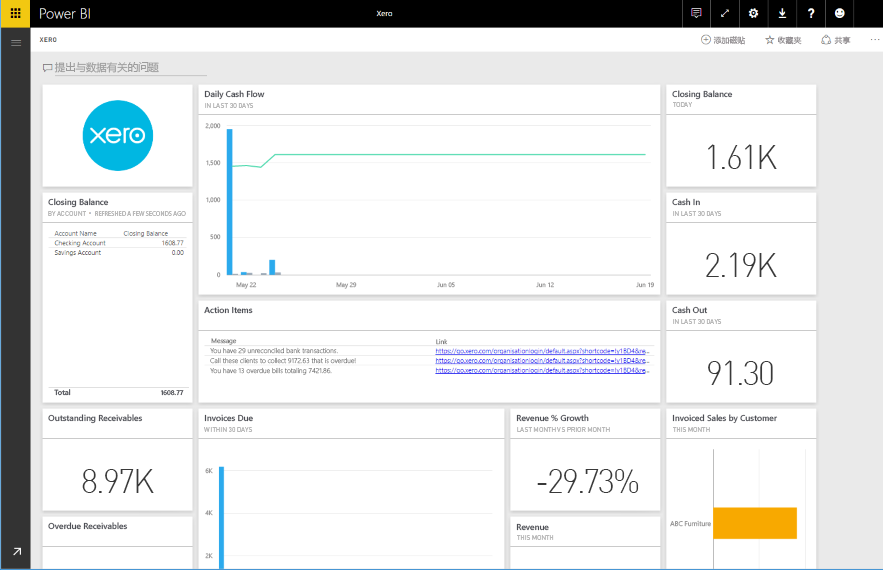

# 使用 Power BI 连接到 Xero
Xero 是易于使用的专为小型企业设计的在线会计软件。 基于带有此 Power BI 内容包的 Xero 财务状况创建引人注目的可视化效果。 你的默认仪表板包括许多小型企业指标，如现金头寸、收入和支出、盈亏趋势、应收帐款天数和投资回报。

连接到 Power BI 的 [Xero 内容包](https://app.powerbi.com/getdata/services/xero)或了解有关 [Xero 与 Power BI](https://help.xero.com/Power-BI) 集成的详细信息。

## 如何连接
1. 选择左侧导航窗格底部的**获取数据**。
   
   
2. 在**服务**框中，选择**获取**。
   
   
3. 选择“Xero”\>“获取”。
   
   
4. 为与你的 Xero 帐户相关联的组织输入一个昵称。 任何名称均可，这主要是为帮助拥有多个 Xero 组织的用户整理组织。 请参阅[以下](#FindingParams)详细信息。
   
   
5. 对于“身份验证方法”，选择“OAuth”，如出现提示，请登录你的 Xero 帐户并选择要连接的组织。 输入登录名后，请选择“登录”以启动加载过程。
   
    
   
    
6. 审批后，导入过程将自动开始。 导入完成后，在导航窗格中将会出现新的仪表板、报表和模型。 选择仪表板查看已导入的数据。
   
     

**下一步？**

* 尝试在仪表板顶部的[在“问答”框中提问](power-bi-q-and-a.md)
* 在仪表板中[更改磁贴](service-dashboard-edit-tile.md)。
* [选择磁贴](service-dashboard-tiles.md)以打开基础报表。
* 虽然数据集将按计划每日刷新，你可以更改刷新计划或根据需要使用**立即刷新**来尝试刷新

## 包含的内容
内容包仪表板包括涵盖各个区域的磁贴和指标，有关详细信息，请参阅对应报表：  

| 分区图 | 仪表板磁贴 | 报表 |
| --- | --- | --- |
| 现金 |每日现金流  兑现  结算  按帐户结算余额  结算今日余额 |银行帐户 |
| 客户 |已开票销售额  已开票销售额（按客户）  已开票销售额增长趋势  发票到期  未收的应收帐款  逾期应收帐款 |客户  库存 |
| 供应商 |已开帐单购买  已开帐单购买（按供应商）  已开帐单购买的增长趋势   帐单到期  未收的应付帐款  逾期应付帐款 |供应商  库存 |
| 库存 |每月销售额（按产品） |库存 |
| 损益 |每月损益  本财政年净利润  本月净利润  最高支出帐户 |损益 |
| 资产负债表 |总资产  总负债  权益 |资产负债表 |
| 健康 |流动比率  毛利润百分比   总资产回报率  总负债/权益比率 |健康  术语和技术说明 |

数据集还包括以下各表，用于自定义你的报表和仪表板：  

* 地址  
* 警报  
* 银行对帐单每日余额  
* 银行对帐单  
* 联系人  
* 费用报销单  
* 发票行项目  
* 发票  
* 项目  
* 月末  
* 组织  
* 试算平衡表  
* Xero 帐户

## 系统要求
访问 Xero 内容包需要以下角色：“Standard + Reports”或“Advisor”。

## 查找参数
为你的组织提供名称以便在 Power BI 中进行跟踪。 这将允许你连接到多个不同的组织。 请注意，不能多次连接到同一个组织，因为它会影响计划刷新。   

## 故障排除
* Xero 用户必须具有以下角色才能访问 Power BI 的 Xero 内容包：“Standard + Reports”或“Advisor”。 内容包需要使用基于用户的权限才能通过 Power BI 访问报表数据。  
* 如果在加载一段时间后接收到失败消息，请验证显示该错误消息所用的时间。 请注意，Xero 提供的访问令牌仅在 30 分钟内有效，因此数据过多而无法在该时间范围内加载完毕的帐户将加载失败。 对此我们正在进行积极改进。
* 加载过程中，仪表板上的磁贴处于泛加载状态。 此状态在全部加载完成之前不会更改。 如果收到加载完成的通知，但磁贴仍处于加载状态，请尝试使用仪表板右上角的 ... 刷新仪表板磁贴。
* 如果内容包刷新失败，请检查是否在 Power BI 中多次连接到同一组织。 Xero 只允许对组织的单一活动连接，如果多次连接到同一组织，则可能会看到错误消息，提示你的凭据无效。  
* 对于连接 Power BI 的 Xero 内容包遇到的问题（如错误消息或加载缓慢），请先清除缓存或 cookie 并重启浏览器，然后重新连接到 Power BI。  

如果仍存在其他问题，请在 http://support.powerbi.com 开具票证。

## 后续步骤
[Power BI 入门](service-get-started.md)

[在 Power BI 中获取数据](service-get-data.md)

