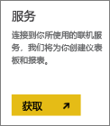
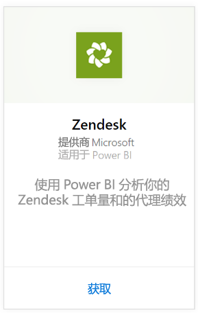
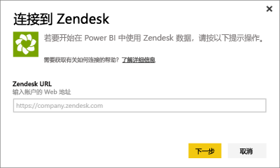
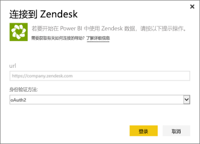
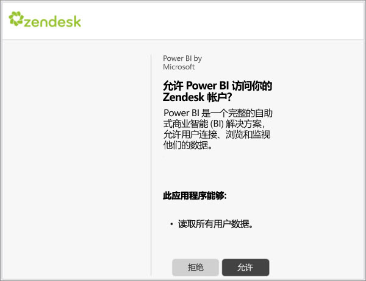
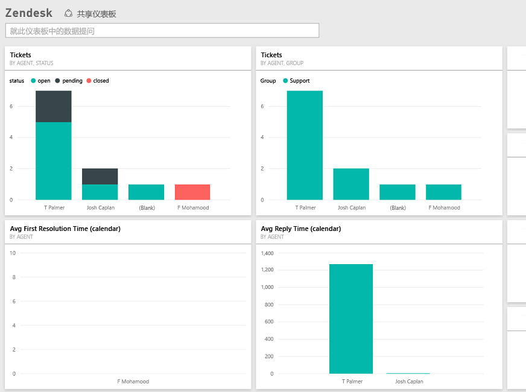

# 使用 Power BI 连接到 Zendesk
Zendesk 内容包提供 Power BI 仪表板和一组 Power BI 报表，这些报表提供有关你的票证量和代理性能的深入分析。 可以使用提供的仪表板和报表，或自定义它们以突出显示你最关注的信息。  此数据将每天自动刷新一次。 

连接到 [Zendesk 内容包](https://app.powerbi.com/getdata/services/zendesk)或进一步了解 Power BI 与 [Zendesk 集成](https://powerbi.microsoft.com/integrations/zendesk)。

>[!NOTE]
>需要使用 Zendesk 管理员帐户进行连接。 以下是有关[要求](#Requirements)的详细信息。

## 如何连接
1. 选择左侧导航窗格底部的**获取数据**。
   
   
2. 在**服务**框中，选择**获取**。
   
    
3. 选择 **Zendesk** \> **获取**。
   
   
4. 提供与你的帐户相关联的 URL。 它将采用 **https://company.zendesk.com** 形式，有关详细信息，请参阅下方的[查找这些参数](#FindingParams)。
   
   
5. 出现提示时，输入你的 Zendesk 凭据。  选择 **oAuth 2** 作为身份验证机制，然后单击**登录**。 按照 Zendesk 身份验证流程进行操作。 （如果你已经在浏览器中登录到 Zendesk，可能不会提示你输入凭据。）
   
   > [!NOTE]
   > 内容包需要使用 Zendesk 管理员帐户连接。 
   > 
   > 
   
   
6. 单击**允许**以允许 Power BI 访问你的 Zendesk 数据。
   
   
7. 单击“连接”以开始导入过程。 Power BI 导入数据后，你会在左侧的导航窗格中看到新的仪表板、报表和数据集。 新的项目会以黄色星号 \* 标记。
   
   

**下一步？**

* 尝试在仪表板顶部的[在“问答”框中提问](power-bi-q-and-a.md)
* 在仪表板中[更改磁贴](service-dashboard-edit-tile.md)。
* [选择磁贴](service-dashboard-tiles.md)以打开基础报表。
* 虽然数据集将按计划每日刷新，你可以更改刷新计划或根据需要使用**立即刷新**来尝试刷新

## 包含的内容
Power BI 内容包中包括下列数据：  

* 用户（最终用户和代理）  
* 组织  
* 组  
* 票证  

还有一组计算所得度量值，如平均等待时间和过去 7 天解决的票证。 内容包中包含完整列表。

## 系统要求
访问 Zendesk 内容包需要 Zendesk 管理员帐户。 如果你是代理或最终用户，想要查看你的 Zendesk 数据，请在 [Power BI Desktop](desktop-connect-to-data.md) 中添加建议并察看 Zendesk 连接器。

## 查找参数
Zendesk URL 将与你用于登录 Zendesk 帐户的 URL 相同。 如果不能确定你的 Zendesk URL，可以使用 Zendesk [登录帮助](https://www.zendesk.com/login/)。

## 故障排除
如果遇到连接问题，请检查你的 Zendesk URL，确保使用的是 Zendesk 管理员帐户。

## 后续步骤
* [Power BI 入门](service-get-started.md)
* [获取数据](service-get-data.md)

