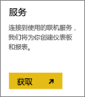
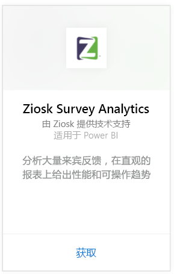
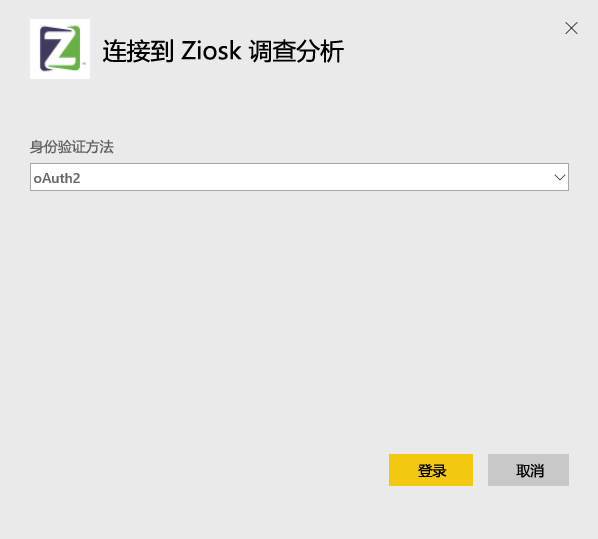
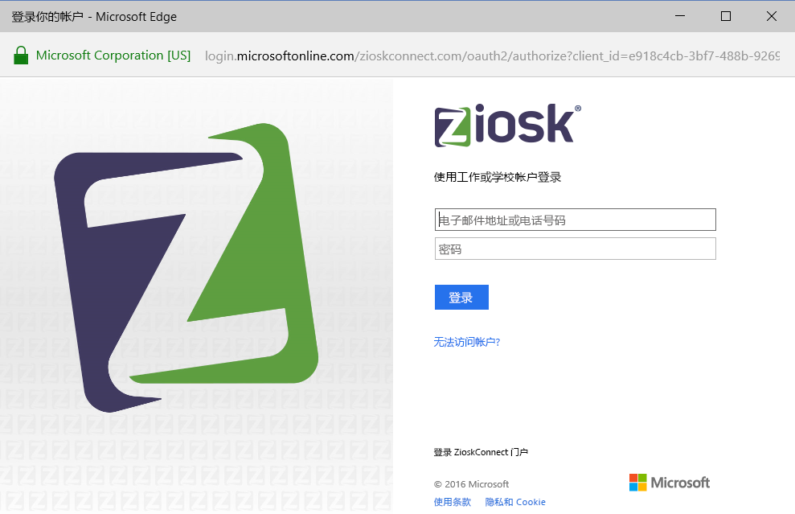
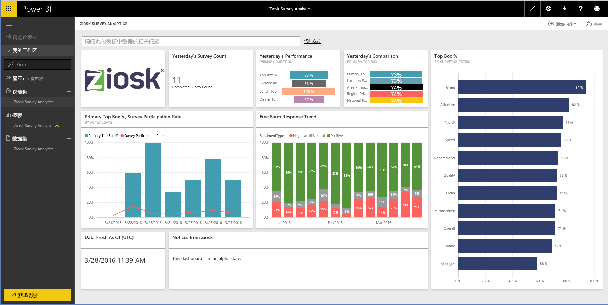

# 使用 Power BI 连接到 Ziosk 调查分析
通过 Power BI 的 Ziosk 调查分析内容包，使用 Ziosk 平板电脑的餐厅可以非常方便地访问 Ziosk 调查数据所提供的见解，包括按日期、位置、员工等进行的分段。

连接到 Power BI 的 [Ziosk Survey Analytics 内容包](https://app.powerbi.com/getdata/services/ziosk-survey-analytics)。

## 如何连接
1. 选择左侧导航窗格底部的**获取数据**。  
   
    
2. 在**服务**框中，选择**获取**。  
   
    
3. 选择 **Ziosk 调查分析**，然后选择**获取**。  
   
    
4. 选择 **OAuth 2**，然后选择**登录**。 出现提示时，提供你的 Ziosk 凭据。
   
    
   
    
5. 连接成功后，将自动加载仪表板、报表和数据集。 完成后，将使用 Ziosk 帐户中的数据更新磁贴。
   
    

**下一步？**

* 尝试在仪表板顶部的[在“问答”框中提问](power-bi-q-and-a.md)
* 在仪表板中[更改磁贴](service-dashboard-edit-tile.md)。
* [选择磁贴](service-dashboard-tiles.md)以打开基础报表。
* 虽然数据集将按计划每日刷新，你可以更改刷新计划或根据需要使用**立即刷新**来尝试刷新

## 包含的内容
该内容包中包括来自下列表的数据：  

    - 酒水类别  
    - 开胃菜类别  
    - 评论关键字  
    - 日期  
    - 时段  
    - 餐后甜点类别  
    - 自由形式  
    - 儿童类别  
    - 消息  
    - 高级内容类别  
    - 问题  
    - 商店  
    - 调查  
    - 工作日  

## 系统要求
为了实例化此内容包，Ziosk 帐户需拥有对上述表的权限。

## 后续步骤
[Power BI 入门](service-get-started.md)

[Power BI - 基本概念](service-basic-concepts.md)

