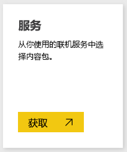
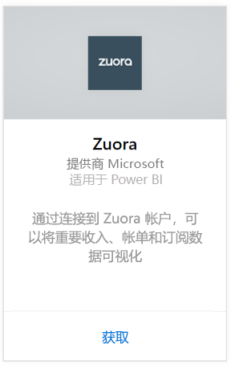
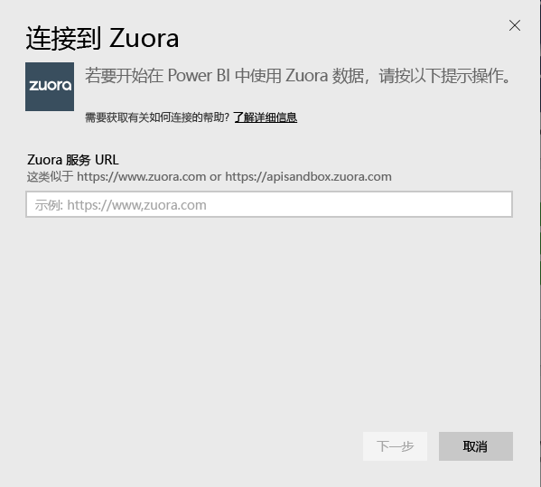
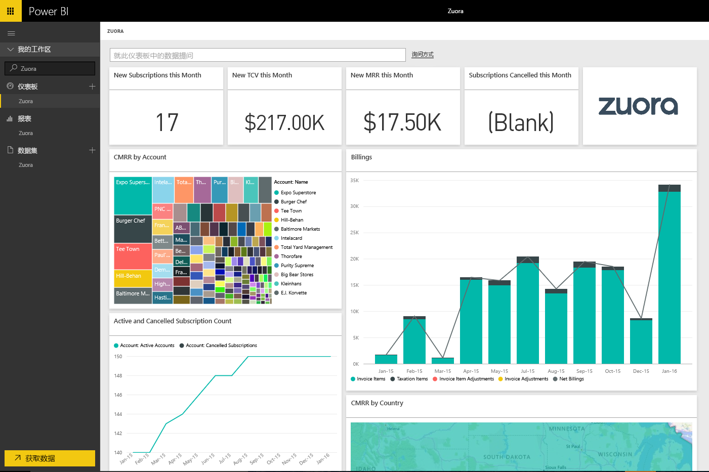

# 使用 Power BI 连接到 Zuora
借助适用于 Power BI 的 Zuora，可以将重要收入、帐单和订阅数据可视化。 使用默认的仪表板和报表来分析使用情况趋势、跟踪计帐和付款、监视定期收入或进行自定义以满足自己独特的仪表板和报表需求。

连接到适用于 Power BI 的 [Zuora](https://app.powerbi.com/getdata/services/Zuora)。

## 如何连接
1. 选择左侧导航窗格底部的**获取数据**。

   
2. 在**服务**框中，选择**获取**。

   
3. 选择 **Zuora**\>**获取**。

   
4. 指定你的 Zuora URL。 通常为“https://www.zuora.com”，请参阅以下有关[查找这些参数](#FindingParams)的详细信息。

   
5. 对于**身份验证方法**，请选择**基本**并提供用户名和密码（区分大小写），然后选择**登录**。

    
6. 审批后，导入过程将自动开始。 导入完成后，在导航窗格中将会出现新的仪表板、报表和模型。 选择仪表板查看已导入的数据。

     

**下一步？**

* 尝试在仪表板顶部的[在“问答”框中提问](power-bi-q-and-a.md)
* 在仪表板中[更改磁贴](service-dashboard-edit-tile.md)。
* [选择磁贴](service-dashboard-tiles.md)以打开基础报表。
* 虽然数据集将按计划每日刷新，你可以更改刷新计划或根据需要使用**立即刷新**来尝试刷新

## 包含的内容
此内容包使用 Zuora AQUA API 拉取以下各表：

| 表格 |  |  |
| --- | --- | --- |
| 帐户 |InvoiceItemAdjustment |退款 |
| AccountingCode |付款 |RevenueSchedule |
| AccountingPeriod |PaymentMethod |RevenueScheduleItem |
| BillTo |产品 |订阅 |
| DateDim |ProductRatePlan |TaxationItem |
| 发票 |ProductRatePlanCharge |使用情况 |
| InvoiceAdjustment |RatePlan | |
| InvoiceItem |RatePlanCharge | |

它还包括这些计算度量值：

| 度量值 | 说明 | 伪计算 |
| --- | --- | --- |
| 帐户：付款 |基于付款生效日期，某个时间段内的付款总额。 |SUM (Payment.Amount)  WHERE Payment.EffectiveDate =< TimePeriod.EndDate AND    Payment.EffectiveDate >= TimePeriod.StartDate |
| 帐户：退款 |基于退款生效日期，某个时间段内的退款总额。 将金额报表为负数。 |-1*SUM(Refund.Amount) WHERE Refund.RefundDate =< TimePeriod.EndDate AND    Refund.RefundDate >= TimePeriod.StartDate |
| 帐户：净付款 |某个时间段内的帐户付款加上帐户退款。 |Account.Payments + Account.Refunds |
| 帐户：活动帐户 |某个时间段内活动帐户的计数。 订阅必须开始于某个时间段开始日期之前（或当天）。 |COUNT (Account.AccountNumber) WHERE     Subscription.Status != "Expired" AND    Subscription.Status != "Draft" AND    Subscription.SubscriptionStartDate <= TimePeriod.StartDate AND    (Subscription.SubscriptionEndDate > TimePeriod.StartDate OR Subscription.SubscriptionEndDate = null) –长期有效订阅 |
| 帐户：平均定期收入 |某个时间段内每活动帐户的毛 MRR。 |毛 MRR / Account.ActiveAccounts |
| 帐户：已取消的订阅 |某个时间段内已取消订阅的帐户的计数。 |COUNT (Account.AccountNumber) WHERE Subscription.Status = "Cancelled" AND    Subscription.SubscriptionStartDate <= TimePeriod.StartDate AND    Subscription.CancelledDate >= TimePeriod.StartDate |
| 帐户：付款错误 |付款总额错误。 |SUM (Payment.Amount) WHERE Payment.Status = "Error" |
| 收入计划项：识别的收入 |某个会计时间段内识别的总收入。 |SUM (RevenueScheduleItem.Amount) WHERE AccountingPeriod.StartDate = TimePeriod.StartDate |
| 订阅：新订阅 |某个时间段内新订阅的计数。 |COUNT (Subscription.ID) WHERE Subscription.Version = "1" AND    Subscription.CreatedDate <= TimePeriod.EndDate AND    Subscription.CreatedDate >= TimePeriod.StartDate |
| 发票：开票项 |某个时间段内开票项的费用总额。 |SUM (InvoiceItem.ChargeAmount) WHERE     Invoice.Status = "Posted" AND    Invoice.InvoiceDate <= TimePeriod.EndDate AND    Invoice.InvoiceDate >= TimePeriod.StartDate |
| 发票：纳税项 |某个时间段内纳税项的纳税总额。 |SUM (TaxationItem.TaxAmount) WHERE Invoice.Status = "Posted" AND    Invoice.InvoiceDate <= TimePeriod.EndDate AND    Invoice.InvoiceDate >= TimePeriod.StartDate |
| 发票：开票项调整 |某个时间段内开票项调整的总额。 |SUM (InvoiceItemAdjustment.Amount)  WHERE     Invoice.Status = "Posted" AND    InvoiceItemAdjustment.AdjustmentDate <= TimePeriod.EndDate AND    InvoiceItemAdjustment.AdjustmentDate >= TimePeriod.StartDate |
| 发票：发票调整 |某个时间段内发票调整的总额。 |SUM (InvoiceAdjustment.Amount)  WHERE     Invoice.Status = "Posted" AND    InvoiceAdjustment.AdjustmentDate <= TimePeriod.EndDate AND    InvoiceAdjustment.AdjustmentDate >= TimePeriod.StartDate |
| 发票：净计帐 |某个时间段内开票项、纳税项、开票项调整和发票调整的总和。 |Invoice.InvoiceItems + Invoice.TaxationItems + Invoice.InvoiceItemAdjustments + Invoice.InvoiceAdjustments |
| 发票：发票帐龄余额 |已过帐发票的总余额。 |SUM (Invoice.Balance)  WHERE     Invoice.Status = "Posted" |
| 发票：毛计帐 |某个时间段内已过帐发票的开票项费用金额的总和。 |SUM (InvoiceItem.ChargeAmount)  WHERE     Invoice.Status = "Posted" AND    Invoice.InvoiceDate <= TimePeriod.EndDate AND    Invoice.InvoiceDate >= TimePeriod.StartDate |
| 发票：总调整 |与已过帐发票相关联的已处理过的发票调整和开票项调整的总和。 |SUM (InvoiceAdjustment.Amount)  WHERE     Invoice.Status = "Posted" AND    InvoiceAdjustment.Status = "Processed" + SUM (InvoiceItemAdjustment.Amount)  WHERE     Invoice.Status = "Posted" AND    invoiceItemAdjustment.Status = "Processed" |
| 费率计划费用：毛 MRR |某个时间段内订阅中每月定期收入的总和。 |SUM (RatePlanCharge.MRR)  WHERE     Subscription.Status != "Expired" AND    Subscription.Status != "Draft" AND    RatePlanCharge.EffectiveStartDate <= TimePeriod.StartDate AND        RatePlanCharge.EffectiveEndDate > TimePeriod.StartDate     OR    RatePlanCharge.EffectiveEndDate = null --长期有效订阅 |

## 系统要求
需要 Zuora API 的访问权限。

## 查找参数
提供你通常用于登录以访问 Zuora 数据的 URL。 有效选项为：  

* https://www.zuora.com  
* https://www.apisandbox.zuora.com  
* 与你的服务实例相对应的 URL  

## 故障排除
Zuora 内容包拉取你的 Zuora 帐户的许多不同的方面。 如果你不使用某些功能，你可能会看到对应的磁贴/报表为空。 如果在加载时遇到任何问题，请与 Power BI 技术支持联系。

## 后续步骤
[Power BI 入门](service-get-started.md)

[在 Power BI 中获取数据](service-get-data.md)
