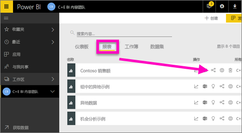
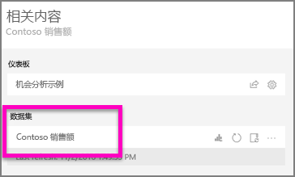
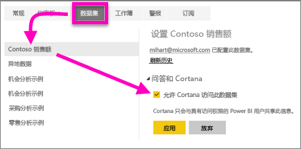

# 使 Cortana 能够访问 Power BI 报表（及其基础数据集）
你已阅读 [Cortana 和 Power BI 简介](service-cortana-intro.md)（如果未阅读，请先阅读简介，然后再返回此步骤）。 并且，现在想要自己尝试一下。  在 Cortana 中使用自然语言提问，并从存储在 Power BI 报表的数据中找到答案之前，有几个要求需要注意。 具体而言，需要执行以下操作。

> [!NOTE]
> 如果你尝试预览 Cortana 和 Power BI 仪表板，则可以跳过本文的其余部分。 无需对 Cortana 进行任何设置即可搜索 Power BI 仪表板。
> 
> 

在 Power BI 服务中

* 为 Cortana 启用一个或多个数据集（由于报表是在数据集的基础之上生成，因此 Cortana 需要有权访问这些数据集）

在 Microsoft Windows 中

* 检查运行系统的是否是 Windows 10 版本 1511 或更高版本
* 请确保该 Power BI 和 Windows 之间可以彼此“通信”。 这意味着要将帐户连接到 Windows。

## 使用 Power BI 服务启用 Cortana 以访问 Power BI 中的报表页
使 Cortana 能够访问 Power BI 中报表的过程很简单。  实际上，只需通过选择“启用 Cortana 以访问此数据集”来启用报表的基础数据集。 然后，通过常规 Power BI 共享、应用和内容包功能可访问 Power BI 中数据集的任何用户将都能够从 Windows 10 中 Cortana 的报表中获取答案。

将需要登录 Power BI 服务（而不是 Power BI Desktop），并对希望 Cortana 能够访问的每个数据集重复这些步骤。

1. 确定要启用的数据集。 从报表内容列表中，选择你想要 Cortana 访问的报表，并选择“相关视图”图标 。
   
    
2. 与此报表关联的数据集是 Contoso 销售额。
   
    
3. 在数据集名称的右侧，选择省略号 (...) >“设置”。  
   
    
4. 选择“问答和 Cortana” > “允许 Cortana 访问此数据集” > “应用”。
   
   
   
   在此示例中，我们对 Contoso 销售额数据集启用 Cortana。
   
   > [!NOTE]
   > 将新的数据集或 Cortana 回复卡添加到 Power BI 并为 Cortana 启用时，可能需要 30 分钟结果才会开始出现。 登录或退出 Windows 10 或者在 Windows 10 中重启 Cortana 进程都能使新内容立刻显示。
   > 
   > 如果为 Cortana 启用一个数据集且该数据集是你所有的内容包或应用的一部分，则需要对你的同事重新发布才能将该数据集用于 Cortana。
   > 
   > 

## 将 Power BI 凭据添加到 Windows
需要运行 Windows 10 版本 1511 或更高版本。

1. 确定正在运行的 Windows 10 版本。 打开“设置”。
    

    然后选择“系统”>“关于”。 屏幕底部会显示“Windows 规范”>“版本”

   * 如果安装有 Windows 10 版本 1511（Windows 10 的 2015 年 11 月更新程序）至版本 1607，请添加工作或学校帐户以及 Microsoft 帐户（完成下面的第 2 和 3 步）。
   * 如果安装有 Windows 10 版本 1607（Windows 10 的 2016 年 7 月更新程序）或更高版本，请添加工作或学校帐户（仅完成下面的第 2 步）。
1. 为 Cortana 添加工作或学校帐户。
   
   * 打开“设置” > “帐户”。
     
       
   * 滚动到底部并选择“添加工作或学校帐户”。 或者在“帐户”页中选择“访问工作或学校帐户”>“连接”。
     
     

Cortana 将使用此工作或学校帐户来检查 Power BI，以获取你在 Cortana 中的问题的可能答案。

## 后续步骤
[在 Power BI 中创建 Cortana *回复卡*](service-cortana-answer-cards.md)

[Cortana 和 Power BI 集成问题疑难解答](service-cortana-troubleshoot.md)

更多问题？ [尝试参与 Power BI 社区](http://community.powerbi.com/)

