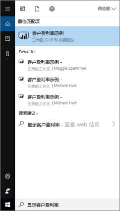
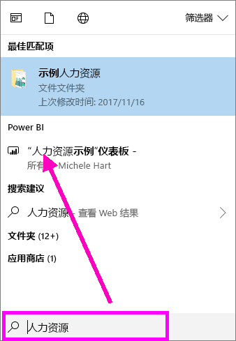
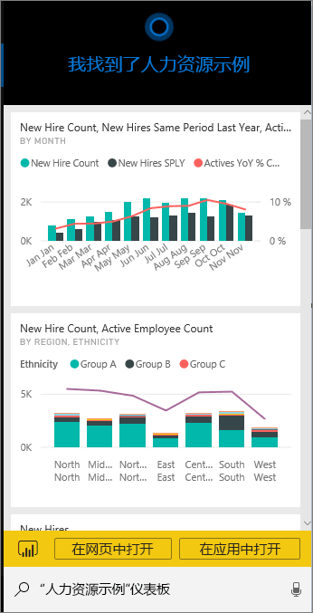
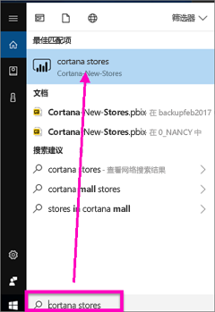
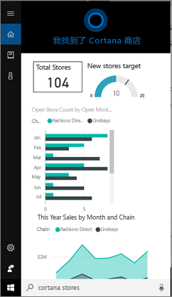
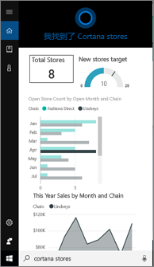
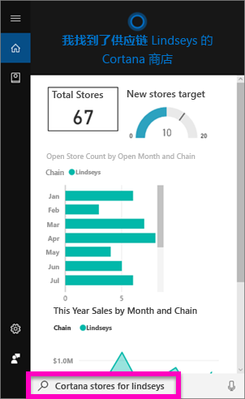
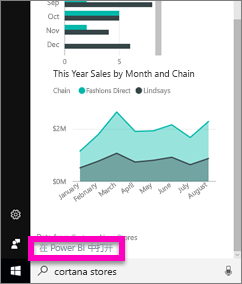
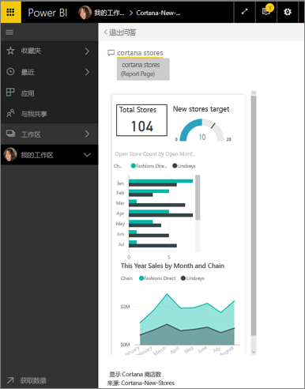

# 使用 Power BI 的 Cortana 快速查找和查看 Power BI 数据
在 Windows 10 设备上使用 Cortana 获取重要业务问题的即时答案。 通过与 Power BI 集成，Cortana 可以直接从 Power BI 仪表板和报表检索关键信息。 需要 Windows 10 的 2015 年 11 月版本或更高版本、Cortana、 Power BI，并访问至少一个数据集。

## 预览 Windows 10 的新 Cortana 仪表板搜索体验
一段时间以来，你已经能够[使用 Cortana 检索某些类型的报表页](service-cortana-answer-cards.md)。 现在，我们添加了新体验，即同时还能够检索仪表板。 请进行尝试并[向我们发送反馈](mailto:pbicortanasg@microsoft.com)。 最终，新体验将得以扩展，将对报表的 Cortana 搜索也包括在内。  新体验的主要优点之一是，无需执行任何特殊的设置操作（即无需启用 Cortana 或配置 Windows 10），它就能正常工作。

> [!NOTE]
> 如果它无法“正常工作”，请参阅[疑难解答文章](service-cortana-troubleshoot.md)寻求帮助。
> 
> 

基础技术使用的是 [Microsoft 的 Azure 搜索服务]()。 此搜索服务提供额外的功能，如智能排名、错误纠正和自动完成。

这两种 Cortana 体验将并行存在。

## Power BI 的 Cortana 文档
我们有 4 个文档可以指导你完成设置和使用 Power BI 的 Cortana。 本系列文章将指导你完成以下步骤

**文章 1**（本文）：了解 Cortana 和 Power BI 如何协同工作

**文章 2**：[搜索 Power BI 报表：启用 Cortana - Power BI - Windows 集成](service-cortana-enable.md)

**文章 3**：[搜索 Power BI 报表：创建特殊的 *Cortana 回复卡*](service-cortana-answer-cards.md)

**文章 4**：[解决问题](service-cortana-troubleshoot.md)

## Cortana 和 Power BI 如何协作？
当你使用 Cortana 提问时，Power BI 可以是 Cortana 查找答案的位置之一。 在 Power BI 中，Cortana 可以从 Power BI 报表（包含名为 Cortana 回复卡的特殊类型的报表页）和 Power BI 仪表板中找到丰富的数据驱动的答案。

如果 Cortana 找到匹配项，就会在 Cortana 屏幕中显示仪表板或报表页的名称。 可以在 Power BI 中打开仪表板或报表页。 也可以在 Cortana 中浏览报表页，它们是交互式的。

### Cortana 和仪表板（新体验）
Cortana 可以在你拥有的仪表板和已与你共享的仪表板中找到答案。 使用标题、关键字、所有者名称、工作区名称、应用名称等向 Cortana 提问。

问题必须具有至少 2 个词语，Cortana 才能找到答案。 因此，如果搜索名称中只有一个词语（即“营销”）的仪表板，请在问题中添加“显示”、“Power BI”或“<owner name>”一词，如“显示营销”和“michele hart 示例”所示。 

如果仪表板的标题包含多个词语，并且如果你的搜索至少匹配其中两个字，或者如果仪表板匹配其中一个词加上所有者名称，则 Cortana 只会返回该仪表板。 对于名为“客户盈利率示例”的仪表板： 

* “向我显示客户”不会返回 Power BI 仪表板结果。   
* 诸如“向我显示客户盈利率”、“客户 p”、“客户 s”、“盈利率示例”、“michele hart 示例”、“显示客户盈利率示例”和“向我显示客户 p”等查询文本将返回 Power BI 结果。
* 由于添加“powerbi”一词可计作 2 个必需词之一，因此，“powerbi 示例”会返回 Power BI 结果。 
  
    

### Cortana 和报表
 Cortana 可以在具有[专门设计以供 Cortana 显示的页](service-cortana-answer-cards.md)的报表中找到答案。 只需使用其中一个专门的报表页中的标题或关键字提问。  

报表的基础技术使用的是 [Microsoft 的 Power BI 问答](power-bi-q-and-a.md)。

在 Cortana 中提问时，Power BI 将从专门为 Cortana 设计的报表页中进行回答。 可能的答案由 Cortana 直接从 Power BI 中已经创建的 Cortana 回复卡确定。  若要进一步探索答案，只需在 Power BI 中打开一个结果。

> [!NOTE]
> 必须先[使用 Power BI 服务启用此功能并将 Windows 设置为与 Power BI 进行通信](service-cortana-enable.md)，然后 Cortana 才能在 Power BI 报表中查找答案。  
> 
> 

## 使用 Cortana 从 Power BI 获取答案
1. 在 Cortana 中启动。 打开 Cortana 有许多不同的方式：选择任务栏中的 Cortana 图标（如下图所示）、使用语音命令或点击 Windows 移动设备上的搜索图标。
   
     
2. Cortana 准备就绪后，在 Cortana 搜索栏中键入或说出你的问题。 Cortana 将显示可用的结果。 如果有匹配该问题的 Power BI 仪表板，则会显示在“最佳匹配”或“Power BI”下。
   
     
   
   > [!NOTE]
   > 目前仅支持英文。
   > 
   > 
3. 选择仪表板，在 Cortana 中打开它。

    

    可以通过[编辑仪表板的*手机视图*](service-create-dashboard-mobile-phone-view.md)来更改布局。 

1. 在 Cortana 中，还可以使用相应的选项在 Power BI 服务或 Power BI 移动版中打开仪表板。 通过选择“在 Web 上打开”，在 Power BI 服务中打开仪表板。 
   
      
4. 现在，我们使用 Cortana 搜索报表。 我们需要知道[报表是否具有包含 Cortana 回复卡的页](service-cortana-answer-cards.md)。 在此示例中，名为“Cortana-New-Stores”的报表具有名为“Cortana 商店”的 Cortana 回复卡页。  
   
     在 Cortana 搜索栏中键入或说出你的问题。 Cortana 将显示可用的结果。 如果有匹配该问题的 Power BI 报表页，则会显示在“最佳匹配”或“Power BI”下。 在本示例中，我用来创建回复卡的 .pbix 文件（和备份）也会显示在“文档”下。
   
      
5. 选择“Cortana 商店”报表页，在 Cortana 窗口中显示它。
   
       
   
    请注意，回复卡是由数据集所有者创建的一种特殊类型的 Power BI 报表页面。  有关详细信息，请参阅[创建 Cortana 回复卡](service-cortana-answer-cards.md)。
6. 不仅仅如此。 还可以与回复卡上的可视化效果交互，就像在 Power BI 中一样。
   
   * 例如，在一个可视化效果上选择一个元素来交叉筛选和突出显示回复卡上的其他可视化效果。
     
     
   * 或者，改为使用自然语言来筛选结果。  例如，搜索“Cortana stores for Lindseys”，会看到卡经过筛选后仅显示 Lindseys 连锁店的数据。
     
     
7. 继续探索。 滚动到 Cortana 窗口的底部，选择“**在 Power BI 中打开**”。
   
     
8. 随即在 Power BI 中打开报表页。    
     

## 注意事项和疑难解答
* Cortana 将无法访问还没有[为 Power BI 启用](service-cortana-enable.md)的任何 Cortana 卡。
* 仍无法让 Cortana 与 Power BI 协同工作？  请尝试查阅 [Cortana 疑难解答](service-cortana-troubleshoot.md)。
* Power BI 的 Cortana 目前仅以英语提供。
* Power BI 的 Cortana 仅在 Windows 移动设备上可用。

更多问题？ [尝试参与 Power BI 社区](http://community.powerbi.com/)

## 后续步骤
[为报表启用 Cortana - Power BI - Windows 集成](service-cortana-enable.md)

