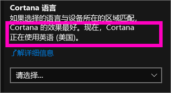
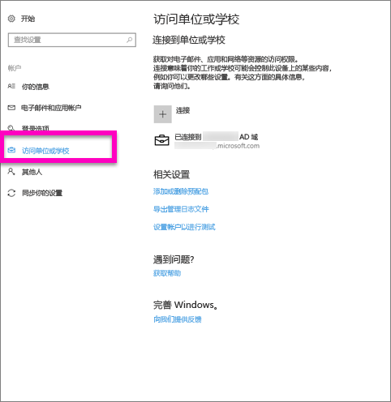
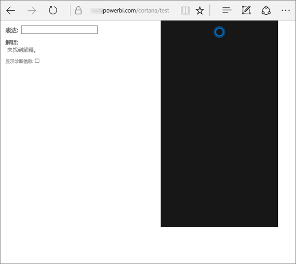
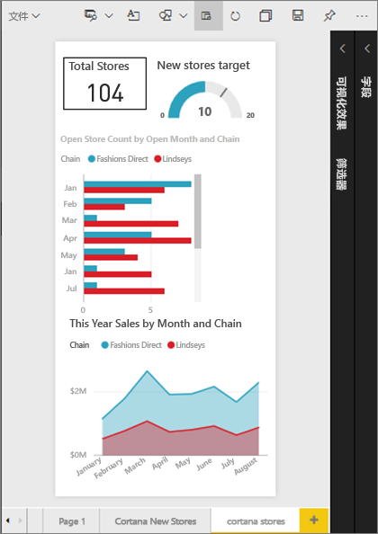
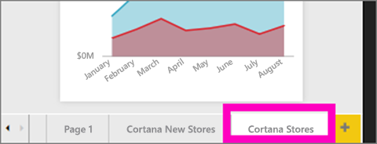
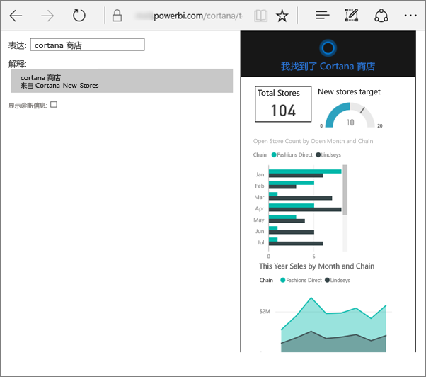
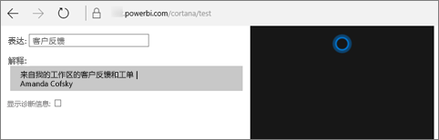

# 对用于 Power BI 的 Cortana 进行故障排除
本文是系列文章中的一部分。 如果你尚未执行上述操作，我们建议阅读以下三篇文章。

**文章 1**：[了解 Cortana 和 Power BI 如何协同工作来搜索 Power BI 仪表板和报表](service-cortana-intro.md)

**文章 2**：[对于搜索报表：启用 Cortana - Power BI - Windows 集成](service-cortana-enable.md)

**文章 3**：[对于搜索报表：创建特殊的 *Cortana 回复卡*](service-cortana-answer-cards.md)

如果在将 Cortana 与 Power BI 集成时仍存在问题，下面正好要介绍如何解决这一问题。 请按照以下步骤来诊断和修复问题。

## 为什么 Cortana 从我的 Power BI 报表或仪表板找不到答案？
1. 是否有 Power BI 帐户？  如果没有，请[免费注册](service-self-service-signup-for-power-bi.md)。
2. Cortana 是否正常运行？  能否在任务栏中看到 Cortana 图标？

    

    选中此图标时，Cortana 是否与你可以在其中键入的字段一起打开？
3. 搜索中是否使用了至少 2 个词语？ Cortana 需要至少通过 2 个词的短语才能从 Power BI 中找到答案。 尝试将“显示”添加到问题的开头。
4. 如果仪表板的标题包含多个词语，并且如果你的搜索至少匹配其中两个字，则 Cortana 只会返回该仪表板。 对于名为“销售额 FY16”的仪表板：

   * “显示销售额” *不* 会返回 Power BI 结果。   
   * “向我显示销售额 fy16”、“销售额 fy16”、“显示销售额 fy16”和“向我显示销售额 f” *将* 返回 Power BI 结果。    
   * 由于添加“powerbi”一词可计作 2 个必需词之一，因此，“powerbi 销售额” *会* 返回 Power BI 结果。
5. 是否具有对任何报表或仪表板进行访问或编辑的权限？ 对于报表，请确保要搜索的内容有[回复卡](service-cortana-answer-cards.md)。  对于仪表板，请确保你尝试搜索的内容位于 **与我共享**、应用工作区或 **我的工作区**中。 [使用疑难解答工具](#try-the-cortana-troubleshooting-tool)帮助确定问题。
6. 是否使用移动设备？  目前，我们仅支持 Windows 移动设备上的 Power BI 和 Cortana 集成。
7. Cortana 是否配置为英语？  当前的 Cortana-Power BI 集成仅支持英语。 打开 Cortana 并选择齿轮图标以显示“设置”。 向下滚动到“**Cortana 语言**”并确保将其设置为其中一个英语选项。

   
8. 是否已为 Cortana 启用了超过 100 个报表？  Cortana 最多只搜索 100 个。  若要确保你的报表包含在内，请将其移动或复制到 **我的工作区**，因为 Cortana 会先在该处进行搜索。
9. 你可能只需等待一些时间。 第一次键入查询时，模型可能尚 *未就绪*。 等待几秒钟，以便数据加载到内存中，然后重试。
10. 对于仪表板，Cortana 可能需要长达 24 小时才能访问。    
11. 对于报表，将新的数据集或自定义回复卡添加到 Power BI 并为 Cortana 启用时，可能需要 30 分钟，结果才会开始出现在 Cortana 中。 登录或退出 Windows 10 或者在 Windows 10 中重启 Cortana 进程都能使新报表内容立刻显示。  
12. 你的 Power BI 管理员可以“选择退出”。 请与你的管理员确认是否属于这种情况。

## 仅限报表：为什么 Cortana 从我的 Power BI 报表找不到答案
1. 如果你正在报表中寻找答案，你是否有包含 Cortana 回复卡的任何报表？ 回复卡是 Cortana 能在 Power BI 报表中找到答案的唯一途径。  通过阅读[在 Power BI 服务和 Power BI Desktop 中创建 Cortana 回复卡](service-cortana-answer-cards.md)，了解如何创建回复卡。
2. 是否运行的是 Windows 版本 1511 或更高版本？  通过打开 Windows 设置，然后选择“**系统 > 关于**”进行查找。 如果不是，请更新你的 Windows 版本。
3. 你的 Windows 和 Power BI 帐户是否已关联？ 这可能会造成混淆。 按照[为 Power BI 启用 Cortana](service-cortana-enable.md#add-your-power-bi-credentials-to-windows) 中的说明操作。
4. 已为 Cortana 启用基础数据集？ 或许某个同事已共享她已为 Cortana 启用的数据集。 但如果没有，请[了解如何自行为 Cortana 启用数据集](service-cortana-enable.md)。 这一操作快速而简单。

## 仅限仪表板：为什么 Cortana 从我的 Power BI 仪表板中找不到答案
1. 确保你已连接到工作帐户。 Power BI 需要此连接才能验证你对数据的访问权限。 若要检查你是否已连接到工作帐户，请使用 Windows 搜索框以导航到“连接到工作或学校帐户”。  

    
2. 你是否对 Cortana 具有访问权限？ 选择 Windows 搜索框并提供对你的信息的 Cortana 访问权限。

## 尝试使用 Cortana 疑难解答工具
仍有问题？  现在就可以立即运行 Cortana 疑难解答工具并减少可能出现的问题。

### 从报表检索答案时遇到问题？
1. 对于报表，在运行疑难解答工具之前，请务必将 Cortana 回复卡上的 **页面级**筛选器设置为 **需要单选**。 有关执行此操作的帮助，请参阅[创建 Cortana 回复卡](service-cortana-answer-cards.md)。
2. 通过将“/cortana/test”添加到 Power BI 服务 URL 的末尾即可打开疑难解答工具。 URL 应如下所示：

   app.powerbi.com/cortana/test

   
3. 在“查询文本”字段中，要对报表进行故障排除，请严格按 Power BI 选项卡中显示的 Cortana 回复卡名称键入其名称。

   

    

   
4. 有时，在第一次将内容键入到“**查询文本**”字段时，不会执行任何操作。 将其当作启动系统；让疑难解答工具知道应该启动了。 再次剪切和粘贴或重新键入到“**查询文本**”字段。 在本示例中，我们回复卡的名称是**Cortana 存储**。 将 **Cortana 商店**粘贴或键入到工具中，生成在 **解释** 字段中显示的单个结果。 单击可查看 Cortana 窗口中显示的回复卡，本示例中为“Cortana 商店”。

   

   我们已得到一个结果，现在知道 Cortana **已**在 Power BI 中启用。 这可减少 Windows 端或 Cortana 语言设置或为 Cortana 启用超过 100 个数据集可能出现的问题。

### 从仪表板中检索答案时遇到问题？
要查找已与你共享的仪表板？  打开“Power BI”> **与我共享**，并找到该仪表板的名称。  然后将该名称键入到“查询文本”字段。

#### 疑难解答工具的已知问题
* 如果该工具第一次没有获取到结果；而是将查询粘贴到“查询文本”文本框中。
* 根据设计规定的，查询必须为 2 个或更多个字词。  如果查询太短，请添加词“显示”。
* 一些带有介词的查询字符串可能无法获取到结果（例如 sales by item）。 请尝试不使用介词，而是使用有意义/唯一的其他查询词。

更多问题？ [尝试参与 Power BI 社区](http://community.powerbi.com/)
