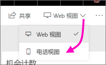
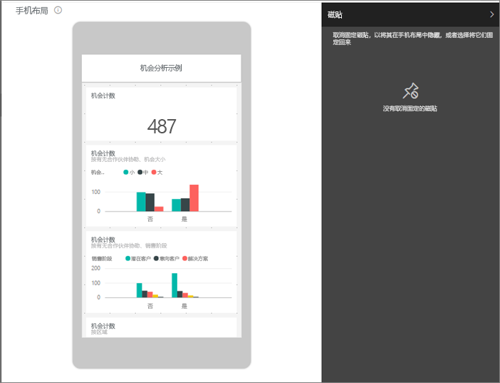
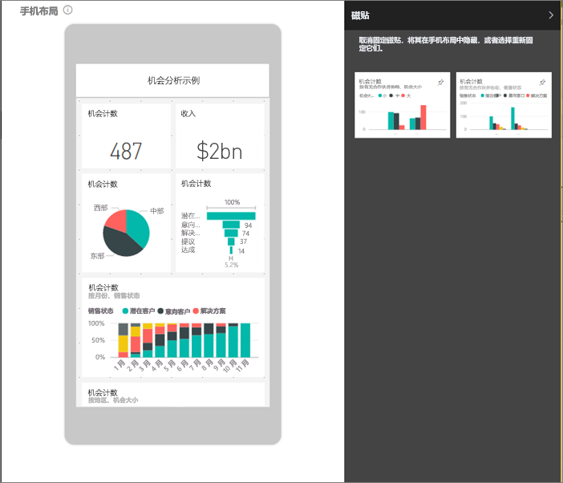
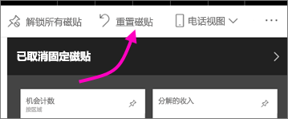

# 创建更适合在移动电话上展示的 Power BI 仪表板的视图
在手机上的 Power BI 移动应用中查看仪表板时，你会发现，仪表板磁贴采用相继布局的方式，所有磁贴的大小都一样。 在 Power BI 服务中，可以创建任何你拥有的仪表板的自定义视图，专用于在手机上查看。

当侧向打开手机时，你会看到仪表板以服务中的原有方式打开，而并没有以你为手机设计的方式打开。

> [!NOTE]
> 在手机上查看仪表板的任何人都可以实时看到你在编辑电话视图时所做的更改。 例如，如果你取消固定仪表板电话视图上的所有磁贴，手机仪表板上的磁贴会突然消失。 
> 
> 

## 创建仪表板电话视图
1. 在 Power BI 服务中打开仪表板。
2. 依次选择右上角“Web 视图”旁边的箭头和“电话视图”。

    

    如果不是仪表板的所有者，将看不到此选项。

    

    此时将打开电话仪表板编辑视图。 你可以在该视图中取消固定、调整大小以及重排磁贴以适应电话视图。 仪表板的 web 版本不会更改。

1. 选择一个磁贴进行拖放、调整大小或取消固定操作。 你将发现，拖动某个磁贴时，其他磁铁也会移开。
   
    
   
    未固定的磁贴会进入“未固定的磁贴”窗格中，除非重新添加回原处，否则它们将继续留在此窗格中。
   
    
2. 如果改变主意，请选择“重置磁贴”，按之前的大小和顺序将它们放回原处。
   
    
   
    在 Power BI 服务中直接打开“电话编辑”视图会稍稍改变手机上磁贴的大小和形状。 因此，若要将仪表板完全恢复到在“电话编辑”视图中打开之前的状态，请选择“重置磁贴”。
3. 若对手机仪表板布局感到满意，请依次选择右上角“电话视图”旁边的箭头和“Web 视图”。
   
    此时，Power BI 会自动保存手机布局。

## 后续步骤
* [创建针对 Power BI 手机应用的优化报表](desktop-create-phone-report.md)
* [创建优化为适应任意大小的响应式视觉对象](visuals/desktop-create-responsive-visuals.md)
* 更多问题？ [尝试咨询 Power BI 社区](http://community.powerbi.com/)

