# 在 Power BI 中创建和发布包含仪表板和报表的应用

在 Power BI 中，可以创建应用，将相关仪表板和报表汇总到一处，然后面向组织中的大规模群体发布它们。 还可以连接到[适用于外部服务（如 Google Analytics 和 Microsoft Dynamics CRM）的 Power BI 应用](service-connect-to-services.md)。

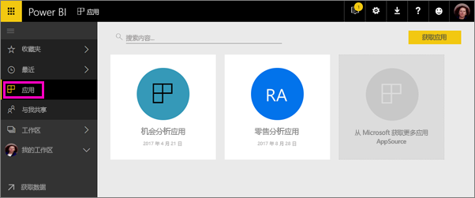

业务用户通常需要多个 Power BI 仪表板和报表，才能经营自己的业务。 应用会将各个仪表板组合在一起，因此，用户无需记住所有仪表板的名称及位置。 使用 Power BI 应用，可以创建仪表板和报表集合并将这些应用发布到整个组织或发布到特定人员或组。 对于报表创建者或管理员，应用能使管理仪表板集合的权限变得更轻松。

业务用户可以通过多种不同的方式获取你的应用。 如果 Power BI 管理员已授予你权限，则可以将这些应用自动安装到同事的 Power BI 帐户中。 或者，他们可以从 Microsoft AppSource 安装这些应用，也可以直接向他们发送一个链接。 他们可以轻松地找到并返回到你的内容，因为所有内容都在同一个位置。 他们将自动获得更新，你可以控制数据刷新的频率。 详细了解[业务用户的应用体验](service-install-use-apps.md)。

### 应用许可证
应用创建者需要 Power BI Pro 许可证。 应用用户查看应用有两种选择。

* 选择 1：应用用户已分配有 Power BI Pro许可证。 
* 选择 2：应用用户未分配有 Power BI Pro 许可证，但该应用位于 Power BI Premium 某个功能中。 请阅读[什么是 Power BI Premium？](service-premium.md)了解详细信息。

### 应用和组织内容包
应用由组织内容包演变而来。 如果你已具有组织内容包，它们将继续与应用并行工作。

在大致了解应用的概述后，我们来探讨在其中构建应用的*应用工作区*。 

## 视频：应用和应用工作区
<iframe width="640" height="360" src="https://www.youtube.com/embed/Ey5pyrr7Lk8?showinfo=0" frameborder="0" allowfullscreen></iframe>

## 应用工作区
在应用工作区中，可以构建应用，因此若要构建应用，首先需要创建应用工作区。 如果你曾在 Power BI 中的组工作区中执行操作，则应用工作区对你而言并不陌生。 它们由组工作区演变而来，是存储应用内容的临时区域和容器。 

可以以成员或管理员身份将同事添加到这些工作区。 所有应用工作区成员和管理员都需要 Power BI Pro 许可证。 在工作区中，所有人可协作处理计划向更广大受众或者整个组织发布的仪表板、报表和其他文章。 

内容准备好后，选择想要发布的仪表板和报表，然后发布应用。 你可以向更广大受众发送一个直接链接，他们也可以通过转到“从 AppSource 下载并浏览更多应用”，在“应用”选项卡中找到你的应用。 这些用户不能修改应用的内容，但他们可以在 Power BI 服务或其中一个移动应用中与之交互：自行对数据进行筛选、突出显示和排序。 

## 创建应用工作区
[!INCLUDE [powerbi-service-create-app-workspace](./includes/powerbi-service-create-app-workspace.md)]

现在没有内容，你可以向其添加内容。 请注意，首次创建工作区时，可能需要等待一小时左右，让工作区传播到 Office 365。 

添加内容的操作类似于将内容添加到“我的工作区”，只不过工作区中的其他人员也可以查看并使用它。 一个明显区别是，在操作完成后，可以将内容作为应用发布。 在应用工作区中，你可以上传或连接到文件，或者连接到第三方服务，这类似于在“我的工作区”中所执行的操作。 例如：

* [连接到服务](service-connect-to-services.md)（如 Microsoft Dynamics CRM、Salesforce 或 Google Analytics）。
* [从文件中获取数据](service-get-data-from-files.md)（如 Excel、CSV 或 Power BI Desktop (PBIX) 文件）。

在应用工作区中查看内容时，所有者会显示为应用工作区的名称。

## 将图像添加到你的应用（可选）
默认情况下，Power BI 会为应用创建一个带有应用首字母的彩色小圆圈。 但你可能会想要使用图像对其进行自定义。 若要添加映像，需要 Exchange Online 许可证。

1. 选择“工作区”，然后选择工作区名称旁边的省略号 (...)，选择“成员”。 
   
     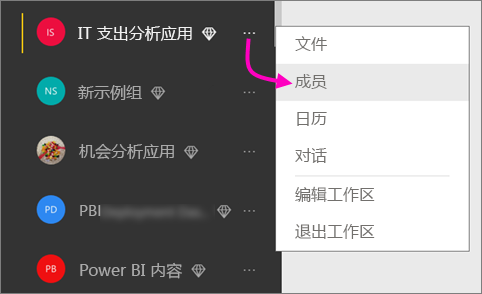
   
    工作区的 Office 365 Outlook 帐户将在新的浏览器窗口中打开。
2. 将鼠标悬停在左上方的彩色圆圈上时，它将变为铅笔图标。 请选择它。
   
     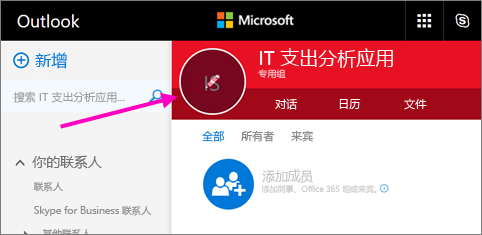
3. 再次选择铅笔图标，然后找到你要使用的图像。
   
     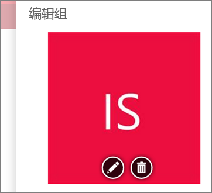
4. 选择“保存”。
   
     
   
    图像会替换 Office 365 Outlook 窗口中的彩色圆圈。 
   
     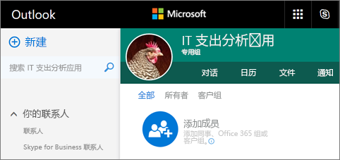
   
    几分钟后，它将在 Power BI 中的应用中显示。
   
     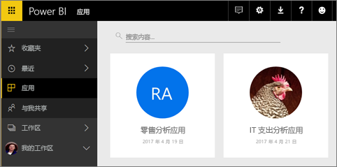

## 发布应用
应用工作区中的仪表板和报表就绪时，将它们发布为应用。 注意，不必将该工作区中的所有报表和仪表板全部发布。 可以只发布已就绪的报表和仪表板。

1. 在工作区列表视图中决定应用要包含的仪表板和报表。

     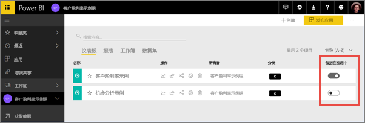

     如果选择不发布某个报表，该报表及与其相关的仪表板旁边将显示一条警告。 此时仍然可以发布应用，但这个相关的仪表板将缺少来自该报表的磁贴。

     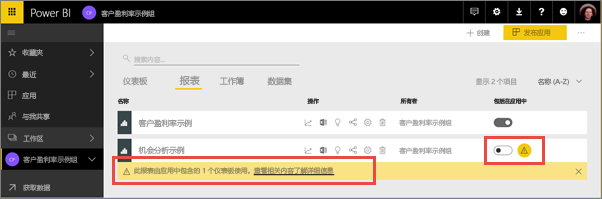

2. 选择右上角中的“发布应用”按钮，启动在该工作区中共享所有内容的过程。
   
     

3. 在“详细信息”中，填写说明以帮助用户查找应用。 可以选择背景颜色对其进行个性化设置。
   
     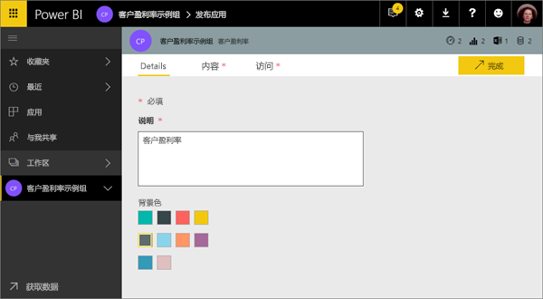

4. 在“内容”中，会看到即将作为应用的一部分进行发布的内容，即已在该工作区中选择的所有内容。 此外，还可以设置应用登录页，即当用户转到你的应用时首先看到的仪表板或报表。 你可以选择“无”。 然后，他们将登录到应用中的所有内容列表。 
   
     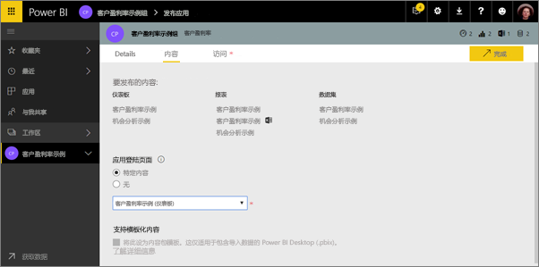

5. 在“访问”中，决定有权访问应用的人员：要么是组织中的所有人，要么是特定人员或者 Active Directory 安全组。 如果具有相应的权限，则可以决定是否为收件人自动安装应用。 可以在 [Power BI 管理门户](#how-to-enable-pushing-apps)启用此设置. 可以详细了解有关[推送应用](#how-to-enable-pushing-apps)的注意事项。

    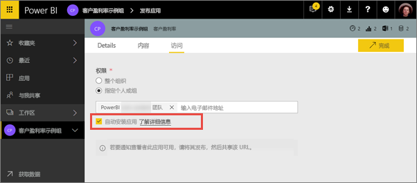

6. 选择“完成”时，将看到一条消息，确认已准备好发布。 在成功对话框中，你可以复制直接链接到此应用的 URL 并将其发送给共享的人员。
   
     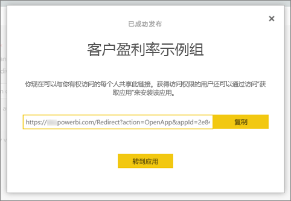

已向其发布应用的业务用户可以通过多种不同的方式找到它。 如果你可以为用户自动安装应用，则该应用将在其 Power BI 帐户的“应用”下出现。 你可以向他们发送应用的直接链接，或者他们可以在 Microsoft AppSource 中进行搜索，在那里他们将看到可以访问的所有应用。 无论通过哪种方式获取应用，在转到应用后，都可以在列表中看到此应用。

详细了解[业务用户的应用体验](service-install-use-apps.md)。

## 更改已发布的应用
发布应用后，你可能想要更改或更新它。 如果你是应用工作区的管理员或成员，则很方便进行更新。 

1. 打开对应于应用的应用工作区。 
   
     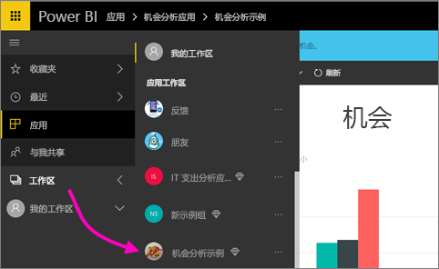
2. 打开仪表板或报表。 你会发现你可以执行任何所需的更改。
   
     应用工作区为临时区域，因此所做的更改在再次发布前不会实时推送到应用。 这样就方便进行更改，而不会影响已发布的应用。  
 
3. 返回到内容的应用工作区列表，再选择“更新应用”。
   
     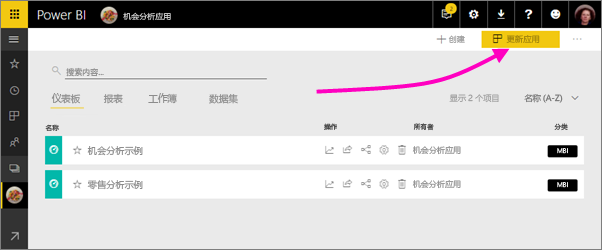

4. 如果需要，更新“详细信息”、“内容”和“访问权限”，然后选择“更新应用”。
   
     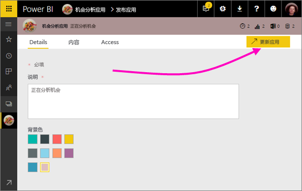

应用的发布对象会自动看到更新版应用。 

# 自动为最终用户安装应用
可以自动为最终用户安装应用，从而更轻松地将正确的应用分发给合适的人员或组。

应用提供最终用户完成作业所需的数据。 现在可以自动将这些应用安装在应用内容列表中，而无需从 Microsoft AppSource 或通过安装链接查找。 这样，你可以更轻松地向用户推出标准 Power BI 内容。

## 如何自动为最终用户安装应用
一旦管理员启用该功能，应用发布者就会提供新选项以自动安装该应用。 当选中该框，并且应用程序发布者选择“完成”（或为现有应用选择“更新应用”）时，该应用将推送到“访问”选项卡的应用的“权限”部分定义的所有用户或组。

## 用户如何获取已推送给他们的应用
推送应用后，应用将自动显示在应用列表中。 你可以精选组织中用户或工作角色需要随时使用的应用。

### 自动安装应用的注意事项
下面是将应用推送给最终用户时需要注意的一些事项：

* 自动向用户安装应用可能需要一些时间。 大多数应用将立即为用户安装，但推送应用可能需要一些时间。  这取决于应用中的项数和授予访问权限的人员数。 我们建议在下班期间推送应用，那时的时间充足，用户也不需要使用应用。 请先与多位用户验证，再发送有关应用可用性的广泛沟通。

* 刷新浏览器。 用户可能需要刷新或关闭和重新打开浏览器才能看到“应用”列表中的推送应用。

* 如果用户没有在“应用”列表中立即看到应用，则应刷新或关闭浏览器并重新打开。

* 尽量不要让用户不知所措。 请注意不要推送太多应用，以便用户了解预先安装的应用是有用的。 最好控制可以将应用推送给最终用户的人员，以协调计时。 可以建立一个联系点，用于将组织中的应用推送给最终用户。

* 不会为未接受邀请的来宾用户自动安装应用。  

## 取消发布应用
应用工作区的任何成员都可以取消发布应用。

* 在应用工作区中，依次选择右上角的省略号（“...”）和“取消发布应用”。
  
     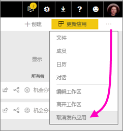

此操作会为已向其发布该应用的所有人员卸载此应用，而且他们也不再有权访问此应用。 此操作不会删除应用工作区或其内容。

## Power BI 应用常见问题
### 应用工作区与组工作区有什么不同？
此版本中，我们将所有组工作区重新命名为应用工作区。 你可以从任何这些工作区中发布应用。 应用工作区的大部分功能与组工作区不相上下。 在接下来的几个月里，我们计划致力于应用工作区的以下增强功能： 

* 创建应用工作区不会像组工作区那样在 Office 365 中创建相应的实体。 因此，你可以创建任意数量的应用工作区，而无需担心会在后台创建不同的 Office 365 组（你仍可以使用 Office 365 组的 OneDrive for Business 来存储文件）。 
* 现在，可以仅将单个用户添加到成员和管理员员列表。 在不久的将来，可以将多个 AD 安全组或新式组添加到这些列表，以便更轻松地进行管理。  

### 应用与组织内容包有什么不同？
应用由内容包发展和简化而来，它们存在以下几个主要区别。 

* 业务用户在安装内容包后，它将失去其分组的标识：它只是穿插了其他仪表板和报表的仪表板和报表列表。 另一方面，应用即使在安装后也会维护其分组和标识。 因此，随着时间的推移，业务用户能够继续轻松地导航到应用。
* 你可以从任何工作区创建多个内容包，但应用与其工作区具备一对一的关系。 我们认为，这使应用更易于理解，并且在长时间运行后更容易对其进行维护。 若要详细了解我们计划如何改进这一方面，请参阅 Power BI 博客的路线图部分。 
* 随着时间的推移，我们计划弃用组织内容包，因此，我们建议你从现在开始构建应用。  

### 对组中的只读成员有什么影响？
在组中，你可以添加只能查看内容的只读成员。 此方法的主要问题是无法将安全组添加为成员。 

借助应用，你可以针对大型受众发布应用工作区的只读版本，其中包括安全组。 可以将所做的更改暂存到应用中的仪表板和报表中，而不会影响最终用户。 我们建议将来以此方式使用应用。 对于长时间运行，我们还计划弃用工作区的只读成员。  

## 后续步骤
* [在 Power BI 中安装并使用应用](service-install-use-apps.md)
* [适用于外部服务的 Power BI 应用](service-connect-to-services.md)
* [Power BI 管理门户](https://docs.microsoft.com/en-us/power-bi/service-admin-portal)
* 是否有任何问题？ [尝试咨询 Power BI 社区](http://community.powerbi.com/)
