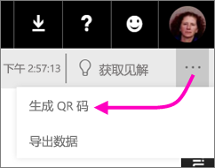
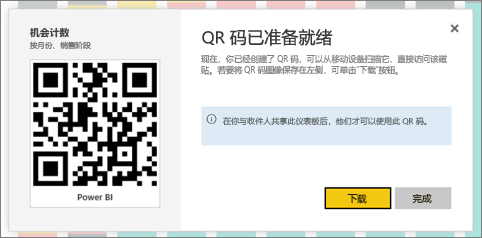

# 在 Power BI 中为磁贴创建 QR 码以供在移动应用中使用
Power BI 中的 QR 代码可以将现实生活中的任何东西直接连接到相关的 BI 信息 &#151; 无需进行导航或搜索。

可以在 Power BI 服务中为任何仪表板中的磁贴创建 QR 码，甚至包括无法编辑的仪表板。 然后将 QR 代码放在关键位置中。 例如，可以将代码粘贴到电子邮件，或将其打印出来并粘贴在特定位置。 

与之共享仪表板的同事可以[直接使用他们的移动设备扫描 QR 码来访问磁贴](mobile-apps-qr-code.md)。 他们既可以使用 Power BI 应用中的 QR 码扫描程序，也可以使用自己设备上安装的其他任何 QR 码扫描程序。 。

## 为磁贴创建 QR 代码
1. 打开 Power BI 服务中的 Power BI 仪表板。
2. 选择磁贴右上角的省略号 (...)，然后选择**焦点模式** 。
3. 选择右上角的省略号 (...)，然后选择**生成 QR 代码**。 
   
    
4. 将出现带有 QR 代码的对话框。 
   
    
5. 你可以在此扫描 QR 代码或下载并保存该代码，以便可以： 
   
   * 将其添加到电子邮件或其他文档，或 
   * 将其打印出来并放在特定位置。 

## 打印 QR 代码
Power BI 可将 QR 代码生成为 JPG 文件，以备打印。 

1. 选择**下载**，然后在连接到打印机的计算机上打开该 JPG 文件。  
   
   > [!TIP]
   > JPG 文件与磁贴同名。 例如 "Opportunity Count - by Month, Sales Stage.jpg"。
   > 
   > 
2. 以 100% 比例或“实际大小”打印文件。  
3. 对 QR 码进行裁剪，并将其粘附到与磁贴相关的位置。 

## 后续步骤
* 使用移动应用[从真实世界连接到 Power BI 数据](mobile-apps-data-in-real-world-context.md)
* [使用移动设备扫描 Power BI QR 码](mobile-apps-qr-code.md)
* [创建报表的 QR 码](service-create-qr-code-for-report.md)
* 是否有任何问题？ [尝试咨询 Power BI 社区](http://community.powerbi.com/)

