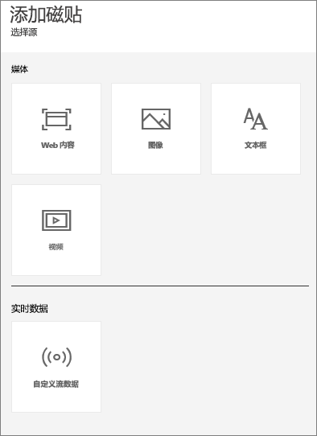
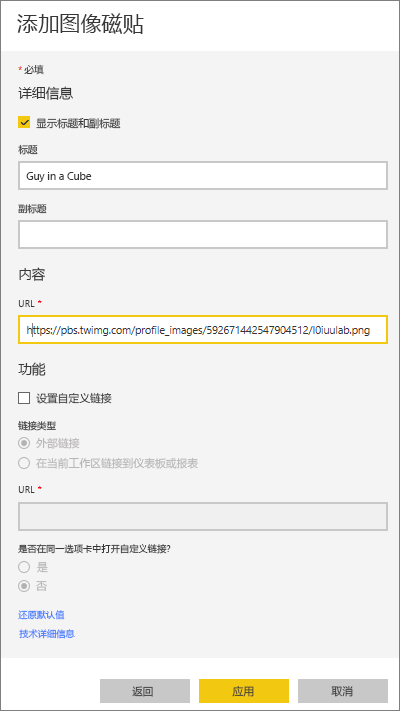
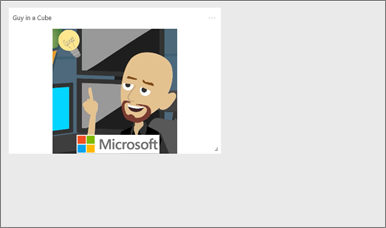
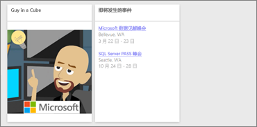
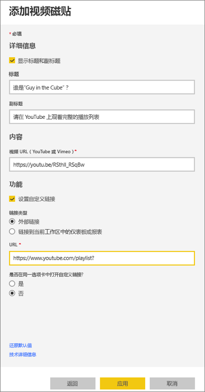
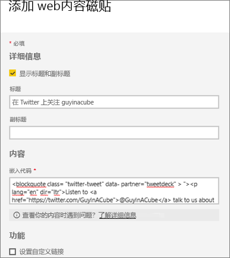
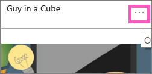
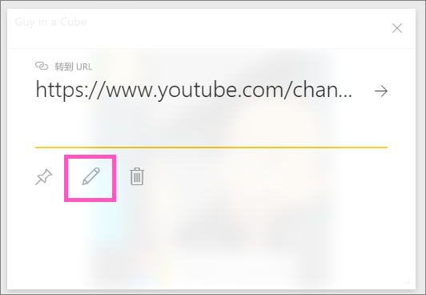

# <a name="add-image-text-video-and-more-to-your-dashboard"></a>向仪表板添加图像、文本、视频等
<iframe width="560" height="315" src="https://www.youtube.com/embed/e2PD8m1Q0vU" frameborder="0" allowfullscreen></iframe>


## <a name="add-tile"></a>添加磁贴
利用“添加磁贴”控件，可以直接向仪表板添加图像、文本框、视频、流数据或 Web 代码。

1. 从顶部菜单栏选择“添加磁贴”。 鉴于空间限制，你可能只能看到加号  符号。
   
    
2. 选择要添加的磁贴类型：“图像”、“文本框”、“视频”、“Web 内容”或“自定义流数据”。
   
    

## <a name="add-an-image"></a>添加图像
假设你希望仪表板上有公司的徽标或其他图像。 将需要在线保存图像文件并链接到该文件。 请确保访问该图像文件无需特殊凭据。 例如，OneDrive 和 SharePoint 需要身份验证，因此存储在该处的图像将无法按此种方式添加到仪表板。  

1. 选择“图像” > “下一步”。
2. 将图像信息添加到**磁贴详细信息**窗格。
   
    
   
   * 若要在图像上方显示标题，请选择显示标题和副标题，并键入标题和/或副标题。
   * 输入图像 URL
   * 若要将磁贴设置为超链接，请选择**设置自定义链接**，并输入 URL。  同事单击此图像或标题时，便会前往此 URL。
   * 选择**应用**。  在仪表板上，根据需要重设图像大小和移动图像。
     
     

## <a name="add-a-text-box-or-dashboard-heading"></a>添加文本框或仪表板标题
1. 选择“文本框”>“下一步”。
   
    
   
   > **注意**：若要添加仪表板标题，请在文本框中键入标题并增大字体。
   > 
   > 
2. 设置文本框格式：
   
   * 若要在文本框上方显示标题，请选择**显示标题和副标题**，并键入标题和/或副标题。
   * 输入并格式化文本框的内容。  
   * （可选）设置标题的自定义链接。  不过在本示例中，我们已经在文本框内添加了超链接，因此请保持**设置自定义链接**的未选中状态。
3. 选择**应用**。  在仪表板上，根据需要重设文本框大小和移动文本框。
   
   

## <a name="add-a-video"></a>添加视频
向仪表板添加 YouTube 或 Vimeo 视频磁贴之后，该视频会直接在仪表板上播放。

1. 选择“视频”>“下一步”。
2. 将视频信息添加到**磁贴详细信息**窗格。
   
    
   
   * 若要在视频磁贴顶部显示标题和副标题，请选择显示标题和副标题，并键入标题和/或副标题。 在本示例中，我们将添加副标题，然后将其设置成返回 YouTube 完整播放列表的超链接。
   * 输入视频 URL
   * 为标题和副标题添加超链接。  你可能希望，同事在观看内嵌视频后能够查看 YouTube 上的完整播放列表；你可以在此添加播放列表的链接。
   * 选择**应用**。  在仪表板上，根据需要重设视频磁贴大小和移动视频磁贴。
     
      
3. 选择用于播放视频的视频磁贴。
4. 选择副标题以访问 YouTube 上的播放列表。

## <a name="add-streaming-data"></a>添加流数据
<iframe width="560" height="315" src="https://www.youtube.com/embed/kOuINwgkEkQ" frameborder="0" allowfullscreen></iframe>

## <a name="add-web-content"></a>添加 Web 内容
粘贴或键入任何 HTML 内容。  Power BI 会把它当成磁贴添加到仪表板中。 手动输入嵌入代码，或从 Twitter、YouTube、embed.ly 等站点复制/粘贴。

1. 选择“Web 内容”>“下一步”。
2. 将信息添加到“添加 Web 内容磁贴”窗格。
   
    
   
   * 若要在磁贴上方显示标题，请选择显示标题和副标题，并键入标题和/或副标题。
   * 输入嵌入代码。 在本示例中，我们会复制并粘贴 Twitter 源。
   * 选择**应用**。  在仪表板上，根据需要重设 Web 内容磁贴大小和移动 Web 内容磁贴。
     
      

## <a name="tips-for-embedding-web-content"></a>嵌入 Web 内容的提示
* 若为 iframe，请使用安全的源。 如果输入 iframe 嵌入代码却得到空白磁贴，请查看 iframe 源是否使用了 **http**。  如果是，请更改为 **https**。
  
  ```
  <iframe src="https://xyz.com">
  ```
* 编辑宽度和高度信息。 此嵌入代码会嵌入视频，并将视频播放器设置为 560 x 315 像素。  当你重设磁贴大小时，这个大小不会更改。
  
  ```
  <iframe width="560" height="315"
  src="https://www.youtube.com/embed/Cle_rKBpZ28" frameborder="0"
   allowfullscreen></iframe>
  ```
  
  如果希望播放器重设大小以适应磁贴大小，请将宽度和高度设为 100%。
  
  ```
  <iframe width="100%" height="100%"
  src="https://www.youtube.com/embed/Cle_rKBpZ28" frameborder="0"
   allowfullscreen></iframe>
  ```
* 此代码会嵌入推文，并以独立链接的方式在仪表板上保留 **AFK** 播客、**@GuyInACube 的 Twitter 页面**、**关注**、**#analytics****回复**、**转推**和**喜欢**的链接。  选择磁贴本身会带你前往 Twitter 的播客。
  
  ```
  <blockquote class="twitter-tweet" data-partner="tweetdeck">
  <p lang="en" dir="ltr">Listen to
  <a href="https://twitter.com/GuyInACube">@GuyInACube</a> talk to
  us about making videos about Microsoft Business Intelligence
  platform
  <a href="https://t.co/TmRgalz7tv">https://t.co/TmRgalz7tv </a>
  <a href="https://twitter.com/hashtag/analytics?src=hash">
  #analytics</a></p>&mdash; AFTK Podcast (@aftkpodcast) <a
  href="https://twitter.com/aftkpodcast/status/693465456531771392">
  January 30, 2016</a></blockquote> <script async src="//platform.twitter.com/widgets.js" charset="utf-8"></script>
  ```

## <a name="edit-a-tile"></a>编辑磁贴
若要更改磁贴...

1. 将鼠标悬停在磁贴右上角并选择省略号。
   
    
2. 选择编辑图标，以便重新打开**磁贴详细信息**窗格并进行更改。
   
    

## <a name="considerations-and-troubleshooting"></a>注意事项和疑难解答
* 若要更轻松地在仪表板上移动磁贴，请添加标题和/或副标题。
* 如果想要嵌入网站的某些内容，但网站未提供可供复制和粘贴的嵌入代码，请签出 embed.ly 以便生成嵌入代码。

## <a name="next-steps"></a>后续步骤
[仪表板磁贴](service-dashboard-tiles.md)

更多问题？ [尝试参与 Power BI 社区](http://community.powerbi.com/)。

