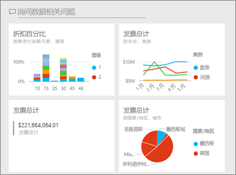
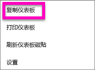
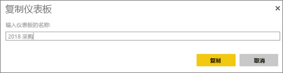

# 在 Power BI 服务中创建仪表板副本

 创建仪表板副本的原因众多。 你可能想要对原始版本进行更改并测试其性能；或创建由同事、区域或团队分发的略微不同的版本。 可能有某个同事喜欢你的仪表板设计，想要使用它向经理汇报工作。 另一个原因是，可能你具有包含相同数据结构和数据类型的新数据库，并且想要重用已创建的仪表板。这也可以完成，但需要在 Power BI Desktop 中执行一些操作。 

仪表板是使用 Power BI 服务进行创建（和复制），可以在 Power BI 移动版和 Power BI Embedded 中进行查看。  Power BI Desktop 不支持仪表板。 

必须是仪表板创建者，才能复制仪表板。 不能复制已作为应用与你共享的仪表板。

1. 打开仪表板。
2. 在右上角选择省略号 (...)，然后选择“复制仪表板”。
   
   
3. 为仪表板命名并选择“复制”。 
   
   
4. 新仪表板将与原始仪表板保存在同一工作区中。 
   
   

5.    打开新仪表板，并根据需要进行编辑。 接下来，不妨执行下列操作：    
    a. [移动、重命名、重设大小或删除磁贴](service-dashboard-edit-tile.md)。  
    b. 依次选择磁贴省略号 (...) 和“编辑详细信息”，编辑磁贴详细信息和超链接。  
    c. [通过仪表板菜单栏添加新磁贴](service-dashboard-add-widget.md)（添加磁贴）  
    d. [通过 Power BI 问答](service-dashboard-pin-tile-from-q-and-a.md)或[通过报表](service-dashboard-pin-tile-from-report.md)固定新磁贴。  
    e. 在仪表板的“设置”窗格中，重命名仪表板、启用或禁用 Power BI 问答并设置磁贴流。  （依次选择仪表板省略号 (...) 下拉列表和“设置”）  
    f. 将仪表板直接与同事共享，或作为 Power BI 应用的一部分共享。 

## 后续步骤
* [设计出色仪表板的提示](service-dashboards-design-tips.md) 

更多问题？ [尝试参与 Power BI 社区](http://community.powerbi.com/)

