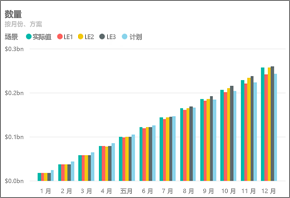
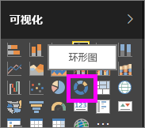
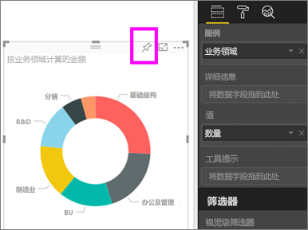
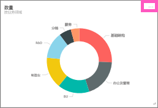
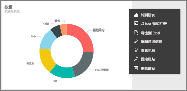
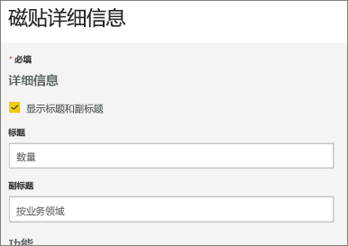
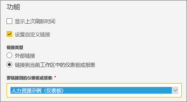
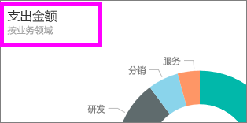
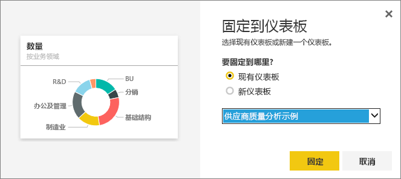

# 编辑或删除仪表板磁贴

## 仪表板所有者与仪表板使用者
如果是仪表板的创建者或所有者，可以通过许多方法，更改相应仪表板上磁贴的外观和默认行为。 下面的设置和策略可用于为同事设计仪表板使用体验。  选择磁贴后打开的是基础报表、自定义 URL 还是其他仪表板？ 也许会[添加显示视频或流数据的磁贴](service-dashboard-add-widget.md)？ 甚至希望[创建包含交互式切片器的磁贴](service-dashboard-pin-live-tile-from-report.md)。 作为创建者，可以通过很多方式进行编辑。 

<iframe width="560" height="315" src="https://www.youtube.com/embed/lJKgWnvl6bQ" frameborder="0" allowfullscreen></iframe>

本文涵盖以下方面。

* [创建并将可视化效果固定到仪表板](#create)
* [移动磁贴](#move)
* [重设磁贴大小](#resize)
* [重命名磁贴](#rename)
* [向磁贴添加超链接](#hyperlink)
* [将磁贴固定到其他仪表板](#different)
* [删除磁贴](#delete)
  
 > [!TIP]
 > 若要更改磁贴本身显示的可视化效果，请删除磁贴，并添加新的 [仪表板磁贴](service-dashboard-tiles.md)。
 > 

 ### 先决条件
 1. 若要跟着介绍一起操作，请打开 Power BI 服务（而非 Power BI Desktop），并[下载“IT 支出分析示例”](sample-it-spend.md)。 看到“成功”消息时，选择“转至仪表板”

- - -

## 新建并将可视化效果固定到仪表板
1. 在“IT 支出分析”仪表板中，选择“金额”磁贴，以打开报表。

    

2. 选择顶部菜单栏中的“编辑报表”，在编辑视图中打开报表。

3. 选择报表底部的加号 (+)，添加新报表页。

    

4. 在“字段”窗格中，依次选择“事实”>“金额”，再依次选择“业务领域”>“业务领域”。
 
5. 在“可视化效果”窗格中，选择“环形图”图标，将可视化效果转换为环形图。

    

5. 选择“固定”图标，并将环形图固定到“IT 支出分析示例”仪表板。

   

6. 看到“成功”消息时，选择“转至仪表板”。 此时，系统会提示保存更改。 选择**保存**。

- - -

## 移动磁贴
在仪表板中，找到新磁贴。 选择并按住磁贴，将其拖动到仪表板画布上的一个新位置。

- - -

## 重设磁贴大小
可将磁贴设置为多种大小 - 从 1x1 到 5x5 的磁贴单位均可。 选择并拖动右下角的图柄，重设磁贴大小。

- - -
## 省略号 (...) 菜单

1. 选择磁贴右上角的省略号 (...)。 
   
   

2. 将鼠标悬停在“帐户”磁贴之上，再选择省略号调出选项。 可用选项因磁贴类型而异。  例如，动态磁贴的可用选项不同于标准可视化效果磁贴的可用选项。 此外，如果仪表板是与自己共享的（即不是所有者），可用选项就更少了。

   

3. 选择“编辑详细信息”，打开“磁贴详细信息”窗口。 

    更改磁贴的标题和默认行为。  例如，可以决定在使用者选择磁贴后，改为显示新仪表板，而不是打开用于创建此磁贴的报表。  
   

### 重命名磁贴
在“磁贴详细信息”窗口顶部，将“标题”更改为“支出金额”。

### 更改默认超链接
默认情况下，选择磁贴后通常会转到用于创建此磁贴的报表，或转到 Power BI 问答（如果磁贴是在 Power BI 问答中创建的话）。 若要链接到网页、其他仪表板或报表（位于同一工作区中）、SSRS 报表或其他在线内容，请添加自定义链接。

1. 在“功能”标题下，选中“设置自定义链接”。

2. 选中“链接到当前工作区中的仪表板或报表”，再从下拉列表中选择一个仪表板或报表。  在此示例中，我选择了“人力资源示例”仪表板。 如果工作区中还没有此示例，可以先添加它，再返回到这一步；也可以选择其他仪表板。 

    

3. 选择**应用**。

4. 此时，磁贴上显示新标题。  此外，如果选择磁贴，Power BI 会打开“人力资源”仪表板。 

    

### 将磁贴固定到其他仪表板
1. 在省略号下拉菜单中，选择“固定磁贴”。
2. 确定是将此磁贴的副本固定到现有仪表板，还是固定到新仪表板。 
   
   
3. 选择“固定”。

### 删除磁贴
1. 要从仪表板中永久删除磁贴，请从省略号下拉菜单中选择“删除磁贴”。 

2. 删除磁贴不会删除基础可视化效果。 选择“金额”磁贴，打开基础报表。 打开报表中的最后一页，可以看到原始可视化效果尚未从报表中删除。 

- - -
## 后续步骤
[Power BI 中的仪表板磁贴](service-dashboard-tiles.md)

[Power BI 中的仪表板](service-dashboards.md)

[Power BI - 基本概念](service-basic-concepts.md)

更多问题？ [尝试参与 Power BI 社区](http://community.powerbi.com/)

