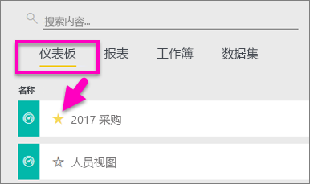
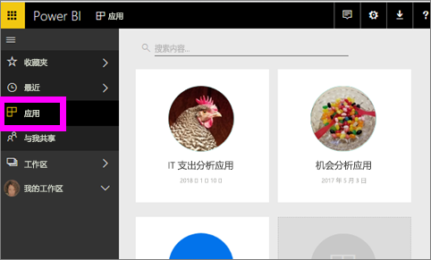
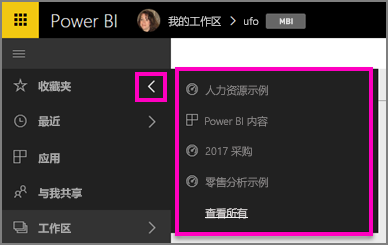
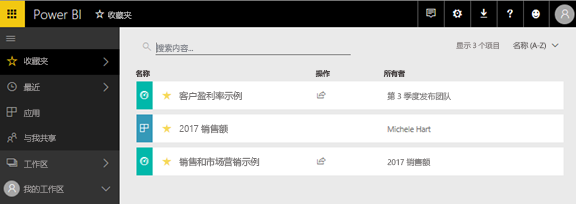
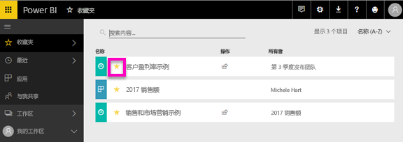

# 在 Power BI 服务中收藏仪表板、报表和应用
收藏内容后，可从所有工作区访问它。  收藏夹中通常放置最常访问的内容。

> [!NOTE]
> 本主题适用于 Power BI 服务，不适用于 Power BI Desktop。
> 
> 

还可以选择单个仪表板作为 Power BI 服务中的[特色仪表板](service-dashboard-featured.md)。

## 将仪表板或报表添加到收藏夹
请观看下面的视频，Amanda 将演示如何向工作区添加收藏项。然后，按照视频下方的分步说明操作，自行进行尝试。

<iframe width="560" height="315" src="https://www.youtube.com/embed/G26dr2PsEpk" frameborder="0" allowfullscreen></iframe>

1. 打开经常使用的仪表板或报表。 即使是与你共享的内容也可以加入收藏夹。
2. 选择 Power BI 服务右上角的“收藏”或星形  图标。
   
   
   
   还可以从工作区的“仪表板”或“报表”内容视图选项卡中收藏仪表板或报表。
   
   

## 收藏应用

1. 从左侧导航窗格中，选择“应用”。

  

2. 将鼠标悬停在应用上，显示更多详细信息。  选择星形  图标收藏。
   
   

## 使用*收藏夹*
1. 若要访问收藏的项，请在任意工作区中，选择“收藏夹”右侧的箭头。  在此处可以选择一个收藏来打开它。 仅列出五个收藏项（按字母顺序排列）。 如果收藏数量超过五个，可选择“查看全部”打开“收藏夹”屏幕（请参阅下面的第 2 点）。 
   
   
2. 要查看已加入收藏夹的“所有”内容，请选择左侧导航窗格中的“收藏夹”或“收藏” 图标。  
   
    
   
   在此处可以进行的操作：打开、确定所有者，甚至与同事共享。

## 取消收藏内容
不再像以前那样频繁地使用报表？  你可以取消收藏。 取消收藏内容时，会从“收藏夹”列表（而不是 Power BI 中）删除该内容。

1. 在左侧导航窗格中，选择“收藏夹”以打开“收藏夹”屏幕。
   
   
2. 选择此内容旁边的黄色星号可取消收藏。

> 请注意：还可以取消收藏仪表板、报表或应用本身。 只需打开并取消选中黄色图标。   
> 
> 

## 后续步骤
[Power BI 入门](service-get-started.md)

[Power BI - 基本概念](service-basic-concepts.md)

更多问题？ [尝试参与 Power BI 社区](http://community.powerbi.com/)

