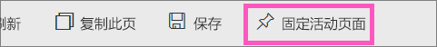

# 将整个报表页以动态磁贴的形式固定到 Power BI 仪表板
添加新[仪表板磁贴](service-dashboard-tiles.md)的另一种方法是固定整个报表页。  这是一种一次性固定多个可视化效果的简便方法。  此外，当固定整个页面时，磁贴是 *动态的* ；你可以就在仪表板上与它们进行交互。 并且你对报表编辑器中返回的任何视觉效果所做的更改（如添加筛选器或更改图表中使用的字段）也都会反映在仪表板磁贴中。  

> [!NOTE]
> 无法固定与你共享的报表中的磁贴。
> 
> 

## 固定报表页
观看 Amanda 将活动报表页固定到仪表板，然后按照视频下的分步说明亲自进行尝试。

<iframe width="560" height="315" src="https://www.youtube.com/embed/EzhfBpPboPA" frameborder="0" allowfullscreen></iframe>

1. 在[编辑视图](service-interact-with-a-report-in-editing-view.md)中打开报表。
2. 在未选择任何视觉化效果的情况下，从菜单栏中选择“固定活动页”。
   
    
3. 将磁贴固定到现有仪表板或新仪表板。 请注意突出显示的文本：*刷新页面时，固定活动页可使对报表所做的更改出现在仪表板磁贴中。*
   
   * 现有仪表板：从下拉列表中选择仪表板的名称。 已与你共享的仪表板不会出现在下拉列表中。
   * 新仪表板：键入新仪表板的名称。
     
     
4. 选择**固定活动**。 一条成功消息（右上角附近）会告知你已将页面以磁贴的形式添加到你的仪表板中。

## 打开仪表板以查看固定的活动磁贴
1. 从导航窗格，选择包含新动态磁贴的仪表板。 可在此处对已固定的报表页进行[重命名、重设大小、链接和移动](service-dashboard-edit-tile.md) 操作。  
2. 与动态磁贴进行交互。  在以下屏幕截图中，选择柱形图上的一个柱已交叉筛选和交叉突出显示了磁贴上的其他可视化效果。
   
    

## 后续步骤
[Power BI 中的仪表板](service-dashboards.md)

更多问题？ [尝试参与 Power BI 社区](http://community.powerbi.com/)

