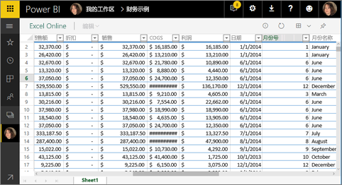
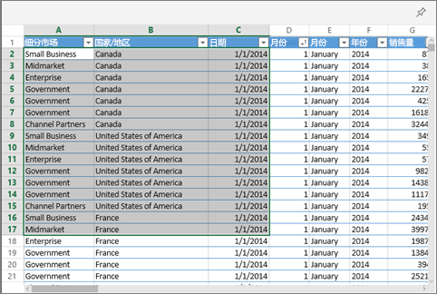

# 从 Excel 将磁贴固定到 Power BI 仪表板
若要从 Excel 工作簿固定磁贴，请将该工作簿连接到 Power BI 服务 (app.powerbi.com)。 实际上，连接工作簿会将该工作簿链接的只读版本引入 Power BI 服务，并允许用户将区域固定到仪表板。 甚至可以将整个工作表固定到仪表板。  
如果已与你共享工作簿，你将能够查看由所有者固定的磁贴，但无法自行创建任何仪表板磁贴。 

有关 Excel 和 Power BI 如何协同工作的详细信息，请参阅[从 Excel 工作簿文件获取数据](http://go.microsoft.com/fwlink/?LinkID=521962)。

视频将演示几个从 Excel 工作簿导入数据并连接至此的方法。

<iframe width="560" height="315" src="https://www.youtube.com/embed/l8JoB7w0zJA" frameborder="0" allowfullscreen></iframe>

## 从 OneDrive for Business 将 Excel 工作簿连接到 Power BI
当你选择“连接”时，你的工作簿将显示在 Power BI 中，就像在 Excel Online 中那样。 但与 Excel Online 不同，你会有一些出色的功能，可帮助你将各元素从你的工作表固定仪表板中。

不能在 Power BI 中编辑你的工作簿。 但如果需要进行一些更改，可以从工作区的“工作簿”选项卡中选择“铅笔”图标，然后选择是在 Excel Online 中编辑工作簿，还是在计算机上的 Excel 中打开工作簿。 你所作的任何更改都会保存到 OneDrive 上的工作簿中。

1. 将你的工作簿上载到你的 OneDrive for Business。
2. 从 Power BI [连接到该工作簿](service-excel-workbook-files.md)。
3. 在 Power BI 中，该工作簿添加到工作区的“工作簿”选项卡。   图标指示这是 Excel 工作簿，黄色星号指示这是新工作簿。
   
    对 Power BI 中工作簿所做的更改不会被保存，并且不会影响 OneDrive for Business 上的原始工作簿。 如果在 Power BI 中排序、筛选或更改值，则无法保存或固定这些更改。 若要更新工作簿，请选择“铅笔”图标，在 Excel Online 中打开它。 对 Excel Online 中工作簿的更改可能需要几分钟的时间才能在磁贴中更新。     
   
   
4. 通过选择工作簿名称，在 Power BI 中打开工作簿。
   
   

## 将单元格的区域固定到仪表板
添加新[仪表板磁贴](service-dashboard-tiles.md)的一种方法是从 Power BI 中的 Excel 工作簿内部进行添加。 可从已保存至你的 OneDrive for Business 或另一个组共享的文档库中的 Excel 工作簿中固定范围。 范围可包含数据、图表、表、数据透视表、数据透视图和其他 Excel 部分。

1. 突出显示你想要固定到仪表板的单元格。
   
    
2. 选择“大头针”图标 。 
3. 将磁贴固定到现有仪表板或新仪表板。 
   
   * 现有仪表板：从下拉列表中选择仪表板的名称。
   * 新仪表板：键入新仪表板的名称。
   
   
4. 选择“固定”。 一条成功消息（右上角附近）会告知你已将范围以磁贴的形式添加到你的仪表板中。 
   
    
5. 选择“转到仪表板”。 在此处可以对已固定的可视化效果执行[重命名、重设大小、添加链接和移动](service-dashboard-edit-tile.md)操作。 默认情况下，选择固定的磁贴将在 Power BI 中打开工作簿。

## 将整个表或数据透视图固定到仪表板
按照上述步骤操作，只不过不选择单元格的区域，而是选择整个表或数据透视表。

要固定表，请选择表的整个区域，并确保包含标头。  要固定数据透视表，请确保包含数据透视表的每个可见部分，包括筛选器（如果使用的话）。

 

从表或数据透视表创建的磁贴将显示整个表。  如果你在原始工作簿中添加/删除/筛选行或列，则也将在磁贴中添加/删除/筛选它们。

## 查看链接到磁贴的工作簿
选择工作簿磁贴将在 Power BI 中打开链接的工作簿。 由于工作簿文件位于该所有者的 OneDrive for Business 上，因此查看工作簿要求具有对该工作簿的读取权限。 如果没有权限，将收到一条错误消息。  

## 注意事项和疑难解答
不支持的功能：Power BI 使用 Excel Services 来检索工作簿磁贴。 因此，由于 Excel 中的某些功能在 Excel Services REST API 中不受支持，因此将不会在 Power BI 中的磁贴上看到这些功能。 例如：迷你图、图标集条件格式设置和时间切片器。 有关不支持的功能的完整列表，请参阅 [Excel Services REST API 中不支持的功能](http://msdn.microsoft.com/library/office/ff394477.aspx)

## 后续步骤
[共享具有 Excel 工作簿链接的仪表板](service-share-dashboard-that-links-to-excel-onedrive.md)

[从 Excel 工作簿获取数据](service-excel-workbook-files.md)

[Power BI 中的仪表板](service-dashboards.md)

更多问题？ [尝试参与 Power BI 社区](http://community.powerbi.com/)

