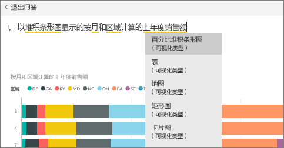
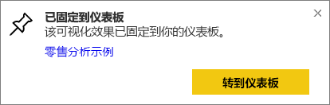
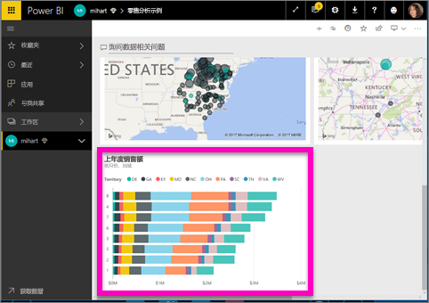
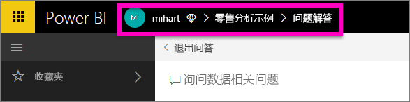

# 从问答将磁贴固定到仪表板
## 如何从“问答”中固定磁贴
问答是 Power BI 即席报表工具。 需要查找特定见解？ 对你的数据提问，然后就会收到以可视化效果形式显示的答案。

> **注意**：要遵循示例执行操作，请打开[零售分析示例](sample-retail-analysis.md)。
> 
> 

1. 打开至少具有一个从报表固定的磁贴的[仪表板](service-dashboards.md)。 在提问后，Power BI 会在将磁贴固定到该仪表板的所有数据集中查找答案。  若要了解详细信息，请参阅[获取数据](service-get-data.md)。
2. 在仪表板顶部的问题框中，键入你想要了解的有关数据的问题。  
   
3. 例如，当你键入“last year sales by month and territory...”时，  
   
   
   问题框将提供建议。
4. 若要将图表作为磁贴添加到仪表板，请选择画布右上方的大头针 。
5. 将磁贴固定到现有仪表板或新仪表板。 
   
   * 现有仪表板：从下拉列表中选择仪表板的名称。 你的选择仅限当前工作区中的这些仪表板。
   * 新仪表板：键入新仪表板的名称，它将被添加到当前工作区。
6. 选择“固定”。
   
   会显示一条成功消息（右上角附近），告知你可视化效果已作为磁贴添加到你的仪表板中。  
   
   
7. 选择“转到仪表板”以查看新磁贴。 可在该仪表板上进行[重命名、调整大小、添加超链接、重新定位磁贴等操作](service-dashboard-edit-tile.md)。 
   
   

## 注意事项和疑难解答
* 开始键入问题时，问答将立即从与当前仪表板关联的所有数据集搜索最佳答案。  “当前仪表板”是顶部导航栏中列出的仪表板。 例如，在属于“mihart”应用工作区的“零售分析示例”仪表板中提出此问题。
  
  
* **问答如何知道要使用哪个数据集**？  “问答”有权访问可使可视化效果固定到该仪表板的所有数据集。

## 后续步骤
[重命名、调整大小、添加超链接、重新定位磁贴等](service-dashboard-edit-tile.md)    
[在焦点模式下显示仪表板磁贴](service-focus-mode.md)     
[返回到 Power BI 中的问答](service-q-and-a.md)  
更多问题？ [尝试参与 Power BI 社区](http://community.powerbi.com/)

