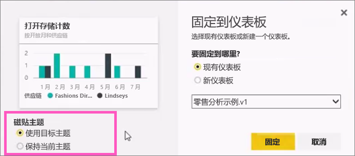
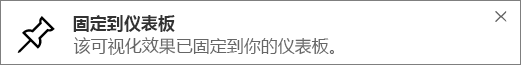

# 从报表将磁贴固定到 Power BI 仪表板
## 从报表固定磁贴
一种从 [Power BI 报表](service-reports.md)内添加新[仪表板磁贴](service-dashboard-tiles.md)的方法。 其实你可以从报表添加许多新磁贴。  单击时，所有这些磁贴都是回到报表的链接。

而且可以将整个报表页固定到仪表板上。  这也称为固定*动态*磁贴。  *动态*是因为你可以使用仪表板上的磁贴进行交互，而且与单独的可视化磁贴不同，在报表中所做的更改可以与仪表板同步。 了解有关以下内容的详细信息。

不能固定与你共享的报表中的磁贴，也不能固定 Power BI Desktop 中的磁贴。 

> 提示：某些可视化效果使用背景图像。 如果背景图像太大，可能无法固定。  请尝试减小图像大小或压缩图像。  
> 
> 

## 从报表固定磁贴
Watch Amanda 通过从 Power BI 报表固定视觉对象和图像创建仪表板。

<iframe width="560" height="315" src="https://www.youtube.com/embed/lJKgWnvl6bQ" frameborder="0" allowfullscreen></iframe>

现在通过使用其中一个 Power BI 示例报表创建你自己的仪表板。

1. 将鼠标悬停在你想要固定的可视化效果上方，然后选择固定图标。 Power BI 将会打开**固定到仪表板**屏幕。
   
     
2. 决定是将磁贴固定到现有仪表板还是固定到新仪表板。
   
   * 现有仪表板：从下拉列表中选择仪表板的名称。 已与你共享的仪表板不会出现在下拉列表中。
   * 新仪表板：键入新仪表板的名称。
3. 在某些情况下，你正在固定的项可能已经应用了*主题*。  例如，从 Excel 工作簿固定的视觉对象。 如果是这样，选择要应用到该磁贴的主题。
4. 选择“固定”。
   
   会显示一条成功消息（右上角附近），告知你可视化效果已作为磁贴添加到你的仪表板中。
   
   
5. 从导航窗格中选择具有新磁贴的仪表板。 选择该磁贴以跳转回报表。 或者，[编辑磁贴显示和行为](service-dashboard-edit-tile.md)。

## 固定整个报表页
另一个选择是将整个报表页固定到仪表板。 这是一种一次性固定多个可视化效果的简便方法。  此外，当固定整个页面时，磁贴是 *动态的* ；你可以就在仪表板上与它们进行交互。 并且你对报表编辑器中返回的任何可视化效果所做的更改（如添加筛选器或更改图表中使用的字段）也都会反映在仪表板磁贴中。  

有关详细信息，请参阅[固定整个报表页](service-dashboard-pin-live-tile-from-report.md)

## 后续步骤
[Power BI 中的仪表板](service-dashboards.md)

[Power BI 中的仪表板磁贴](service-dashboard-tiles.md)

[Power BI 中的报表](service-reports.md)

[Power BI 中的数据刷新](refresh-data.md)

[Power BI 基本概念](service-basic-concepts.md)

更多问题？ [尝试参与 Power BI 社区](http://community.powerbi.com/)

