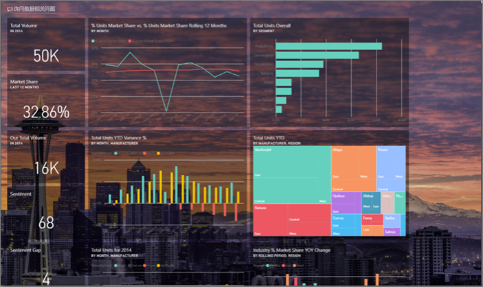
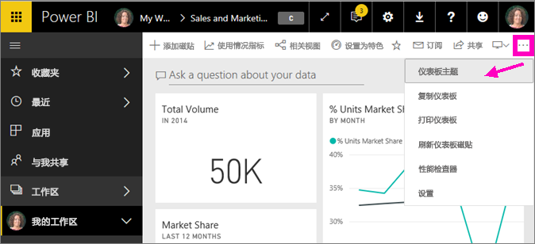
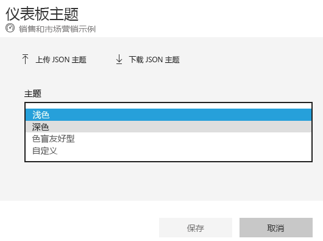
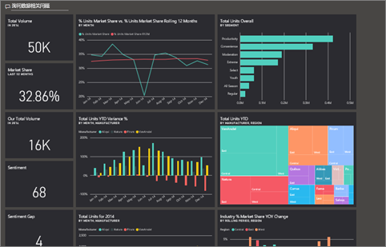
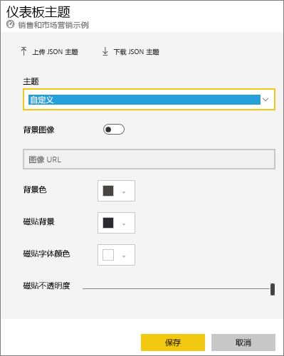
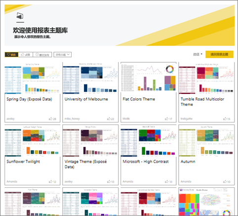
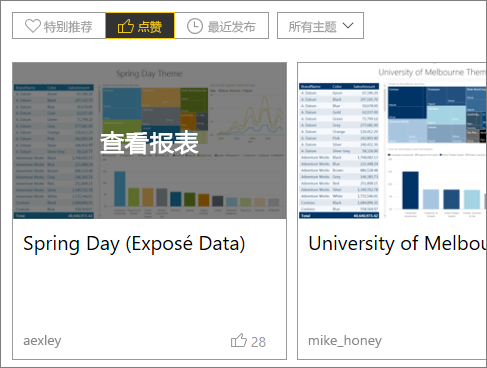
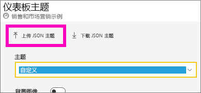
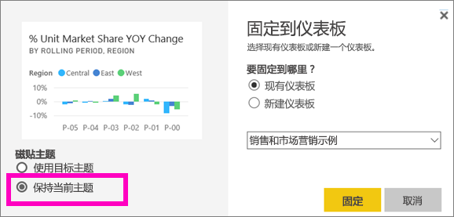
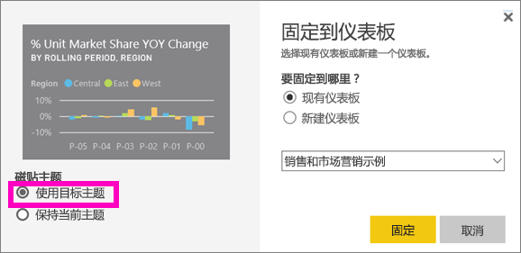

# 在 Power BI 服务中使用仪表板主题
借助“仪表板主题”，可以将颜色主题应用于整个仪表板，如企业品牌颜色、流行色或可能要应用的其他任何颜色主题。 应用“仪表板主题”时，仪表板中的所有视觉对象都会使用选定主题中的颜色（少数例外情况除外，本文稍后将进行介绍）。

更改仪表板上报表视觉对象的颜色，不会影响报表中的视觉对象。 此外，固定来自[已应用报表主题](desktop-report-themes.md)的报表的磁贴时，可以选择保留当前主题或使用仪表板主题。

## 先决条件
* 要继续学习，请打开[销售和市场营销示例仪表板](sample-datasets.md)。

## 仪表板主题的工作原理
首先，打开你创建（或拥有编辑权限）且想进行自定义的仪表板。 选择省略号 (...)，然后选择“仪表板主题”。 

在显示的仪表板窗格中，选择某个预构建的主题。  在下面的示例中，我们选择了“深色”。

## 创建自定义主题

Power BI 仪表板的默认主题是“浅色”。 如果想要自定义颜色或创建自己的主题，请在下拉列表中选择“自定义”。 

使用自定义选项创建自己的仪表板主题。 如果要添加背景图像，建议图像分辨率至少为 1920x1080。 若要使用某个图像作为背景，请将该图像上传到公共网站、复制 URL，并将其粘贴到“图像 URL”字段。 

### 使用 JSON 主题
创建自定义主题的另一种方法是上传这样的 JSON 文件：它包含要用于仪表板的所有颜色的设置。 在 Power BI Desktop 中，报表创建者使用 JSON 文件[为报表创建主题](desktop-report-themes.md)。 可为仪表板上传这些 JSON 文件，或者在 Power BI 社区的[主题库页](https://community.powerbi.com/t5/Themes-Gallery/bd-p/ThemesGallery)中查找并上传 JSON 文件 

还可将自定义主题另存为 JSON 文件，然后将其与其他仪表板创建者共享。 

### 使用主题库中的主题

就像内置和自定义选项一样，上传主题后，将自动对仪表板上的所有磁贴应用颜色。 

1. 将鼠标悬停在某个主题上，然后选择“查看报表”。

    

2. 向下滚动并查找 JSON 文件的链接。  选择下载图标并保存文件。

    

3. 返回 Power BI 服务，在自定义仪表板主题窗口中，选择“上传 JSON 主题”。

    

4. 导航到保存 JSON 主题文件的位置并选择“打开”。

5. 在仪表板主题页上，选择“保存”。 将向仪表板应用新主题。

    

## 注意事项和限制

* 如果报表使用的主题和仪表板主题不同，你可以控制视觉对象是保留当前主题还是使用仪表板主题，使来自各个源的视觉对象实现主题一致性。 将磁贴固定到仪表板时，若要保留报表主题，请选择“保留当前主题”。 仪表板上的视觉对象将保留报表主题（包括透明度设置）。 

    仅当你在 Power BI Desktop 中创建了报表、[添加了报表主题](desktop-report-themes.md)，并将报表发布到 Power BI 服务时，才会看到“磁贴主题”选项。 

    

    请尝试重新固定磁贴并选择“使用仪表板主题”。

    

* 不能对已固定的实时报表页、iframe 磁贴、SSRS 磁贴、工作簿磁贴或映像应用仪表板主题。
* 可以在移动设备上查看仪表板主题，但只能在 Power BI 服务中创建仪表板主题。 
* 仪表板自定义主题仅适用于从报表中固定的磁贴。 

