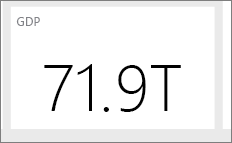

# 设计出色 Power BI 仪表板的提示
现在，你已创建了一个仪表板并添加了一些磁贴，可考虑如何使你的仪表板不仅美观，而且实用。 一般来说，这意味着突出显示最重要的信息，使其整洁有序。

以下是一些提示。

> [!TIP]
> 许多报表的设计原则也适用于仪表板。  阅读我们的白皮书[报表和可视化效果的最佳设计原则](power-bi-visualization-best-practices.md)。
> 
> 

### 考虑受众
可帮助他们做决定的关键指标是什么？ 将如何使用仪表板？ 何种习得设定或文化设定可能会影响设计选择？ 你的受众需要哪些信息才能成功？

请记住，仪表板是一个概览，一个用于监视数据当前状态的单一区域。 仪表板以基础报表和数据集为基础，并且报表和数据集可包含大量详细信息。 读者可从你的仪表板深入了解报表。 因此不要在仪表板上放置详细信息，除非该信息是你的读者监视所需。

将在什么位置显示仪表板？ 如果将在大型监视器上显示，你可在其上放置更多内容。 如果读者将在其平板电脑上查看它，则更少的磁贴将更具可读性。

### 呈现一个情景，并将其保持在一个屏幕
由于仪表板旨在一目了然地显示重要信息，因此最好在一个屏幕上显示所有磁贴。 你是否可以在你的仪表板上避免使用滚动条？

仪表板太杂乱？  删除可以轻松读取和解释的基本信息以外的所有信息。

### 利用全屏模式
[全屏](service-fullscreen-mode.md)显示仪表板，避免干扰。

### 让最重要的信息以最大字体显示
如果仪表板上的文本和可视化效果大小相同，你的读者会很难将重点放在最重要的信息上。 例如，卡片可视化效果是突出显示重要数字的好办法：  

但请务必提供上下文。  

了解有关[仅使用一个数字创建磁贴](power-bi-visualization-card.md) 的信息。

### 将最重要的信息置于顶部角落
大多数人会从上到下阅读，因此将最高级别的详细信息置于顶部，并在你以受众阅读的方向移动时显示更多详细信息（从左到右、从右到左）。

### 对数据使用适当的可视化效果并设置其格式以方便阅读
避免出于多样性的目的而使可视化效果多样。  可视化效果应对图片润色，且应易于“阅读”和解释。  对于某些数据和可视化效果，简单的图形可视化就足够了。 但其他数据可能会要求更复杂的可视化效果 - 确保使用标题和标签以及其他自定义来帮助读者。  

* [选择适当的数据可视化效果](http://blogs.msdn.com/b/microsoft_business_intelligence1/archive/2012/10/08/best-practices-in-data-visualization.aspx)。 请谨慎使用扭曲实体的图表，即三维图表。 请记住，对人脑来说，很难解释圆形形状。 饼图、环形图、仪表以及其他圆形的图表类型可能看起来相当美观，但它们不是最佳的数据可视化效果。
* 与轴上的图表比例、图表维序，以及用于图表内维度值的颜色保持一致。
* 务必恰当地对定量数据进行编码。 显示数字时，不要超过三个或四个数字。 对小数点左侧的一个或两个数字显示度量值并显示千或百万的单位，即 3.4 百万，而不是 3,400,000。
* 不要混合精度和时间的级别。 确保时间范围易于理解。  不要将上个月的图表置于该年度特定月份的已筛选图表旁。
* 不要在同一比例上（如在折线图或条形图上）混合大度量值和小度量值。  例如，一个度量值可能以百万计，其他度量值则以千计。  使用这种大比例，很难看出以千计的度量值的差异。  如果需要混合，则选择一个允许使用第二个轴的可视化效果。
* 不要使用不需要的数据标签打乱图表。 条形图中的值通常易于了解，不显示实际数。
* 请注意如何[对图表进行排序](power-bi-report-change-sort.md)。  如果你想要将注意点放在最高或最低的数字，则通过度量值进行排序。  如果希望用户能够在许多其他类别中快速找到特定类别，则按轴进行排序。  
* 如果类别少于八个，则饼图最佳。 由于不能并排比较值，所以在饼图中的比较值要比在条形图和柱形图中比较值更难。 饼图有助于查看部分对整体的关系，而不利于将部分进行比较。 仪表盘则非常适合用于在目标上下文中显示当前状态。

有关更多可视化效果特定指南，请参阅 [Power BI 中的可视化效果类型](power-bi-visualization-types-for-reports-and-q-and-a.md)。  

## 了解更多关于最佳仪表板设计的信息
若要掌握设计出色仪表板的技术，建议了解视觉感知的基本 Gestalt 原则以及清楚传达上下文中可操作信息的方法。 幸运的是，我们的博客中已分散有大量广泛可用的资源。 一些我们最喜爱的书籍有：

* *Information Dashboard Design* ，Stephen Few 著  
* *Show Me the Numbers* ，Stephen Few 著  
* *Now You See It* ，Stephen Few 著  
* *Envisioning Information* ，Edward Tufte 著  
* *Advanced Presentations* ，Andrew Abela 设计   

## 后续步骤
[Power BI 中的仪表板](service-dashboards.md)  
[Power BI - 基本概念](service-basic-concepts.md)  
更多问题？ [尝试参与 Power BI 社区](http://community.powerbi.com/)

