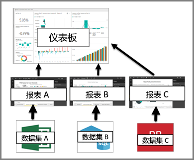

# Power BI 服务中的仪表板

Power BI ***仪表板***是单个页面，通常称为画布，使用可视化效果来讲述故事。 因为它被限制为一页，精心设计的仪表板仅包含该故事的最重要元素。

你在仪表板上看到的可视化效果称为磁贴，并且固定到报表中的仪表板。 如果不熟悉 Power BI，可以通过阅读 [Power BI 基本概念](service-basic-concepts.md)详细了解基础知识。

> [!NOTE]
> 仪表板是 Power BI 服务的一项功能，在 Power BI Desktop 中不可用。 无法在移动设备上创建仪表板，但可以[查看和共享](mobile-apps-view-dashboard.md)。
> 
> 

仪表板上的可视化效果来自报表，并且每个报表基于一个数据集。 事实上，一种想到仪表板的方法就是进入基础报表和数据集。 选择一个可视化效果可将你转到用于创建仪表板的报表（和数据集）。

## 仪表板的优点
仪表板是监控你的业务、寻找答案以及查看所有最重要指标的绝佳方法。 仪表板上的可视化效果可能来自一个或许多个基础数据集，也可能来自一个或多个基础报表。 仪表板将本地数据和云数据合并到一起，提供合并视图（无论数据源自哪里）。

仪表板不仅仅是一张漂亮的图片；它具有高度互动性和高度可定制性，并且磁贴随着基础数据的更改而更新。

## 仪表板与报表
[报表](service-reports.md)经常与仪表板混淆，因为它们也是填充可视化效果的画布。 但它们存在一些主要差异。

| **功能** | **仪表板** | **报表** |
| --- | --- | --- |
| 页面 |一个页面 |一个或多个页面 |
| 数据源 |每个仪表板的一个或多个报表和一个或多个数据集 |每个报表的单个数据集 |
| 可用于 Power BI Desktop |否 |是，可以在 Desktop 中创建和查看报表 |
| 固定 |只能将现有的可视化效果（磁贴）从当前仪表板固定到其他仪表板 |可以将可视化效果（作为磁贴）固定到任何仪表板。 可以将整个报表页面固定到任何仪表板。 |
| 订阅 |无法订阅仪表板 |可以订阅报表页面 |
| 筛选 |无法筛选或切片 |许多不同的方式来筛选、突出显示和切片 |
| 设置警报 |当满足某些条件时，可以创建警报以向你发送电子邮件 |否 |
| 功能 |可以将一个仪表板设置为“精选”仪表板 |无法创建精选报表 |
| 自然语言查询 |从仪表板可用 |从报表不可用 |
| 可以更改可视化效果类型 |不行。 事实上，如果报表所有者更改报表中的可视化效果类型，那么仪表板上的固定可视化效果不会更新 |是 |
| 可以看到基础数据集表和字段 |不行。 可以导出数据，但看不到仪表板本身的表和字段。 |是的。 可以查看数据集表和字段以及值。 |
| 可以创建可视化效果 |仅限于使用“添加磁贴”向仪表板添加小部件 |可以通过“编辑”权限创建许多不同类型的视觉对象、添加自定义视觉对象、编辑视觉对象等 |
| 自定义 |可以通过移动和排列、调整大小、添加链接、重命名、删除和显示全屏等可视化效果（磁贴）来进行自定义。 但是数据和可视化效果本身是只读的。 |在“阅读”视图中，你可以发布、嵌入、筛选、导出、下载为 .pbix，查看相关内容，生成 QR 码，在 Excel 中进行分析等。  在“编辑”视图中，你可以执行目前为止所提到的一切操作，甚至更多操作。 |

## 仪表板创建者和仪表板使用者
根据你的角色，你可能会创建仪表板供你自己使用或与同事共享。 你想了解如何创建和共享仪表板。 或者，你可能会从其他人那里接收仪表板。 你想要了解如何了解并与仪表板进行交互。

以下是一些按角色提供的主题，可帮助你入门。

共享仪表板和查看共享仪表板都需要 Power BI Pro。

### 如果你要创建和共享仪表板
* 使用我们其中一个示例[从报表创建仪表板](service-dashboard-create.md)。
* 了解[仪表板磁贴](service-dashboard-tiles.md)以及将其固定到仪表板的所有不同方式。
* 通过创建与[问答自然语言查询](service-prepare-data-for-q-and-a.md)和[快速见解](service-insights-optimize.md)良好结合的仪表板帮助你的仪表板使用者。
* 发现你可以[与同事共享仪表板](service-how-to-collaborate-distribute-dashboards-reports.md)的所有不同方式。

### 如果你要接收和使用仪表板
* 通过参观我们的[示例仪表板](sample-tutorial-connect-to-the-samples.md)之一，轻松了解仪表板的使用。
* 了解[仪表板磁贴](service-dashboard-tiles.md)，以及当你选择一个磁贴时将发生的情况。
* 不喜欢仪表板的外观？  你可以[调整大小、移动和重命名磁贴](service-dashboard-edit-tile.md)。
* 想要跟踪单个仪表板磁贴并在该磁贴达到某个阈值时接收电子邮件？ [在磁贴上创建警报](service-set-data-alerts.md)。
* 随时询问你的仪表板相关问题。 了解如何使用 [Power BI 问答](power-bi-tutorial-q-and-a.md)询问有关你的数据的问题，并以可视化效果的形式获得答案。

> [!TIP]
> 如果在此处未找到你所查找的内容，请使用左侧的“目录”。
> 
> 

## 后续步骤
[Power BI 入门](service-get-started.md)  
[Power BI - 基本概念](service-basic-concepts.md)  
[Power BI Premium 有哪些特权？](service-premium.md)  

更多问题？ [尝试咨询 Power BI 社区](http://community.powerbi.com/)

