# 在 Power BI 服务中删除几乎所有内容
本文介绍如何在 Power BI 服务中删除仪表板、报表、工作簿、数据集、应用、可视化效果和工作区。

## 删除仪表板
可以删除仪表板。 删除仪表板不会删除基础数据集或与该仪表板相关联的任何报表。

* 如果你是仪表板的所有者，则可以将其删除。 如果已经与同事共享了仪表板，则从 Power BI 工作区中删除仪表板将删除他们的 Power BI 工作区中的该仪表板。
* 如果别人与你共享了仪表板，而你不想再看到它，你可以删除它。  删除仪表板不会从其他任何人的 Power BI 工作区将它删除。
* 如果仪表板是[组织内容包](service-organizational-content-pack-disconnect.md)的一部分，将其删除的唯一方法是删除关联的数据集。

### 删除仪表板
1. 在工作区中，选择“仪表板”选项卡。
2. 找到要删除的仪表板并选择“删除”图标。 。

    

## 删除报表
别担心，删除报表不会删除报表所基于的数据集。  从报表固定的任何可视化效果也安全 - 它们将保留在仪表板上，直到你将它们单独删除。

### 删除报表
1. 在“我的工作区”中，选择“报表”选项卡。
2. 找到要删除的报表并选择“删除”图标。   。   

    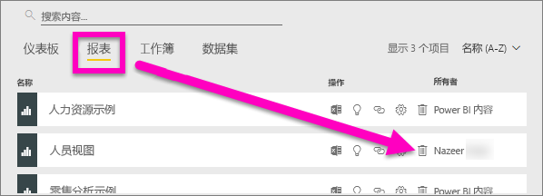
3. 确认删除。

   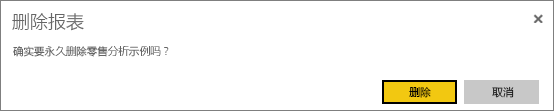

   > [!NOTE]
   > 如果报表是[内容包](service-organizational-content-pack-introduction.md)的一部分，将无法使用此方法将其删除。  请参阅[删除与组织内容包的连接](service-organizational-content-pack-disconnect.md)。
   >
   >

## 删除工作簿
可以删除工作簿。 但是，删除工作簿同时还会删除包含此工作簿数据的所有报表和仪表板磁贴。

如果工作簿存储在 OneDrive for Business 上，则从 Power BI 中删除时并不会从 OneDrive 中删除它。

### 删除工作簿
1. 在“我的工作区”中，选择“工作簿”选项卡。
2. 找到要删除的工作簿并选择“删除”  图标。

    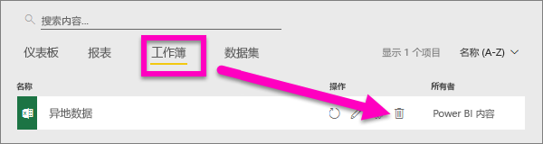
3. 确认删除。

   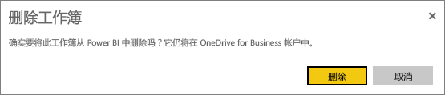

## 删除数据集
可以删除数据集。 但是，删除数据集同时还会删除包含此数据集数据的所有报表和仪表板磁贴。

如果数据集是一个或多个[组织内容包](service-organizational-content-pack-disconnect.md)的一部分，则删除它的唯一方式是从使用它的内容包中将其移除，等待它进行处理，然后重试删除。

### 删除数据集
1. 在“我的工作区”中，选择“数据集”选项卡。
2. 找到要删除的数据集并选择省略号 (...)。  

    
3. 从下拉列表中，选择“删除”。

   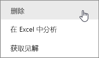
4. 确认删除。

   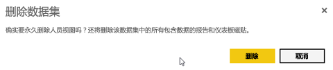

## 删除应用工作区
> [!WARNING]
> 创建应用工作区后，将创建 Office 365 组。 删除应用工作区后，将删除相应的 Office365 组。 也就是说，组也会从 SharePoint 和 Microsoft Teams 等其他 O365 产品中删除。
>
>

作为应用工作区作者，你可以将其删除。 删除它时，如果已将应用发布到整个组织，则同时还会删除所有组成员的关联应用并从你的 AppSource 中删除。 删除应用工作区不同于离开应用工作区。

### 以管理员身份删除应用工作区
1. 从左侧导航栏中选择“工作区”

    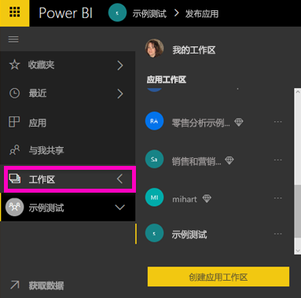
2. 选择要删除的工作区右侧的省略号 (...)，然后选择“编辑工作区”。

   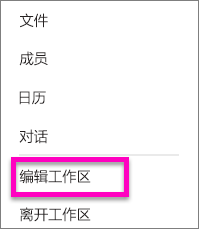
3. 在“编辑工作区”窗口中，选择“删除工作区” > “删除”。

    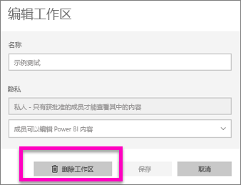

### 从列表中删除应用工作区
如果你不想再成为应用工作区的成员，可以“离开”它，它将从你的列表中删除。 离开工作区对于所有其他工作区成员不会有任何影响。  

> [!IMPORTANT]
> 如果你是应用工作区的唯一管理员，Power BI 将不允许你离开。
>
>

1. 从你想要删除的应用工作区中开始。
2. 在右上角，选择省略号 (...)，然后选择“离开工作区” > “离开”。

      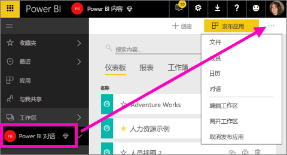

   > [!NOTE]
   > 在下拉列表中看到的选项取决于你是该应用工作区的管理员还是成员。
   >
   >

## 删除应用
可以轻松地从应用列表页删除应用。 但只有应用管理员才可以永久删除应用。

### 从你的应用列表页删除应用
从你的应用列表页删除应用不会删除其他成员的应用。

1. 在左侧导航栏中选择“应用”以打开应用列表页。
2. 将鼠标悬停在要删除的应用上，然后选择“删除” 图标。

   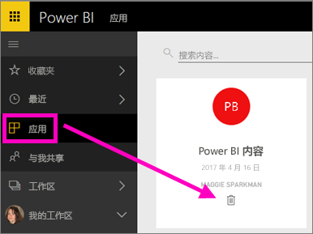

   如果意外删除应用，你有多种选项可以进行恢复。  可以要求应用创建者重新发送，可以找到带应用链接的原始电子邮件，可以检查[通知中心](service-notification-center.md)以查看是否仍列有该应用的通知，或者可以查看组织的 [AppSource](service-install-use-apps.md)。

## 注意事项和疑难解答
本文介绍如何删除 Power BI 服务的主要构建基块。 但你可以在 Power BI 中删除更多内容。  

* [删除精选仪表板](service-dashboard-featured.md#change-the-featured-dashboard)
* [删除（取消收藏）仪表板](service-dashboard-favorite.md)
* [删除报表页](service-delete.md)
* [删除仪表板磁贴](service-dashboard-edit-tile.md)
* [删除报表可视化效果](service-delete.md)

更多问题？ [尝试参与 Power BI 社区](http://community.powerbi.com/)
