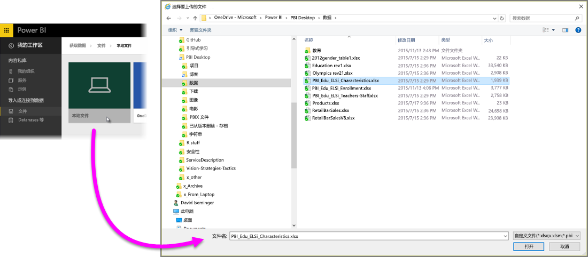
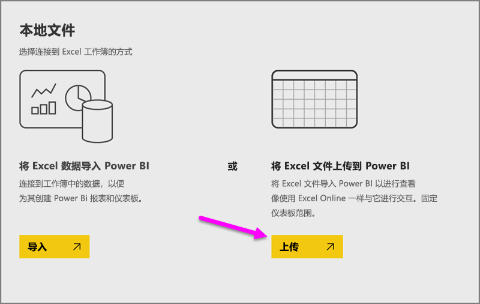

# 从 Excel 工作簿文件中获取数据

Microsoft Excel 是使用最广泛的企业应用程序之一。 也是将数据导入 Power BI 的最常见方式之一。

## Power BI 支持哪些类型的工作簿？
Power BI 支持导入或连接至在 Excel 2007 和更高版本中创建的工作簿。 工作簿必须另存为 .xlsx 或 .xlsm 文件类型，并且小于 1 GB。 本文中所述的某些功能仅在更高版本的 Excel 中可用。

### 具有数据范围或数据表的工作簿
如果你的工作簿中包含具有数据范围的简单工作表，则要在 Power BI 中充分利用你的数据，请务必将这些范围格式化为表。 这样一来，在 Power BI 中创建报表时，你将会在“字段”窗格中看到已命名的表和列，从而更轻松地实现数据可视化。

### 具有数据模型的工作簿
工作簿可以包含一个通过使用链接表 Power Query（Excel 2016 中的获取并转换）或 Power Pivot 加载一个或多个数据表的数据模型。 Power BI 支持所有数据模型属性，如关系、度量、层次结构和 KPI。

> [!NOTE]
> 无法在 Power BI 租户中共享具有数据模型的工作簿。 例如，使用 *contoso.com* 帐户登录到 Power BI 的用户不能与使用 Power BI 登录帐户从 *woodgrovebank.com* 登录的用户共享 Excel 工作簿。
> 
> 

### 具有与外部数据源的连接的工作簿
如果使用 Excel 连接到外部数据源，则工作簿位于 Power BI 中后，你可以基于来自该连接数据源的数据创建报表和仪表板。 此外，你还可以将计划刷新设置为自动将权限连接到数据源并获取更新。 你将不再需要通过 Excel 中的“数据”功能区手动刷新。 将会基于该数据源中的数据自动更新仪表板报表和磁帖中的任意可视化对象。 若要了解详细信息，请参阅 [Power BI 中的数据刷新](refresh-data.md)。

### 具有 Power View 表、数据透视表和图表的工作簿
PowerView 表和数据透视表以及图表在 Power BI 中是否会显示取决于工作簿文件的保存位置以及你选择将其导入 Power BI 的方式。 下面我们将进行详细说明。

## 数据类型
Power BI 支持以下数据类型：整数、十进制数、货币、日期、True/False、文本。 将数据标记为 Excel 中的特定数据类型将改善 Power BI 体验。

## 为 Power BI 准备工作簿
观看此有用的视频，了解有关如何确保为 Power BI 准备好 Excel 工作簿的详细信息。

<iframe width="500" height="281" src="https://www.youtube.com/embed/l2wy4XgQIu0" frameborder="0" allowfullscreen></iframe>

## 保存工作簿文件的位置不同会有所差异
**本地** - 如果你将工作簿文件保存到计算机上的本地驱动器或组织中的其他位置，则你可以将文件加载到 Power BI。 你的文件实际上一直保存在本地驱动器中，因此整个文件并未真正导入到 Power BI。 实际上，在 Power BI 中创建的新数据集以及工作簿中的数据和数据模型（如果有）将加载到数据集中。 如果你的工作簿具有任何 Power View 工作表，则这些工作表会显示在你的 Power BI 网站中的“报表”下。 Excel 2016 还有**发布**功能（在“文件”菜单下）。 使用**发布**实际上与通过 Power BI 使用“获取数据 > 文件 > 本地文件”相同，但是，如果你定期对工作簿进行更改，则前者通常能更轻松地在 Power BI 中更新数据集。

**OneDrive - 企业** – 如果你有 OneDrive for Business，并且使用登录 Power BI 的同一帐户登录到其中，这是将 Excel 中的工作与你在 Power BI 中的数据集、报表和仪表板保持同步的有史以来最有效的方法。由于 Power BI 和 OneDrive 都位于云中，Power BI 大约每小时会连接你在 OneDrive 上的工作簿文件一次。 如果发现任何更改，你的数据集、报表和仪表板会在 Power BI 中自动更新。 就像你将工作簿保存到本地驱动器中一样，你还可以使用“发布”立即更新 Power BI 中的数据集和报表；否则 Power BI 将自动同步（通常在一小时之内）。

**OneDrive - 个人** – 如果你将工作簿文件保存到你自己的 OneDrive 帐户，你会像使用 OneDrive for Business 那样获得很多相同优势。 最大的不同之处在于，当你首次连接至你的文件（使用“获取数据 > 文件 > OneDrive – 个人”）时，你将需要使用 Microsoft 帐户登录 OneDrive，这通常与你用于登录 Power BI 的帐户不同。 当使用你的 Microsoft 帐户登录 OneDrive 时，请务必选择“使我保持登录状态”选项。 这样一来，Power BI 将能够大约每小时连接你的工作簿文件一次，并确保你在 Power BI 中的数据集和报表同步。

**SharePoint 团队网站** – 将 Power BI Desktop 文件保存到 SharePoint 团队网站与保存到 OneDrive for Business 大致相同。 最大的区别是你从 Power BI 连接到文件的方式。 你可以指定一个 URL 或连接到根文件夹。

## 一个 Excel 工作簿 – 两种使用方式
如果你将工作簿文件保存到 **OneDrive**，则你可以通过多种方式了解你在 Power BI 中的数据

### 将 Excel 数据导入到 Power BI
当你选择“导入”时，表和/或数据模型中支持的任何数据将导入到 Power BI 中的新数据集中。 如果你有任何 Power View 工作表，将作为报表在 Power BI 中重新创建。

你可以继续编辑工作簿。 保存所做的更改后，它们将与 Power BI 中的数据集同步（通常大约在一小时之内）。 如果你需要更即时地满足需求，只需再次单击“发布”，而所做的更改便会立即导出。 同样，也会更新报表和仪表板中的任何可视化效果。

如果你已使用“获取并转换数据”或 Power Pivot 将数据加载到数据模型中，或者如果你的工作簿的 Power View 表中包含你想要在 Power BI 中查看的可视化对象，请选择此选项。

在 Excel 2016 中，你还可以使用“发布 > 导出”。 几乎是相同的操作。 若要了解详细信息，请参阅[从 Excel 2016 发布到 Power BI](service-publish-from-excel.md)。

### 在 Power BI 中连接、管理和查看 Excel
当你选择“连接”时，你的工作簿将显示在 Power BI 中，就像在 Excel Online 中那样。 但与 Excel Online 不同，你会有一些出色的功能，可帮助你将各元素从你的工作表固定仪表板中。

不能在 Power BI 中编辑你的工作簿。 但是，如果你需要进行一些更改，你可以单击“编辑”，然后选择在 Excel Online 中编辑你的工作簿或在计算机上的 Excel 中打开工作簿。 你所作的任何更改都会保存到 OneDrive 上的工作簿中。

当选择这种方式时，不会在 Power BI 中创建任何数据集。 你的工作簿将显示在 Power BI 工作区导航窗格中的“报表”下。 已连接的工作簿具有特殊的 Excel 图标。

如果你只在工作表中有数据，或者具有要固定到仪表板的范围、数据透视表和图表，请选择此选项。

在 Excel 2016 中，你还可以使用“发布 > 上传”。 几乎是相同的操作。 若要了解详细信息，请参阅[从 Excel 2016 发布到 Power BI](service-publish-from-excel.md)。

## 从 Power BI 导入或连接到 Excel 工作簿
1. 在 Power BI 的导航窗格中，单击“获取数据”。
   
   
2. 在“文件”中，单击“获取”。
   
   
3. 查找你的文件。
   
   
4. 如果工作簿文件位于 OneDrive 或 SharePoint-团队网站，请选择“导入”或“连接”。

## 本地 Excel 工作簿
你还可以使用本地 Excel 文件，并将其上传到 Power BI。 只需从上一个菜单中选择“本地文件”，然后导航到保存 Excel 工作簿的位置。

选择后，选择将你的文件上传到 Power BI。

上传你的工作簿后，你会看到一条通知，说明工作簿已经准备就绪。

准备就绪后，你可以在 Power BI 的“报表”部分找到该工作簿。

## 从 Excel 2016 发布到 Power BI 网站
使用 Excel 2016 中的**发布到 Power BI** 功能实际上与使用 Power BI 中的“获取数据”导入或连接到你的文件相同。 我们在此将不会进行详细介绍，但你可以查看[从 Excel 2016 发布到 Power BI](service-publish-from-excel.md) 了解详细信息。

## 故障排除
工作簿文件太大？ 查阅[减小 Excel 工作簿的大小以便在 Power BI 中进行查看](reduce-the-size-of-an-excel-workbook.md)。

目前，当你选择“导入”时，Power BI 只会导入属于已命名表或数据模型的数据。 因此，如果工作簿不包含已命名表、Power View 表或 Excel 数据模型，你可能会看到如下错误：“我们在 Excel 工作簿中找不到任何数据”。 [本文](service-admin-troubleshoot-excel-workbook-data.md)介绍如何修复你的工作簿，然后重新导入。

## 后续步骤
**浏览你的数据** - 将文件中的数据和报表导入到 Power BI 后，就可以浏览文件了。 只需右键单击新的数据集，然后单击“浏览”。 如果你在步骤 4 中选择连接到 OneDrive 上的工作簿文件，你的工作簿将显示在报表中。 单击工作簿时，它将在 Power BI 中打开，就像在 Excel Online 中一样。

**计划刷新** - 如果你的 Excel 工作簿文件连接到外部数据源，或你从本地驱动器导入，你可以设置计划刷新，以确保你的数据集或报表始终为最新。 在大多数情况下，设置计划刷新非常容易，但本文不会进行详细介绍。 若要了解详细信息，请参阅 [Power BI 中的数据刷新](refresh-data.md)。

[从 Excel 2016 发布到 Power BI](service-publish-from-excel.md)

[Power BI publisher for Excel](publisher-for-excel.md)

[Power BI 中的数据刷新](refresh-data.md)

