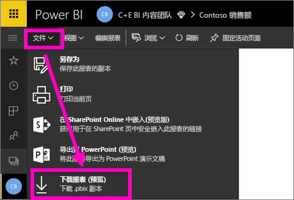
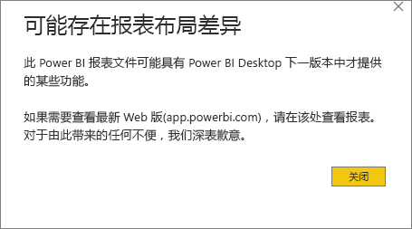
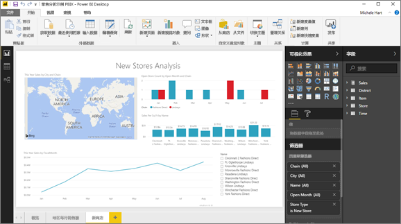

# 将报表从 Power BI 服务导出到 Power BI Desktop（预览）
在 Power BI Desktop 中，可以通过保存报表并选择“ **发布** ”来导出（也称为“ *下载* ”）报表至 Power BI 服务。 也可以从其他方向导出，并将报表从 Power BI 服务下载至 Desktop。 无论导出方向如何，导出文件的扩展名都是 .pbix。

有几个需要牢记的限制和注意事项，将稍后在本文中讨论。

## 下载 .pbix 报表
若要下载 .pbix 文件，请执行以下步骤：

1. 在 **Power BI 服务**的[编辑视图](service-reading-view-and-editing-view.md)中，打开要下载的报表。
2. 在菜单栏中，依次选择**“文件”>“下载报表”**。
   
   > [!NOTE]
   > 只能下载在 2016 年 11 月 23 日后[使用 Power BI Desktop 创建](guided-learning/publishingandsharing.yml#step-2)和更新的报表。 否则，Power BI 服务中的“ *下载报表* ”菜单选项为灰显。
   > 
   > 
3. 在创建 .pbix 文件的同时，系统会显示状态横幅来提示你进度。 在文件就绪后，系统会提示你打开或保存此 .pbix 文件。 文件名与报表名相匹配。
   
    
   
    现在可以选择在 Power BI 服务 (app.powerbi.com) 或 Power BI Desktop 中打开.pbix 文件。     
4. 若要立即在 Desktop 中打开报表，请选择“打开”。 若要将文件保存到特定位置，请依次选择“保存”>“另存为”。 如果尚未准备好，请[安装 Power BI Desktop](desktop-get-the-desktop.md)。
   
    在 Desktop 中打开报表时，可能会看到警告消息，告知你在 Power BI 服务报表中提供的某些功能在 Desktop 中可能不可用。
   
    

5. Power BI Desktop 中的报表编辑器与 Power BI 服务中的报表编辑器非常相似。  
   
    

## 注意事项和疑难解答
从 Power BI 服务下载（导出）*.pbix* 文件时，须遵循几个重要的注意事项和限制。

* 若要下载文件，必须具有编辑报表的权限
* 报表必须使用 Power BI Desktop 创建，且必须在 Power BI 服务中发布。或者，必须已将 .pbix 文件上载到 Power BI 服务中。
* 报表的发布或更新日期必须晚于 2016 年 11 月 23 日。 在该日期前发布的报表无法下载。
* 此功能对最初在 **Power BI 服务**中创建的报表及内容包均不适用。
* 应始终使用 **Power BI Desktop** 的最新版本打开下载的文件。 在 **Power BI Desktop** 的非当前版本中可能无法打开下载的 *.pbix* 文件。
* 如果你的管理员已关闭了导出数据的功能，则该功能在 **Power BI 服务**中将不可见。

## 后续步骤
查看有关此功能的 **Guy in a Cube** 一分钟视频：

<iframe width="560" height="315" src="https://www.youtube.com/embed/ymWqU5jiUl0" frameborder="0" allowfullscreen></iframe>

此外，还有一些其他文章，可帮助你了解如何使用 **Power BI 服务**：

* [Power BI 中的报表](service-reports.md)
* [Power BI - 基本概念](service-basic-concepts.md)

一旦安装了 **Power BI Desktop**，以下内容可帮助你快速启动和运行：

* [Power BI Desktop 入门](desktop-getting-started.md)

更多问题？ [尝试参与 Power BI 社区](http://community.powerbi.com/)   

