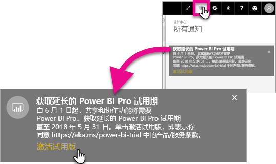

# 激活延长的专业版试用期
自 2017 年 6 月 1 日起，所有符合资格的用户都可选择延长 Power BI 服务的 Pro 试用期。

<iframe width="640" height="360" src="https://www.youtube.com/embed/tPsNoPyY9aA?showinfo=0" frameborder="0" allowfullscreen></iframe>

在 [2017 年 5 月 3 日 Power BI Premium 公告](https://powerbi.microsoft.com/blog/microsoft-accelerates-modern-bi-adoption-with-power-bi-premium/)中，Microsoft 宣告对免费 Power BI 服务的更改将于 2017 年 6 月 1 日开始生效。 这些更改包括将访问权限扩展到针对所有数据源、提高工作区存储限制以及提高免费服务的刷新率和流式处理速率，使它们具有与 Power BI Pro 相同的标准。

该公告中还宣布共享和协作功能将仅供 Power BI Pro 用户使用，包括对等仪表板共享、组工作区（现在称为应用工作区）、导出到 PowerPoint 和使用 Power BI 应用分析 Excel 中的数据。 导出到 CSV/Excel 和 PowerPoint 是 5 月 3 日公告中指定的 Power BI Pro 独有功能，但在收到大量用户社区的反馈后，这一策略改进为这一功能同样可供免费服务用户使用。

从 2017 年 6 月 1 日开始，在过去一年内保持活动状态的免费服务现有用户（在 2017 年 5 月 2 日或之前）可以享受延长了 12 个月的 Power BI Pro 免费试用优惠。 这个优惠可让用户在下一年中使用 Power BI Pro 的所有功能，这是对社区表示的感谢，也可让用户有时间适应更改。

2017 年 6 月 1 日，有资格的用户将在登录服务时收到通知，告知他们更改已生效，并提示他们注册延长 Power BI Pro 试用期优惠。 用户的 IT 管理员无法控制产品内通知，也不能代表用户注册延长 Power BI Pro 试用期。 每个有资格的用户必须单独完成这一过程。

用户可选择在 12 个月内的任意时间注册优惠，但无论何时接受优惠，延长 Pro 试用期都将于 2018 年 5 月 31 日结束，对任何用户都是如此。 届时用户可以选择购买 Power BI Pro，如果选择不采取行动并且不购买 Power BI Pro，将转换为没有共享和协作功能的 Power BI 免费版本。

Power BI Pro 没有任何更改。 2017 年 6 月 1 日及之后登陆服务的用户不会受到任何影响，也不会收到通知。 拒绝延长 Power BI Pro 试用期优惠的用户或者不符合资格享受优惠的用户将会继续使用没有共享和协作功能的 Power BI 免费版本。 用户随时都可通过访问 Power BI [网站](https://powerbi.microsoft.com/get-started/)注册标准的 60 天 Power BI Pro 试用期。

## 延长 Pro 试用期的资格
帐户必须满足以下要求才有资格享受延长 Pro 试用期优惠。

* 2016 年 5 月 3 日与 2017 年 5 月 2 日之间的 Power BI（免费）活动用户有资格延长 Pro 试用期。
* 以前曾使用或目前正在使用 60 天产品内 Pro 试用期的用户仍然有资格延长 Pro 试用期。

> [!NOTE]
> 通过 Office 365 内的 Power BI Pro 或 Power BI Pro 试用订阅获得许可证的用户无法享受此优惠。
> 
> 

## 如何激活
有两种方法可激活延长 Pro 试用期。 第一种是在登录 Power BI 时激活。 如果错过了该时机，还可以在通知区域内看见这个选项。

> [!NOTE]
> 产品内通信不受管理员控制，将发送给有资格的用户。
> 
> 

### 登录时的体验
在登录 Power BI 服务时，有资格的用户会看到一个弹出通知。 选择“激活试用期”将会开始延长 Pro 试用期。 不需要任何进一步的操作。

然后，在试用期内，用户能够访问所有现有共享仪表板和报表。

如果选择“暂不激活”，还可以在 2018 年 5 月 31 日试用期结束前的任意时间激活延长 Pro 试用期。

### 以后再激活
如果因选择“暂不激活”而错过了弹出通知，可以在 2018 年 5 月 31 日试用期结束前的任意时间激活延长 Pro 试用期。 可以在“通知中心”完成此操作。

在通知中心，用户将看到有关延长 Pro 试用期的通知。 该通知将在用户消除前持续存在。

在通知内，可以选择“激活试用期”，然后开始试用。 不需要任何进一步的操作。

然后，在试用期内，用户能够访问所有现有共享仪表板和报表。

## 激活后
激活后，将在右上角看到试用期的剩余天数。

可以查看[延长 Pro 试用期优惠条款和条件](https://aka.ms/power-bi-trial)中的条款。 对于所有符合资格的用户，延长 Pro 试用期都将于 2018 年 5 月 31 日结束。

## 常见问题
2017 年 5 月 3 日之后注册的新用户是怎样的情况？

2017 年 5 月 3 日之后注册 Power BI（免费）的用户没有资格延长 Pro 试用期。 但是，他们可以使用标准的 60 天 Pro 试用期。

我如何知道组织中哪些人有资格延长 Pro 试用期？

虽然没有一种直接的甄别方法，但是你可以查看 Azure Active Directory 中针对 Power BI 的集成应用程序报表，从而发现过去 30 天内组织中的活动用户。 这样你可以知道哪些人符合条件。 有关详细信息，请参阅[查找已登录的 Power BI 用户](service-admin-access-usage.md)。

合格期限内且拥有免费许可证的活动用户将收到弹出通知。 

> [!NOTE]
> Azure AD 报表不指示用户在 Power BI 中使用的是免费版还是 Pro。 它只报告哪些用户已登录到 Power BI 及其登录时间。 出现在报表中的用户不一定意味着他们符合延长 Pro 试用期的条件。
> 
> 

管理员可以阻止用户激活延长 Pro 试用期吗？

不行。 管理员无法阻止用户激活延长 Pro 试用期或 Power BI Pro 的服务内 60 天试用期。

## 后续步骤
[延长 Pro 试用期优惠的条款和条件](https://aka.ms/power-bi-trial)  
[适用于个人用户的 Power BI 服务协议](https://powerbi.microsoft.com/terms-of-service/)  
[Power BI Premium 公告](https://aka.ms/pbipremium-announcement)  
[查找已登录的 Power BI 用户](service-admin-access-usage.md)

更多问题？ [尝试咨询 Power BI 社区](https://community.powerbi.com/)

