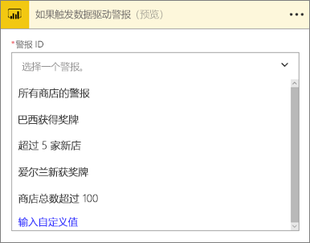
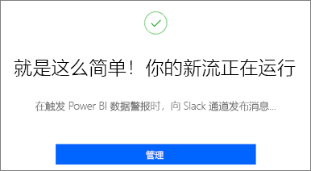
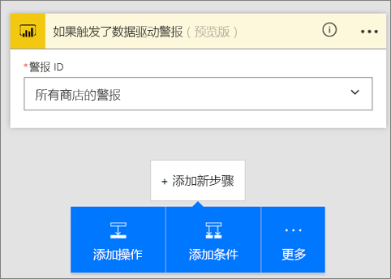
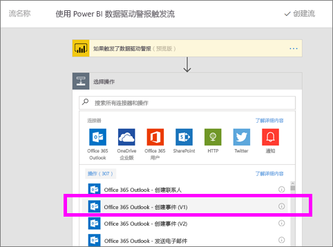
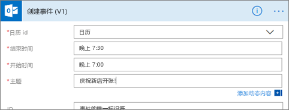
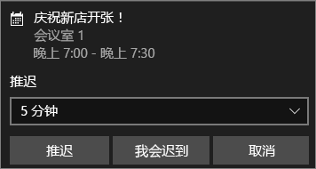

# Microsoft Flow 和 Power BI
## 什么是 Microsoft Flow
[Microsoft Flow](https://flow.microsoft.com/en-us/documentation/getting-started) 是一款跨企业用户依赖的日益增多的应用程序和 SaaS 服务自动执行工作流的 SaaS。 使用 Flow，可以通过集成常用应用和服务（包括 Power BI）来自动执行任务，从而获得通知、同步文件、收集数据等。 借助工作流自动化，执行重复任务不再是难事。

[立即开始使用 Flow。](https://flow.microsoft.com/documentation/getting-started)

观看 Sirui 创建一个 Flow，该 Flow 在 Power BI 警报触发时向同事发送包含详细信息的电子邮件。 然后按照视频下面的分步说明来自己尝试一下。

<iframe width="560" height="315" src="https://www.youtube.com/embed/YhmNstC39Mw" frameborder="0" allowfullscreen></iframe>

## 创建由 Power BI 数据警报触发的流
本教程介绍了如何创建两个不同的流：一个是通过模板创建，另一个是从头开始创建。 若要继续学习本教程，请[在 Power BI 中创建数据警报](service-set-data-alerts.md)，然后[注册 Microsoft Flow](https://flow.microsoft.com/en-us/#home-signup)（此产品免费！）。

## 通过模板创建使用 Power BI 的流
在此任务中，我们将使用模板创建一个由 Power BI 数据警报（通知）触发的简单流。

1. 登录到 Microsoft Flow (flow.microsoft.com)。
2. 选择“**我的流**”。
   
   
3. 选择“**使用模板创建**”。
   
    
4. 在搜索框中查找 Power BI 模板，然后选择“**在 Power BI 数据警报触发时将消息发布到 Slack 通道**”。
   
    
5. 选择“**使用此模板**”。
   
   
6. 如果系统出现提示，请选择“**登录**”，然后按提示操作，从而连接 Slack 和 Power BI。 绿色对勾表明你已登录。  确认连接后，选择“**继续**”。
   
   

### 生成流
此模板包含一个触发器（通知爱尔兰新获奥运会奖牌的 Power BI 数据警报）和一个操作（将消息发布到 Slack）。 在你选择字段的同时，Flow 会显示可以包含的动态内容。  在此示例中，我们将在消息正文中添加磁贴值和磁贴 URL。

1. 在触发器下拉列表中，选择一个 Power BI 数据警报。 选择“**爱尔兰新获奖牌**”。 若要了解如何创建警报，请参阅 [Power BI 中的数据警报](service-set-data-alerts.md)。
   
   
2. 若要向 Slack 发布信息，请输入通道名和消息文本（还可以选择 Flow 创建的默认消息）。 请注意我们已在消息文本字段中添加的动态内容。
   
   > [!NOTE]
   > 在通道名称开头添加“@”。  例如，如果 Slack 通道名为“channelA”，请在 Flow 中输入 “@channelA”。
   > 
   > 
   
   
3. 完成后，选择“创建流”或“保存流”。  此时，系统已创建并计算流。  Flow 会在有错误时提示你。
4. 如果有错误，请选择“**编辑流**”修复错误。如果没有错误，请选择“**完成**”运行这一新流。
   
   
5. 打开你的 Slack 帐户，查看消息。  
   
   

## 从头开始创建使用 Power BI 的 Flow
在此任务中，我们将从头开始创建一个由 Power BI 数据警报（通知）触发的简单流。

1. 登录 Microsoft Flow。
2. 依次选择“我的流” > “从头开始创建”。
   
   
3. 使用搜索框查找 Power BI 触发器，然后选择“使用 Power BI 数据驱动的警报触发流”。

### 生成流
1. 在下拉列表中，选择警报名称。  若要了解如何创建警报，请参阅 [Power BI 中的数据警报](service-set-data-alerts.md)。
   
    
2. 依次选择“**下一步**” > “**添加操作**”。
   
   
3. 搜索 **Outlook**，然后选择“**创建事件**”。
   
   
4. 填写事件字段。 在你选择字段的同时，Flow 会显示可以包含的动态内容。
   
   
5. 完成后，选择“**创建流**”。  此时，Flow 会保存并计算流。 如果没有错误，请选择“**完成**”运行此流。  此时，系统会将这一新流添加到“**我的流**”页中。
   
   
6. 当 Power BI 数据警报触发流时，你会收到如下 Outlook 事件通知。
   
    

### 后续步骤
* [开始使用 Microsoft Flow](https://flow.microsoft.com/en-us/documentation/getting-started/)
* [在 Power BI 服务中设置数据警报](service-set-data-alerts.md)
* [在 iPhone 上设置数据警报](mobile-set-data-alerts-in-the-mobile-apps.md)
* [在适用于 Windows 10 的 Power BI 移动应用中设置数据警报](mobile-set-data-alerts-in-the-mobile-apps.md)
* 更多问题？ [尝试参与 Power BI 社区](http://community.powerbi.com/)

