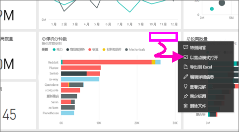
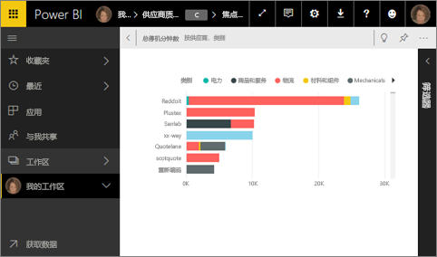
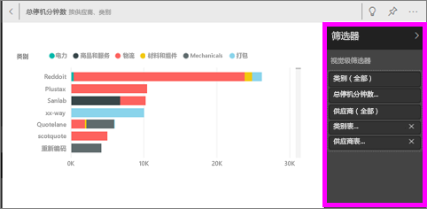
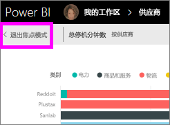
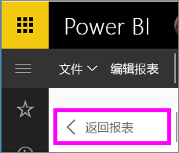

# 在“焦点”模式下显示仪表板磁贴或报表视觉对象

<iframe width="560" height="315" src="https://www.youtube.com/embed/dtdLul6otYE" frameborder="0" allowfullscreen></iframe>

## 什么是焦点模式？

焦点模式使你可以展开（弹出）内容以查看更多详细信息。  在焦点模式下，你可以查看和修改此视觉对象创建时应用的筛选器。  在 Power BI 服务中，可以在仪表板磁贴或报表视觉对象上使用焦点模式，而在 Power BI Desktop 中，可以在[报表视觉对象](desktop-report-view.md)上使用焦点模式。

> [!NOTE]
> 焦点模式不同于[全屏模式](service-fullscreen-mode.md)。
> 

## 仪表板磁贴的焦点模式

1. 将鼠标悬停在磁贴可视化效果上，选择省略号 (...)，然后选择“以焦点模式打开”。 

    。

2. 该磁贴随即打开并填充整个报表画布。 

   

3. 展开“筛选器”窗格，查看应用于此视觉对象的所有筛选器。
   
   

4. 通过修改筛选器进一步浏览，如果你发现了需要关注的内容，可以将视觉对象固定到仪表板。

5. 通过选择视觉对象左上角的“< 退出焦点模式”，退出焦点模式并返回仪表板。
   
        

## 报表可视化效果的焦点模式

1. 将鼠标悬停在报表可视化效果上，然后选择“焦点模式”图标 。  
   
   
2. 此可视化效果随即打开并填充整个画布。 

   
3. 展开“筛选器”窗格，查看应用于此视觉对象的所有筛选器。
   
   
4. 通过修改筛选器进一步浏览，如果你发现了需要关注的内容，可以将视觉对象固定到仪表板。   
5. 通过选择视觉对象左上角的“返回报表”，退出焦点模式并返回报表。 
   
      

## 从焦点模式转到全屏模式
处于焦点模式后，便可以[全屏（电视模式）查看](service-fullscreen-mode.md)磁贴或视觉对象。全屏模式显示将不会有菜单和导航按钮的干扰。

## 注意事项和疑难解答
* 在报表中将焦点模式用于可视化效果时，将能够查看和修改所有筛选器：视觉对象级别、页面级别、钻取以及报表级别。    
* 在仪表板上将焦点模式用于可视化效果时，将只能够查看和修改视觉对象级别的筛选器。

更多问题？ [尝试参与 Power BI 社区](http://community.powerbi.com/)

