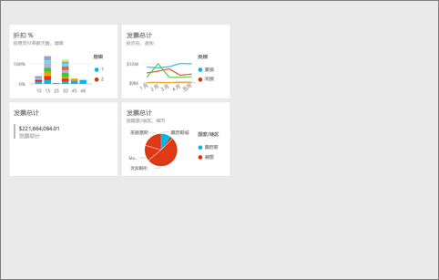
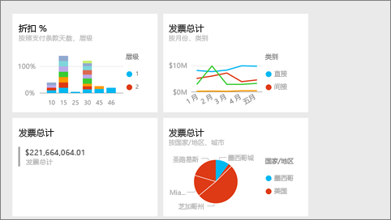
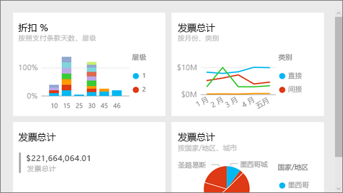

# Power BI 服务中的全屏幕模式
## 什么是全屏模式？

显示 Power BI 内容（仪表板、报表页、磁贴和可视化效果），而不受菜单和导航栏的干扰。  可以随时快速获取内容的纯粹而完整的视图。 有时这也称为电视模式。 在全屏幕模式下可用的功能会因内容而异。 

如果使用 Power BI 移动版，[全屏可用于 Windows 10 移动应用](mobile-windows-10-app-presentation-mode.md)。 Power BI Desktop 不具有面向报表或可视化效果的全屏幕模式，但有针对[关系视图](desktop-report-view.md)的调整到页面大小和[报表视觉对象的焦点模式](service-focus-mode.md)。

 

全屏模式的一些用途包括：

* 在会议上展示你的仪表板、磁贴、视觉对象或报告
* 在办公室通过专用大屏幕或投影仪显示
* 在小屏幕上查看
* 在锁定模式下查看 -- 你可以触摸屏幕或将鼠标悬停在磁贴上，而不打开基础报表或仪表板

> 注意：全屏模式不同于[焦点（弹出）模式](service-focus-mode.md)。
> 
> 

观看 Amanda 在全屏模式下打开并导航她的仪表板，然后应用一些 URL 参数来控制默认显示。 然后按照视频下面的分步说明来自己尝试一下。

<iframe width="560" height="315" src="https://www.youtube.com/embed/c31gZkyvC54" frameborder="0" allowfullscreen></iframe>

## 全屏模式下的仪表板和报表页
1. 从仪表板或报表上方的 Power BI 菜单栏中选择全屏图标 。 仪表板画布或报表页将填充整个屏幕。 以下为仪表板示例。
   
      
2. 在全屏幕模式下，有多个菜单选项。  若要显示菜单，只需移动鼠标或光标。 
   
     仪表板菜单    
         
   
     报表页菜单    
        
   
        
    使用“返回”按钮导航到浏览器中的前一页。 如果前一页是 Power BI 页面，它也将以全屏模式显示。  全屏模式将一直保持，直到你退出。
   
        
    使用此按钮可以全屏模式打印仪表板或报表页。 
   
        
    使用“适应屏幕”按钮来尽可能以最大大小显示仪表板，而无需使用滚动条。     
   
    
   
           
    有时你并不关心滚动条，但希望仪表板能横向填充整个可用空间。 选择“适应宽度”按钮。    
   
    
   
           
    在全屏显示的报表中，使用这些箭头在报表页之间移动。    
3. 若要退出全屏模式，请选择“退出全屏”图标。
   
      

## 全屏模式下的可视化效果和仪表板磁贴
1. 若要在全屏模式下显示仪表板磁贴和报表可视化效果，必须先从已处于[焦点模式](service-focus-mode.md)的磁贴或可视化效果开始。 
   
    
2. 然后，选择该磁贴或视觉对象的全屏图标   。 磁贴或视觉对象将会全屏显示，而无菜单或导航栏。
   
    

## 后续步骤
[Power BI 中的仪表板](service-dashboards.md)  
[焦点”模式](service-focus-mode.md)    

更多问题？ [尝试参与 Power BI 社区](http://community.powerbi.com/)

