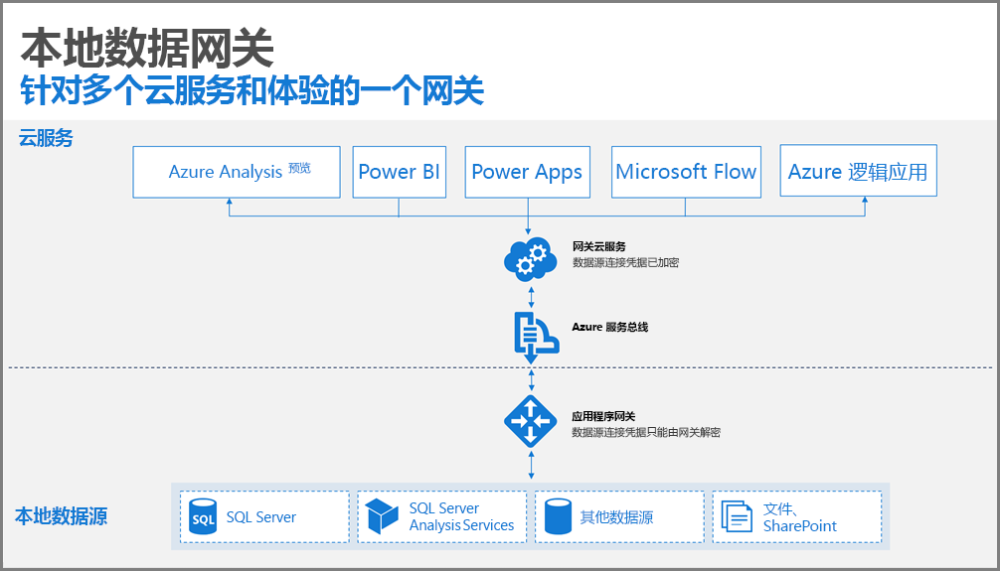
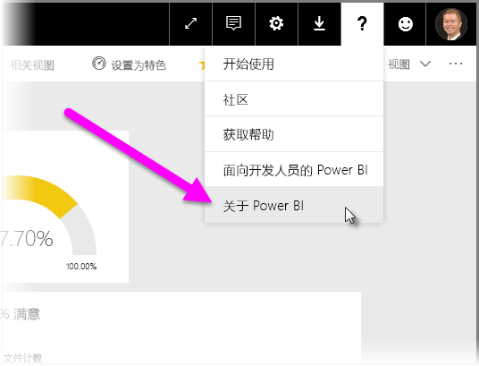
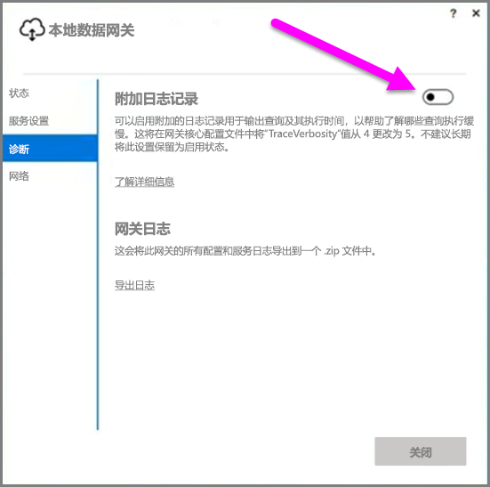
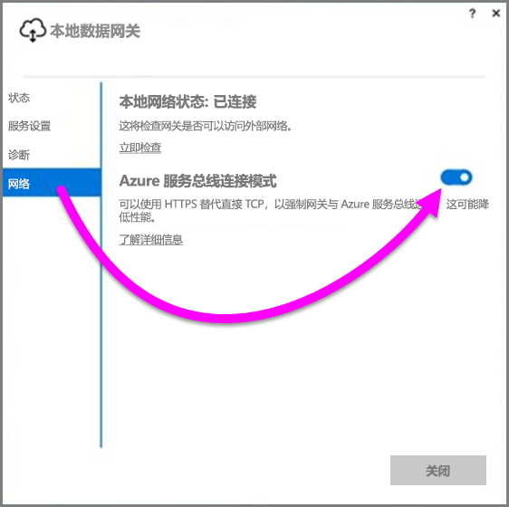
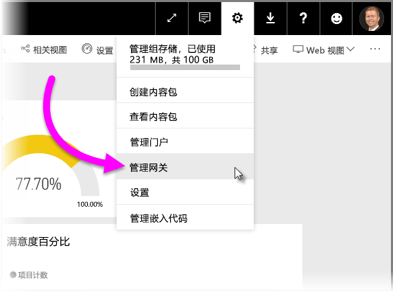

# 部署 Power BI 数据网关指南

本文提供在网络环境中部署数据网关的指南和注意事项。 **网关**是一种便于访问驻留在本地专用网络上的数据的软件，方便后续在 Power BI 等云服务中使用这些数据。 本文将指导你完成部署，并为本地数据网关设置提供指南。

有关本地数据网关的详细信息（包括安装链接），请查看[博客文章](https://powerbi.microsoft.com/blog/power-bi-gateways-march-update/)。

## 本地数据网关的安装注意事项
在深入了解安装和部署的详细信息之前，应牢记一些注意事项。 以下各部分介绍了需要牢记的重要事项。

### 用户数
使用报表（该报表使用网关）的用户数是决定安装该网关位置的重要指标。 下面是要考虑的一些问题：

* 用户是否在一天中的不同时间使用这些报表？
* 他们使用什么类型的连接（DirectQuery 或 Import）？
* 是否所有用户都使用相同的报表？

如果用户每天都在同一时间访问给定的报表，则需要确保在能够处理所有这些请求的计算机上安装网关（请参阅以下各部分，了解可帮助确定此问题的性能计数器和最低要求）。

在 Power BI 中有一个约束，只允许每个报表有一个网关。因此，即使报表基于多个数据源，所有此类数据源也必须通过单个网关。 但是，如果仪表板基于多个报表，则可以对每个提供的报表使用专用网关，从而将网关负载分发到有助于该单个仪表板的多个报表中。

### 连接类型
Power BI 提供了两种连接类型：DirectQuery 和 Import。 并非所有数据源都支持这两种连接类型，而且有很多原因可能会导致选择其中一种类型，如安全要求、性能、数据限制和数据模型大小。 可在[本地数据网关](service-gateway-onprem.md)一文的“可用数据源类型列表”部分中详细了解连接类型和支持数据源。

根据所使用的连接类型，网关的使用可能会有所不同。 例如，应尽可能将 DirectQuery 数据源从“计划刷新”数据源中分离出来（假设它们位于不同的报表中并且可以分开）。 这样做可以防止网关将成千上万的 DirectQuery 请求排入队列的时间与上午计划用于公司主仪表板的大型数据模型刷新时间相同。 以下是每种类型需要考虑的内容：

* “计划刷新”：根据查询大小和每天发生的刷新次数，可以选择保持在推荐的最低硬件要求之间或升级到更高性能的计算机。 如果没有折叠给定的查询，网关计算机上会发生转换，因此网关计算机可受益于拥有更多可用的 RAM。
* DirectQuery：每次任何用户打开报表或查看数据时，都会发送查询。 因此，如果预计有超过 1,000 位用户同时访问数据，那么需要确保计算机具有强大耐用的硬件组件。 更多 CPU 内核可使 DirectQuery 连接有更好的吞吐量。

安装本地数据网关的计算机的要求如下：

最低：

* .NET 4.5 Framework
* 64 位版本的 Windows 7 / Windows Server 2008 R2（或更高版本）

**推荐：**

* 8 核 CPU
* 8 GB 内存
* 64 位版本的 Windows 2012 R2（或更高版本）

### 位置
网关的安装位置可能会对查询性能产生重大影响，因此请尝试确保网关、数据源位置和 Power BI 租户尽可能靠近彼此，最大限度地减少网络延迟。 若要确定 Power BI 租户位置，请在 Power BI 服务中选择“?” 图标（右上角），然后选择“关于 Power BI”。

### 监视网关
可以使用一些工具来监视已安装网关的使用和性能。

#### 性能计数器
有许多性能计数器可用于评价并估计网关上发生的活动。 计数器有助于了解是否存在大量特定类型的活动，这可能会提示你部署新网关。

> [!NOTE]
> 这些计数器将不会捕获特定任务持续时间。
> 
> 

除了计算机的计数器之外，网关计数器也提供计算机所处理负载量的信息，并且可以提供服务器资源容量是否正在延伸或即将超出范围的指示。

这些计数器可从“Windows 性能监视器”进行访问，并且可由用于此目的的任何报表工具使用。 有关如何结合使用网关性能监视器与 Power BI 的详细步骤，请查看以下社区创建的博客文章。

* [Monitor On-premises data gateways](https://insightsquest.com/2016/08/08/monitor-on-premises-data-gateways/)（监视本地数据网关）

#### 日志
配置和服务日志提供了网关所发生情况的另一层面的信息。 当连接未按预期方式工作时，要记得检查网关日志，因为并非所有的错误信息都会出现在 Power BI 服务上。

在本地计算机上查看所有日志文件的一种简单方法是在初始安装完成后，重新打开网关时，使用本地数据网关上的“导出日志”按钮，然后选择“诊断”>“导出日志”。

#### 附加日志记录
默认情况下，网关执行基本日志记录。 如果正在调查网关问题，且需要有关查询连接细节的详细信息，可暂时启用“详细日志记录”来收集其他日志信息。 为此，请在已安装的网关中选择“诊断程序”>“其他日志记录”。

根据网关使用情况，启用此设置可能会显著增加日志大小。 建议在完成审查日志后，禁用“其他日志记录”。 不建议在网关正常使用期间将此设置保持为启用状态。

#### 网络配置
网关创建与 Azure 服务总线的出站连接。 网关使用以下出站端口进行通信：

* TCP 443（默认）
* 5671
* 5672
* 9350 至 9354

网关不需要入站端口。 所有必需的端口列在上面的列表中。

建议你将防火墙中数据区域的 IP 地址列入白名单。 可在 [Microsoft Azure 数据中心 IP 列表](https://www.microsoft.com/download/details.aspx?id=41653)中下载 IP 地址列表。 该列表每周更新一次。 网关将使用指定的 IP 地址以及完全限定的域名 (FQDN) 与 Azure 服务总线进行通信。 如果使用 HTTPS 强制网关进行通信，则网关仅使用 FQDN，并且不会使用 IP 地址则进行通信。

#### 强制 HTTPS 与 Azure 服务总线通信
可以使用 HTTPS 替代直接 TCP 来强制网关与 Azure 服务总线通信。 这样会稍微降低性能。 还可以使用网关接口（从 2017 年 3 月的网关版本开始），通过使用 HTTPS 来强制网关与 Azure 服务总线进行通信。

为此，请在网关中选择“网络”，然后将“Azure 服务总线连接模式”切换至“启用”。

### 附加指南
本部分为部署和管理网关提供附加指南。

* 避免单点故障。 如果可以，请将本地数据源分发到多个网关上；在这种情况下，如果一台计算机变得不可用，你仍能刷新部分数据，不会完全丢失该功能。
* 网关不能安装在域控制器上，因此不要计划或尝试执行此操作。
* 不能在可能会关闭、进入休眠模式或无法连接到 Internet 的计算机上（如便携式计算机）安装网关，因为网关无法在任何这些环境下运行。
* 避免在无线网络上安装网关，因为性能可能会受到无线网络的影响。

#### 网关恢复
可使用恢复密钥恢复现有网关，或者将其移动到新计算机中。 会向安装网关的用户提供恢复密钥，并且之后不能更改密钥。 恢复密钥用于数据加密和网关恢复。

若要恢复网关，请确保你是网关上的管理员，知道网关名称，有正确的恢复密钥并且具有相似性能特征的新计算机可用。

登录后，选择“迁移现有网关”选项。 然后，需要选择要恢复或迁移的网关，最后提供恢复密钥并点击配置。 完成该步骤后，旧网关将被新网关替代，新网关将继承其以前配置的名称和所有数据源。 所有数据源现在将通过新计算机，而无需重新发布任何内容。 尚不支持自动故障转移，但网关团队正在积极考虑提供此功能。

#### 管理员
可在 Power BI 服务中找到网关管理员列表。 登录 Power BI 服务时，请选择“设置”（齿轮图标）>“管理网关”->“网关 UI”。  

在此可以选择网关并查看网关管理员列表。 列出的管理员可以访问、恢复和删除网关。 还可以在网关中添加和删除数据源。 若要确保组织中的所有管理员都能访问组中的所有网关，建议使用以下内容：

* 创建 AAD 安全组并向其添加其他用户，然后将此安全组添加到各自的网关管理员列表中。 这可确保在发生故障时或需要恢复或迁移网关时，多个用户可以访问网关。 这也让其他管理员了解其组中正在使用哪些网关以及每个网关上存在哪些数据源。

## 后续步骤
[配置代理设置](service-gateway-proxy.md)  
[本地数据网关故障排除](service-gateway-onprem-tshoot.md)  
[本地数据网关常见问题解答](service-gateway-onprem-faq.md)  

更多问题？ [尝试参与 Power BI 社区](http://community.powerbi.com/)

