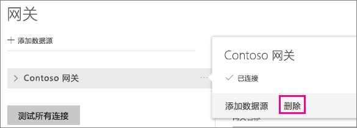
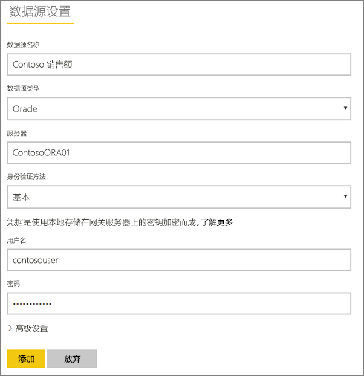
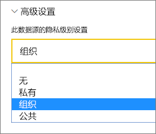
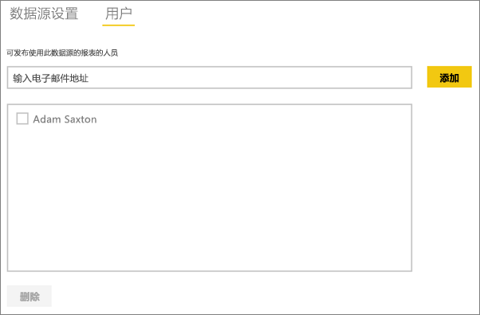
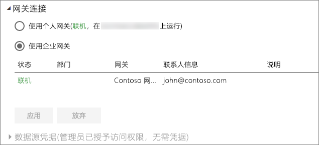

# 管理数据源 - 导入/计划刷新
安装本地数据网关之后，需要添加可与该网关结合使用的数据源。 本文将介绍如何结合使用网关和用于计划刷新的数据源，而不是 DirectQuery 或实时连接。

## 下载和安装网关
你可以从 Power BI 服务中下载网关。 选择“下载” > “数据网关”，或转到[网关下载页](https://go.microsoft.com/fwlink/?LinkId=698861)。

## 添加网关
若要添加网关，只需[下载](https://go.microsoft.com/fwlink/?LinkId=698863)并在你的环境中的服务器上安装企业网关即可。 安装网关后，该网关将显示在**管理网关**下的网关列表中。

> [!NOTE]
> 除非你至少是一个网关的管理员，否则“**管理网关**”将不会显示。 作为管理员添加网关或安装和配置网关时就会出现这种情况。
> 
> 

## 删除网关
删除网关也将删除该网关下的所有数据源。  此外，还会中断任何仪表板和依赖于这些数据源的报表。

1. 选择右上角的齿轮图标  > **管理网关**。
2. “网关”> **删除**
   
   

## 添加数据源
可以通过选择某个网关，然后单击**添加数据源**，或者转到“网关”> **添加数据源**来添加数据源。

然后，你可以从列表中选择**数据源类型**。 所有列出的数据源均可用于通过企业网关的计划刷新。 Analysis Services、SQL Server 和 SAP HANA 可以用于计划刷新或 DirectQuery/实时连接。

然后需要填写数据源（包括源信息和用来访问数据源的凭据）的信息。

> [!NOTE]
> 将使用这些凭据运行对数据源的所有查询。 有关详细信息，请参阅主要本地数据网关文章以了解更多有关如何存储[凭据](service-gateway-onprem.md#credentials)的信息。
> 
> 

所有内容填写完毕之后，可以单击**添加**。  借助你的本地数据，现在你可以对计划刷新使用此数据源。 如果成功，则会看到*连接成功*。

<!-- Shared Install steps Include -->
[!INCLUDE [gateway-onprem-datasources-include](./includes/gateway-onprem-datasources-include.md)]

### 高级设置
可以为你的数据源配置隐私级别。 以便控制数据的混搭方式。 这仅适用于计划刷新。 [了解详细信息](https://support.office.com/article/Privacy-levels-Power-Query-CC3EDE4D-359E-4B28-BC72-9BEE7900B540)

## 删除数据源
删除数据源将中断依赖于给定的数据源的所有仪表板或报表。  

若要删除数据源，请转到“数据源”> **删除**。

## 管理管理员
在网关的“管理员”选项卡上，可以添加和删除可管理网关的用户。 目前只能添加用户。 无法添加安全组。

## 管理用户
在数据源的“用户”选项卡上，可以添加和删除可使用此数据源的用户或安全组。

> [!NOTE]
> 用户列表仅控制允许发布报表的人员。 报表所有者可以创建仪表板（或内容包），并与其他用户共享它们。
> 
> 

## 对计划刷新使用数据源
创建数据源后，可通过 DirectQuery 连接或通过计划刷新使用该数据源。

> [!NOTE]
> Power BI Desktop 和本地数据网关内的数据源之间的服务器名称和数据库名称必须匹配！
> 
> 

数据集和网关内的数据源之间的链接取决于服务器名称和数据库名称。 这些名称必须匹配。 例如，如果提供了一个服务器名称的 IP 地址，则在 Power BI Desktop 中，你将需要使用网关配置中的数据源 IP 地址。 如果使用 *SERVER\INSTANCE*，则在 Power BI Desktop 中，你将需要使用为网关配置的数据源中的同一地址。

如果你被列于网关内配置的数据源的“用户”选项卡中，并且服务器和数据库名称匹配，则你可将网关视为用于计划刷新的一个选项。

> [!WARNING]
> 如果数据集包含多个数据源，则必须在网关内添加每个数据源。 如果未将一个或多个数据源添加到网关，则不会看到可用于计划刷新的网关。
> 
> 

## 限制
* OAuth 在本地数据网关是不受支持的身份验证方案。 不能添加需要 OAuth 的数据源。 如果数据集具有需要 OAuth 的数据源，则不能将网关用于计划的刷新。

## 后续步骤
[本地数据网关](service-gateway-onprem.md)  
[本地数据网关 - 深入了解](service-gateway-onprem-indepth.md)  
[本地数据网关疑难解答](service-gateway-onprem-tshoot.md)  
更多问题？ [尝试参与 Power BI 社区](http://community.powerbi.com/)

