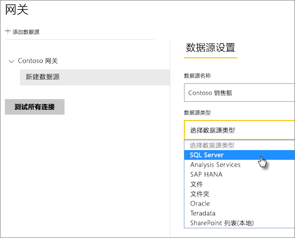
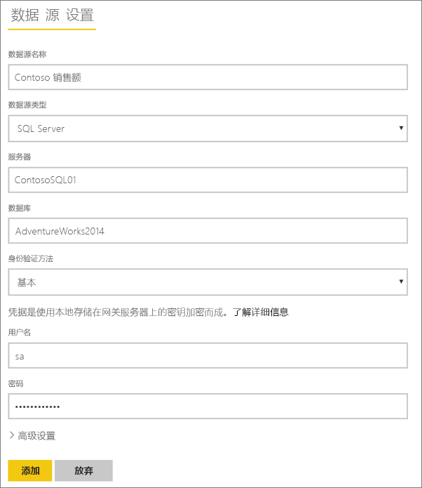
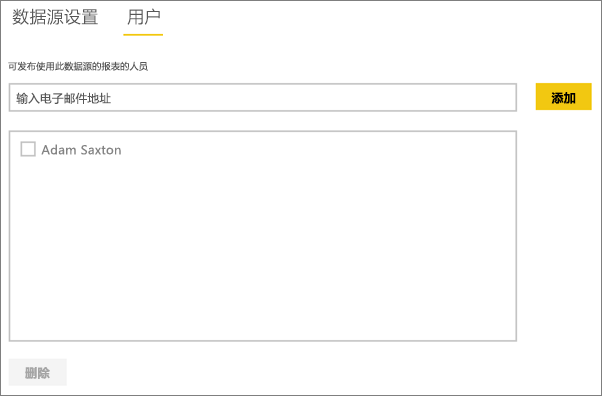

# 管理数据源 - SQL Server
安装本地数据网关之后，可以添加可与该网关结合使用的数据源。 本文将探讨如何使用网关和数据源。 你可以使用 SQL Server 数据源进行计划刷新或 DirectQuery。

## 下载和安装网关
你可以从 Power BI 服务中下载网关。 选择“下载” > “数据网关”，或转到[网关下载页](https://go.microsoft.com/fwlink/?LinkId=698861)。

## 添加网关
若要添加网关，只需[下载](https://go.microsoft.com/fwlink/?LinkId=698861)并在你的环境中的服务器上安装该网关即可。 安装网关后，该网关将显示在**管理网关**下的网关列表中。

> [!NOTE]
> 除非你至少是一个网关的管理员，否则“**管理网关**”将不会显示。 将你作为管理员添加到网关或自行安装和配置网关时，会发生这种情况。
> 
> 

## 删除网关
删除网关也将删除该网关下的所有数据源。  此外，还会中断任何仪表板和依赖于这些数据源的报表。

1. 选择右上角的齿轮图标  > **管理网关**。
2. “网关”> **删除**
   
   

## 添加数据源
可以通过选择某个网关，然后单击**添加数据源**，或者转到“网关”> **添加数据源**来添加数据源。

然后，你可以从列表中选择**数据源类型**。

> [!NOTE]
> 使用 DirectQuery 时，网关仅支持 SQL Server 2012 SP1 和后续版本。
> 
> 

然后需要填写数据源（包括**服务器**和**数据库**）的信息。  

你还需要选择**身份验证方法**。  可能是 **Windows** 或**基本**。  如果你打算使用 SQL 身份验证而不是 Windows 身份验证，则需要选择**基本**。 然后输入将用于此数据源的凭据。

> [!NOTE]
> 除非为数据源配置并启用了 Kerberos 单一登录 (SSO)，否则对数据源的所有查询都将使用这些凭据运行。 通过 SSO，导入数据集使用存储的凭据，但是 DirectQuery 数据集使用当前 Power BI 用户通过 SSO 执行查询。 有关详细信息，请参阅主要的本地数据网关文章，详细了解如何存储[凭据](service-gateway-onprem.md#credentials)，或参阅介绍如何[使用 Kerberos 进行从 Power BI 到本地数据源的 SSO（单一登录）](service-gateway-kerberos-for-sso-pbi-to-on-premises-data.md)的文章。
> 
> 

所有内容填写完毕之后，可以单击**添加**。  现在你可以使用此数据源对本地 SQL Server 服务器进行计划刷新或 DirectQuery。 如果成功，则会看到*连接成功*。

### 高级设置
可以为你的数据源配置隐私级别。 以便控制数据的混搭方式。 这仅适用于计划刷新。 它不适用于 DirectQuery。 [了解详细信息](https://support.office.com/article/Privacy-levels-Power-Query-CC3EDE4D-359E-4B28-BC72-9BEE7900B540)

## 删除数据源
删除数据源将中断依赖于给定的数据源的所有仪表板或报表。  

若要删除数据源，请转到“数据源”> **删除**。

## 管理管理员
在网关的“管理员”选项卡上，可以添加和删除能够管理网关的用户（或安全组）。

## 管理用户
在数据源的“用户”选项卡上，可以添加和删除可使用此数据源的用户或安全组。

> [!NOTE]
> 用户列表仅控制允许发布报表的人员。 报表所有者可以创建仪表板（或内容包），并与其他用户共享它们。
> 
> 

## 使用数据源
创建数据源后，可通过 DirectQuery 连接或通过计划刷新使用该数据源。

> [!NOTE]
> Power BI Desktop 和本地数据网关内的数据源之间的服务器名称和数据库名称必须匹配！
> 
> 

数据集和网关内的数据源之间的链接取决于服务器名称和数据库名称。 这些名称必须匹配。 例如，如果在 Power BI Desktop 内为服务器名称提供 IP 地址，则需要在网关配置中使用数据源的 IP 地址。 如果使用 *SERVER\INSTANCE*，则在 Power BI Desktop 中，你将需要使用为网关配置的数据源中的同一地址。

此示例适用于 DirectQuery 和计划刷新这两种情况。

### 通过 DirectQuery 连接使用数据源
用户需要确保 Power BI Desktop 和为网关配置的数据源之间的服务器名称和数据库名称相互匹配。 还需要确保你的用户列在数据源的**用户**选项卡中，以便发布 DirectQuery 数据集。 首次导入数据时，需要在 Power BI Desktop 中选择 DirectQuery。 [了解详细信息](desktop-use-directquery.md)

发布之后，应从 Power BI Desktop 或**获取数据**启动报表。 在网关中创建数据源之后，可能会花费几分钟时间连接才可用。

### 通过计划刷新使用数据源
如果你被列于网关内配置的数据源的“用户”选项卡中，并且服务器和数据库名称匹配，则你可将网关视为用于计划刷新的一个选项。

## 后续步骤
* [本地数据网关](service-gateway-onprem.md)  
* [本地数据网关 - 深入了解](service-gateway-onprem-indepth.md)  
* [本地数据网关故障排除](service-gateway-onprem-tshoot.md)
* [使用 Kerberos 进行从 Power BI 到本地数据源的 SSO（单一登录）](service-gateway-kerberos-for-sso-pbi-to-on-premises-data.md)。 
* 更多问题？ [尝试参与 Power BI 社区](http://community.powerbi.com/)

