# 管理数据源 - Analysis Services
安装本地数据网关之后，需要添加可与该网关结合使用的数据源。 本文将探讨如何使用网关和数据源。 你可以使用 Analysis Services 数据源进行计划刷新或实时连接。

<iframe width="560" height="315" src="https://www.youtube.com/embed/ownIGbcRAAU" frameborder="0" allowfullscreen></iframe>

## 下载和安装网关
你可以从 Power BI 服务中下载网关。 选择“下载” > “数据网关”，或转到[网关下载页](https://go.microsoft.com/fwlink/?LinkId=698861)。

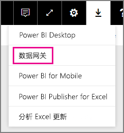

## Analysis Services 实时连接限制
你可以使用针对表格或多维实例的实时连接。

| **服务器版本** | **所需的 SKU** |
| --- | --- |
| 2012 SP1 CU4 或更高版本 |商业智能和企业版 SKU |
| 2014 |商业智能和企业版 SKU |
| 2016 |标准 SKU 或更高版本 |

* 不支持单元格级别格式和转译功能。
* 操作和命名集不会公开到 Power BI，但你仍然可以连接到包含操作或命名集的多维数据集，并创建视觉对象和报表。

## 添加网关
若要添加网关，只需[下载](https://go.microsoft.com/fwlink/?LinkId=698861)并在你的环境中的服务器上安装该网关即可。 安装网关后，该网关将显示在**管理网关**下的网关列表中。

> [!NOTE]
> 除非你至少是一个网关的管理员，否则“**管理网关**”将不会显示。 作为管理员添加网关或安装和配置网关时就会出现这种情况。
> 
> 

## 删除网关
删除网关也将删除该网关下的所有数据源。  此外，还会中断任何仪表板和依赖于这些数据源的报表。

1. 选择右上角的齿轮图标  > **管理网关**。
2. “网关”> **删除**
   
   

## 添加数据源
可以通过选择某个网关，然后单击**添加数据源**，或者转到“网关”> **添加数据源**来添加数据源。

然后，你可以从列表中选择**数据源类型**。 如果要连接到多维或表格服务器，请选择 Analysis Services。

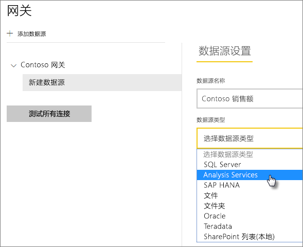

然后需要填写数据源（包括**服务器**和**数据库**）的信息。  

网关将使用你输入的**用户名**和**密码**连接到 Analysis Services 实例。

> [!NOTE]
> 输入的 Windows 帐户必须具有连接到该实例的服务器管理员权限。 如果此帐户的密码设置为过期，且数据源未更新此密码，则用户将遇到连接错误。 有关详细信息，请参阅主要本地数据网关文章以了解更多有关如何存储[凭据](service-gateway-onprem.md#credentials)的信息。
> 
> 

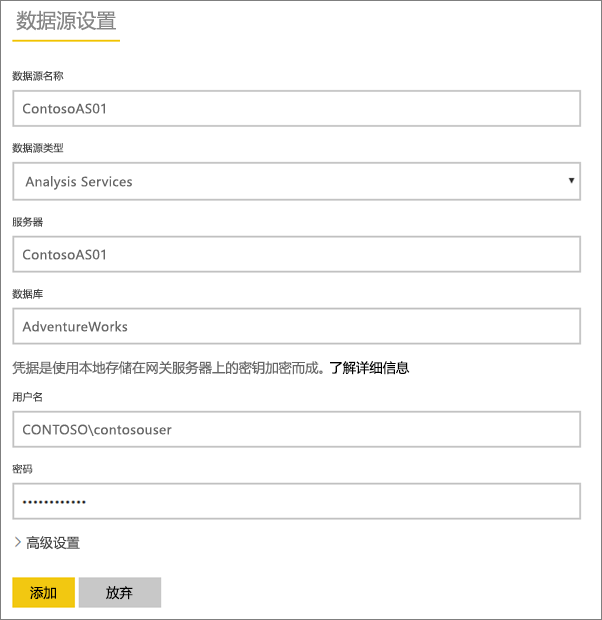

所有内容填写完毕之后，可以单击**添加**。  现在可以使用此数据源对本地的 Analysis Services 实例进行计划刷新或实时连接。  如果成功，则会看到连接成功。

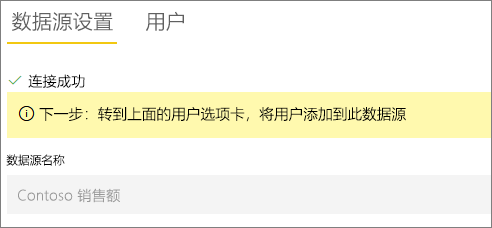

### 高级设置
可以为你的数据源配置隐私级别。 以便控制数据的混搭方式。 这仅适用于计划刷新。 而不适用于实时连接。 [了解详细信息](https://support.office.com/article/Privacy-levels-Power-Query-CC3EDE4D-359E-4B28-BC72-9BEE7900B540)

## Analysis Services 的用户名
每次用户与连接到 Analysis Services 的报表交互时，有效用户名将传递到网关，然后传递到你的本地 Analysis Services 服务器。 你用于登录 Power BI 的电子邮件地址，我们会将其作为有效用户传递到 Analysis Services。 在连接属性 [EffectiveUserName](https://msdn.microsoft.com/library/dn140245.aspx#bkmk_auth) 中传递它。 此电子邮件地址应与在本地 Active Directory 域内的定义的 UPN 匹配。 UPN 是 Active Directory 帐户的属性。 该 Windows 帐户还需位于 Analysis Services 角色中。 如果在 Active Directory 中找不到匹配项，则登录不会成功。 [了解详细信息](https://msdn.microsoft.com/library/ms677605.aspx)

你还可以将 Power BI 登录名与本地目录 UPN 映射。 [了解详细信息](service-gateway-enterprise-manage-ssas.md#map-user-names)

<iframe width="560" height="315" src="https://www.youtube.com/embed/Qb5EEjkHoLg" frameborder="0" allowfullscreen></iframe>

### 如何辨别我的 UPN？
你可能不知道你的 UPN 是什么，而且你有可能不是域管理员。 你可以从工作站使用以下命令找出你的帐户的 UPN。

    whoami /upn

结果将类似于电子邮件地址，但是这是位于域帐户上的 UPN。 如果使用 Analysis Services 数据源进行实时连接，并且此数据源与你用于登录 Power BI 的电子邮件地址不匹配，建议了解一下如何[映射用户名](#map-user-names)。

## 映射用户名
<iframe width="560" height="315" src="https://www.youtube.com/embed/eATPS-c7YRU" frameborder="0" allowfullscreen></iframe>

可以通过两种不同的方式映射用于 Analysis Services 的用户名：

1. 手动重映射用户 
2. 执行本地 Active Directory 属性查找，将 AAD UPN 重映射到 Active Directory 用户（AD 查找映射）

虽然可以使用第二种方法执行手动映射，但这样做既耗时又难以维护；当模式匹配不足以满足需求时（例如，当 AAD 和本地 AD 之间的域名不同时，或当 AAD 和 AD 之间的用户帐户名称不同时），尤为困难。 因此，不建议使用第二种方法进行手动映射。

我们将在接下来的两个部分中按顺序介绍这两种方法

### 手动重映射用户名
对于 Analysis Services 数据源，可以配置自定义用户主体名称 (UPN) 规则。 当你的 Power BI 服务登录名与本地目录 UPN 不匹配时，这会很有用。 例如，如果使用 john@contoso.com 登录 Power BI，但本地目录 UPN 是 john@contoso.local，可以配置映射规则，将 john@contoso.local 传递到 Analysis Services。

要访问 UPN 映射屏幕，可以执行以下操作。

1. 转到**齿轮图标**，然后选择**管理网关**。
2. 展开包含 Analysis Services 数据源的网关。 或者，如果尚未创建 Analysis Services 数据源，可以在此时创建。
3. 选择数据源，然后选择**用户**选项卡。
4. 选择**映射用户名**。
   
    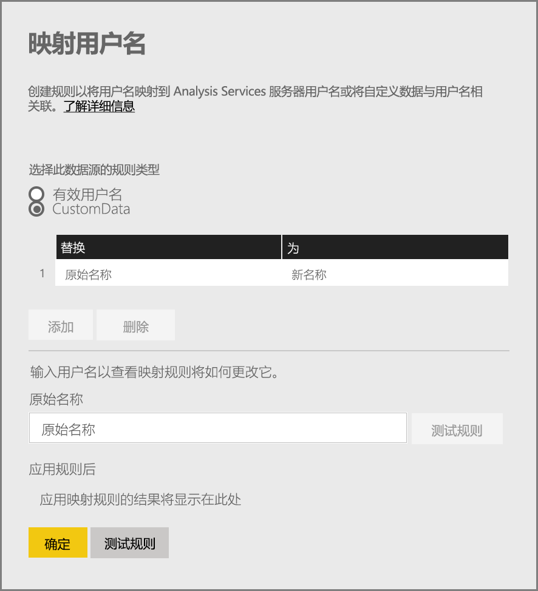

随即你将看到添加规则和对给定用户进行测试的选项。

> [!NOTE]
> 可能会无意间更改不想更改的用户。 例如，如果 **Replace（原始值）**是 @contoso.com 且 **With（新名称）**是 @contoso.local，则登录名包含 @contoso.com 的所有用户都将被替换为 @contoso.local。 此外，如果 **Replace（原始名称）**是 dave@contoso.com 且 **With（新名称）**是 dave@contoso.local，则登录名为 v-dave@contoso.com 的用户将作为 v-dave@contoso.local 发送。
> 
> 

### AD 查找映射
若要通过执行本地 AD 属性查找来将 AAD UPN 重映射到 Active Directory 用户，请按照此部分中的步骤操作。 首先，我们将介绍这种方法的工作原理。

Power BI 服务中将发生以下事件：

- 对于 Power BI AAD 用户对本地 SSAS 服务器执行的每个查询，都会同时传递 UPN 字符串（如 firstName.lastName@contoso.com）

> [!NOTE]
> 仍会在将用户名字符串发送到本地数据网关之前，应用 Power BI 数据源配置中定义的任何手动 UPN 用户映射。
> 
> 

在具有可配置自定义用户映射的本地数据网关上，请执行以下操作：

1. 查找搜索 Active Directory（自动或可配置）
2. 根据 Power BI 服务中的传入 UPN 字符串（“firstName.lastName@contoso.com”），查找 AD 人员的属性（如电子邮件地址）。
3. 如果 AD 查找失败，尝试将同时传递的 UPN 用作传递给 SSAS 的 EffectiveUser。
4. 如果 AD 查找成功，检索相应 AD 人员的 UserPrincipalName。 
5. 它将 UserPrincipalName 电子邮件地址作为 EffectiveUser 传递给 SSAS（如 Alias@corp.on-prem.contoso）

如何将网关配置为执行 AD 查找：

1. 下载和安装最新网关
2. 在网关中，需要将“本地数据网关服务”更改为使用域帐户（而不是本地服务帐户，否则 AD 查找将无法在运行时正常工作）运行。 你将需要重启网关服务才能使更改生效。  转到你的计算机上的网关应用（搜索“本地数据网关”）。 为此，请依次转到“服务设置”>“更改服务帐户”。 请确保自己拥有此网关的恢复密钥，因为需要在同一台计算机上还原它，除非要改为新建网关。 
3. 以管理员身份转到此网关的安装文件夹 C:\Program Files\On-premises data gateway，以确保自己拥有写入权限并编辑下列文件：
   
       Microsoft.PowerBI.DataMovement.Pipeline.GatewayCore.dll.config 
4. 根据自己设定的 AD 用户 Active Directory 属性配置，编辑以下两个配置值。 下面显示的配置值只是示例，需要根据自己的 Active Directory 配置指定它们。 
   
   
5. 重启本地数据网关服务才能使配置更改生效。

### 使用映射规则
若要创建映射规则，请输入**原始名字**和**新名字**的值，然后选择**添加**。

| 字段 | 说明 |
| --- | --- |
| Replace（原始名称） |用于登录 Power BI 的电子邮件地址。 |
| With（新名称） |用其替换的值。 替换的结果将被传递到 Analysis Services 连接的 *EffectiveUserName* 属性。 |

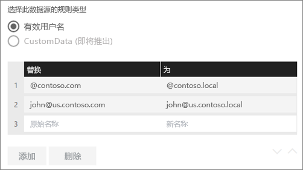

当在列表中选择某个项时，可以使用 **v 形图标**选择对其重新排序或**删除**该条目。

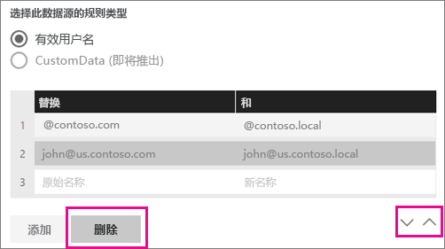

### 使用通配符 (\*)
可以将通配符用于“**Replace（原始名称）**”字符串。 它只能用于自身而不能与任何其他字符串部分一起使用。 这样可以使你获取所有用户，并将单个值传递到数据源。 当你希望组织中的所有用户都能够在本地环境中使用相同的用户，那么这非常有用。

### 测试映射规则
通过输入**原始名称**的值并选择 **测试规则**，可以验证将被替换的原始名称的值。

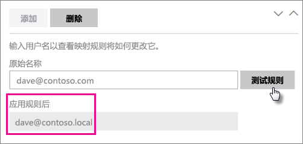

> [!NOTE]
> 保存的规则将需要花费几分钟以使服务开始对其进行使用。 在浏览器中，该规则将立即生效。
> 
> 

### 映射规则限制
* 映射只适用于正在配置的特定数据源。 它不是一种全局设置。 如果具有多个 Analysis Services 数据源，必须对每个数据源的用户进行映射。

## 删除数据源
删除数据源将中断依赖于给定的数据源的所有仪表板或报表。  

要删除数据源，请转到“数据源”>“删除”

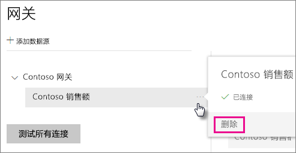

## 管理管理员
在网关的“管理员”选项卡上，可以添加和删除能够管理网关的用户（或安全组）。

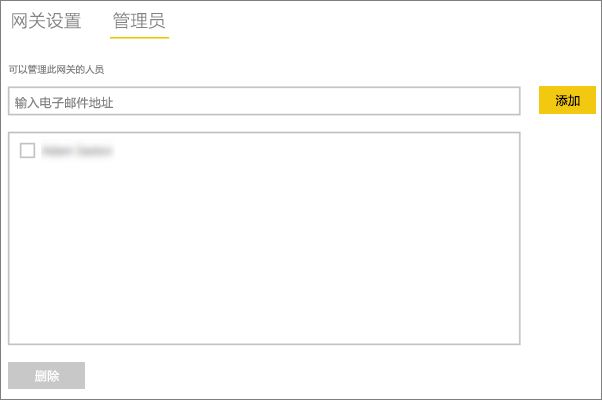

## 管理用户
在数据源的“用户”选项卡上，可以添加和删除能使用此数据源的用户或安全组。

> [!NOTE]
> 用户列表仅控制允许发布报表的人员。 报表所有者可以创建仪表板（或内容包），并与其他用户共享它们。
> 
> 

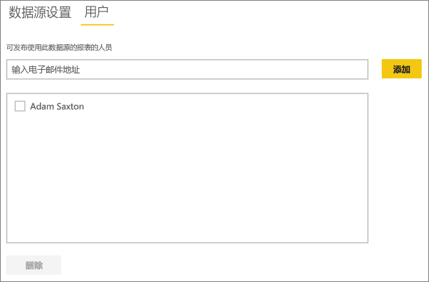

## 使用数据源
创建数据源后，可通过实时连接或通过计划刷新使用该数据源。

> [!NOTE]
> Power BI Desktop 和本地数据网关内的数据源之间的服务器名称和数据库名称必须匹配！
> 
> 

数据集和网关内的数据源之间的链接取决于服务器名称和数据库名称。 这些名称必须匹配。 例如，如果提供了一个服务器名称的 IP 地址，则在 Power BI Desktop 中，你将需要使用网关配置中的数据源 IP 地址。 如果使用 SERVER\INSTANCE，则在 Power BI Desktop 中，你将需要使用为网关配置的数据源中的同一地址。

此示例适用于实时连接和计划刷新这两种情况。

### 通过实时连接使用数据源
你需要确保 Power BI Desktop 和为网关配置的数据源之间的服务器名称和数据库名称相互匹配。 还需要确保你的用户列在数据源的**用户**选项卡中，以便发布实时连接数据集。 首次导入数据时，需要在 Power BI Desktop 中选择实时连接。

发布之后，应从 Power BI Desktop 或**获取数据**启动报表。 在网关中创建数据源之后，可能会花费几分钟时间连接才可用。

### 通过计划刷新使用数据源
如果你被列于网关内配置的数据源的“用户”选项卡中，并且服务器和数据库名称匹配，则你可将网关视为用于计划刷新的一个选项。

## 后续步骤
[本地数据网关](service-gateway-onprem.md)  
[本地数据网关 - 深入了解](service-gateway-onprem-indepth.md)  
[本地数据网关疑难解答](service-gateway-onprem-tshoot.md)  
更多问题？ [尝试参与 Power BI 社区](http://community.powerbi.com/)

