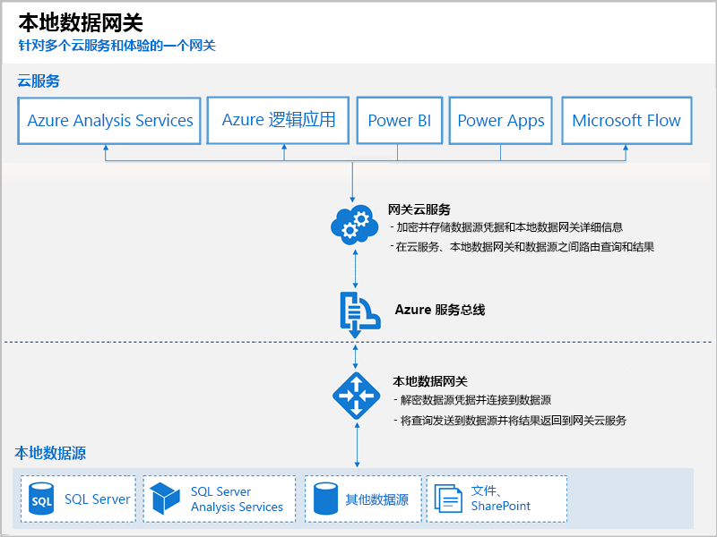

# 什么是 Power BI 网关？

Power BI 网关是安装在本地网络中的软件；它便于访问该网络中的数据。 这类似于网关守卫侦听连接请求，并仅在用户请求满足特定条件时才授权访问。 这样，组织可以使数据库和其他数据源保留在其本地网络上，但可安全地使用 Power BI 报表和仪表板中的本地数据。

下图显示基本视图，其中包含处理来自三个本地计算机的云的请求的网关。 我们稍后将在本文中对其进行阐述。

## 网关类型

Power BI 提供两个网关，每个网关用于不同场景：

* 本地数据网关（个人模式）– 允许一位用户连接到源，且无法与其他人共享。 只能与 Power BI 协同使用。 此网关非常适用于你是创建报表的唯一人员且不需要与其他人共享数据源的场景。

* 本地数据网关 – 允许多个用户连接到多个本地数据源。 可供 Power BI、PowerApps、Flow、Azure Analysis Services 和 Azure 逻辑应用使用，只需安装一个网关便可支持所有云服务。 此网关非常适用于更复杂的场景，即多个用户访问多个数据源。 

## 使用网关

使用网关有以下四个主要步骤：

1. 在本地计算机上使用适当模式安装网关
2. 将用户添加到网关，以便他们可以访问本地数据源
3. 连接到数据源，以便它们可以用于报表和仪表板
4. 刷新本地数据，以便 Power BI 报表保持最新

可以安装独立的网关，也可以将网关添加到群集（当为了实现高可用性时推荐使用）。

## 网关的工作原理

安装的网关（本地数据网关）作为一项 Windows 服务运行。 此本地服务通过 Azure 服务总线注册到网关云服务。 下图显示本地数据与使用该网关的云服务之间的流。

查询和数据流：

1. 云服务将创建查询以及本地数据源的加密凭据， 并将其发送到队列中以让网关进行处理。
2. 网关云服务将分析该查询，并将请求推送到 Azure 服务总线。
3. 本地数据网关将为挂起的请求轮询 Azure 服务总线。
4. 网关获取查询、解密凭据并使用这些凭据连接到数据源。
5. 网关将查询发送到数据源执行。
6. 执行的结果从数据源发出，返回到网关，然后到云服务和服务器上。

## 后续步骤
[安装本地数据网关](service-gateway-install.md)

更多问题？ [尝试参与 Power BI 社区](http://community.powerbi.com/)

