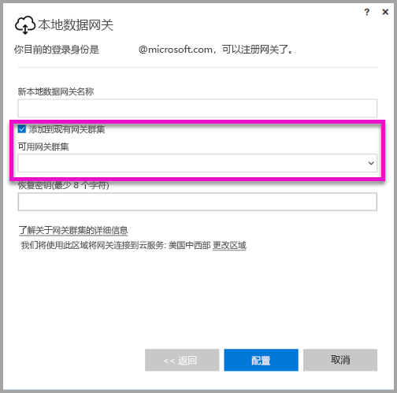

# <a name="high-availability-clusters-for-on-premises-data-gateway"></a>本地数据网关的高可用性群集
可以创建“本地数据网关”安装项目的“高可用性群集”，确保组织能够访问 Power BI 报表和仪表板中使用的本地数据资源。 网关管理员可通过此类群集将网关分组，以避免访问本地数据资源时出现单一故障点。 本文介绍创建本地数据网关的高可用性群集时可以执行的步骤，并分享有关设置此类群集的最佳做法。 高可用性网关群集要求对本地数据网关应用 2017 年 11 月更新或更高版本。


## <a name="setting-up-high-availability-clusters-of-gateways"></a>设置网关的高可用性群集

在安装“本地数据网关”过程中，可以指定是否要将该网关添加到现有网关群集。 



若要将网关添加到现有群集，必须提供新网关要加入的群集的主网关实例的恢复密钥。 群集的主网关必须运行 2017 年 11 月网关更新或更高版本。 


## <a name="managing-a-gateway-cluster"></a>管理网关群集

在某个网关群集中包含两个或更多个网关后，所有网关管理操作（例如添加数据源或授予对网关的管理权限）都将应用到该群集所属的所有网关。 

当管理员使用“Power BI 服务”中齿轮图标下面的“管理网关”菜单项时，会看到已注册群集或各个网关的列表，但看不到属于群集的单个网关实例。

所有新的“计划刷新”请求和 DirectQuery 操作将自动路由到给定网关群集的主实例。 如果主网关实例不处于联机状态，则请求将路由到群集中的另一个网关实例。

## <a name="powershell-support-for-gateway-clusters"></a>网关群集的 PowerShell 支持

本地数据网关安装文件夹中提供了 PowerShell 脚本。 该文件夹默认为 *C:\Program Files\On-premises data gateway*。 若要正常运行这些脚本，必须使用 PowerShell 5 或更高版本。 PowerShell 脚本可让用户执行以下操作：

-   检索用户可用的网关群集列表
-   检索群集中注册的网关实例的列表及其联机或脱机状态
-   修改群集中网关实例的启用/禁用状态以及其他网关属性
-   删除网关

若要运行表中的 PowerShell 命令，首先需要执行以下步骤：

1. 以管理员身份打开 PowerShell 命令窗口
2. 然后运行以下一次性 PowerShell 命令（假设从未在当前计算机上运行过 PowerShell 命令）：

    ```
    Set-ExecutionPolicy -ExecutionPolicy Unrestricted -Force
    ```

3. 接下来，在 PowerShell 窗口中导航到本地数据网关安装文件夹，并使用以下命令导入所需的模块：

    ```
    Import-Module .\OnPremisesDataGatewayHAMgmt.psm1
    ```

完成这些步骤后，可以使用下表中的命令来管理网关群集

| **命令** | **说明** | **参数** |
| --- | --- | --- |
| *Login-OnPremisesDataGateway* |此命令可让用户登录，以管理其本地数据网关群集。  只有运行此命令并登录之后，才可正常运行其他高可用性命令。 注意：在调用 Login 过程中获取的 AAD 身份验证令牌的有效期只有 1 个小时，之后将会失效。 可以重新运行 Login 命令获取新令牌。| AAD 用户名和密码（在执行命令而不是初始调用过程中提供）|
| *Get-OnPremisesDataGatewayClusters* | 检索已登录用户的网关群集列表。 | （可选）可将格式设置参数传递给此命令以便于阅读，例如：*Format-Table -AutoSize -Wrap* |
| *Get-OnPremisesDataClusterGateways* | 检索指定群集中的网关列表，以及每个网关的其他信息（联机/脱机状态、计算机名称，等等） | *-ClusterObjectID xyz*（其中，*xyz* 需替换为实际群集对象 ID 值，可以使用 *Get-OnPremisesDataGatewayClusters* 命令检索该值）|
| *Set-OnPremisesDataGateway* | 用于设置群集中给定网关的属性值，包括启用/禁用特定的网关实例  | *-ClusterObjectID xyz*（*xyz* 应替换为实际群集对象 ID 值，可以使用 *Get-OnPremisesDataGatewayClusters* 命令检索该值）*-GatewayObjectID abc*（*abc* 应替换为实际网关对象 ID 值，在指定了群集对象 ID 的情况下，可以使用 *Get-OnPremisesDataClusterGateways* 命令检索该值） |
| *Get-OnPremisesDataGatewayStatus* | 用于检索群集中给定网关实例的状态  | *-ClusterObjectID xyz*（*xyz* 应替换为实际群集对象 ID 值，可以使用 *Get-OnPremisesDataGatewayClusters* 命令检索该值）*-GatewayObjectID abc*（*abc* 应替换为实际网关对象 ID 值，在指定了群集对象 ID 的情况下，可以使用 *Get-OnPremisesDataClusterGateways* 命令检索该值） |
| *Remove-OnPremisesDataGateway*  | 用于从群集中删除网关实例 - 请注意，只有在删除群集中的其他所有网关之后，才能删除群集中的主网关。| *-ClusterObjectID xyz*（*xyz* 应替换为实际群集对象 ID 值，可以使用 *Get-OnPremisesDataGatewayClusters* 命令检索该值）*-GatewayObjectID abc*（*abc* 应替换为实际网关对象 ID 值，在指定了群集对象 ID 的情况下，可以使用 *Get-OnPremisesDataClusterGateways* 命令检索该值） |


## <a name="next-steps"></a>后续步骤

-   [管理数据源 - Analysis Services](service-gateway-enterprise-manage-ssas.md)  
-   [管理数据源 - SAP HANA](service-gateway-enterprise-manage-sap.md)  
-   [管理数据源 - SQL Server](service-gateway-enterprise-manage-sql.md)  
-   [管理数据源 - Oracle](service-gateway-onprem-manage-oracle.md)  
-   [管理数据源 - 导入/计划刷新](service-gateway-enterprise-manage-scheduled-refresh.md)  
-   [深入了解本地数据网关](service-gateway-onprem-indepth.md)  
-   [本地数据网关（个人模式）](service-gateway-personal-mode.md)
-   [为本地数据网关配置代理设置](service-gateway-proxy.md)  
-   [使用 Kerberos 进行从 Power BI 到本地数据源的 SSO（单一登录）](service-gateway-kerberos-for-sso-pbi-to-on-premises-data.md)  

更多问题？ [尝试参与 Power BI 社区](http://community.powerbi.com/)
