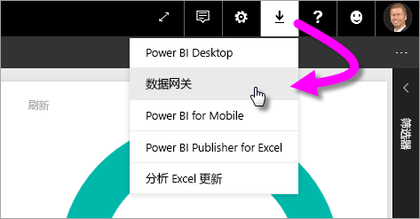
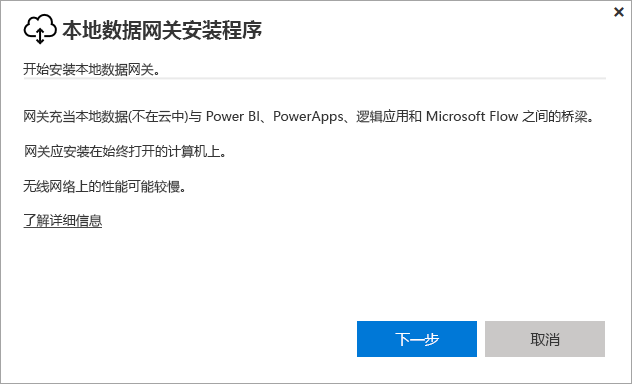
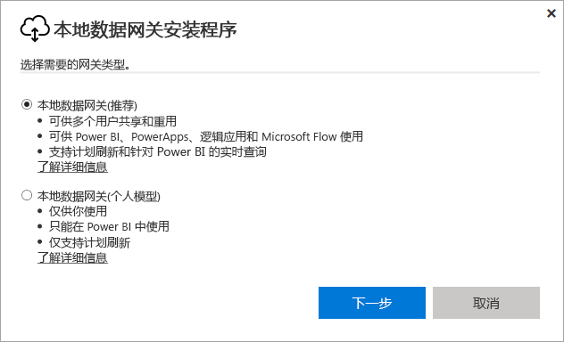
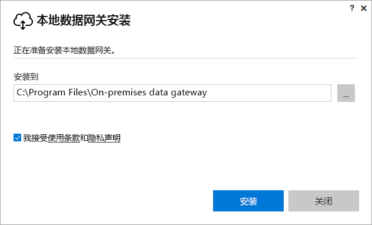
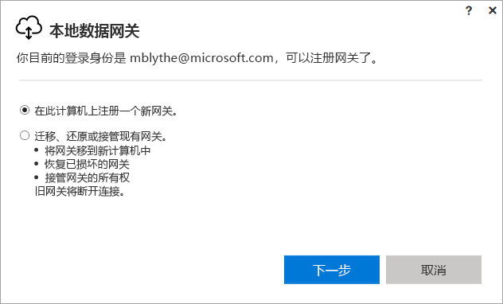
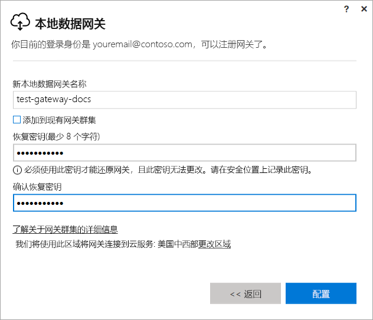
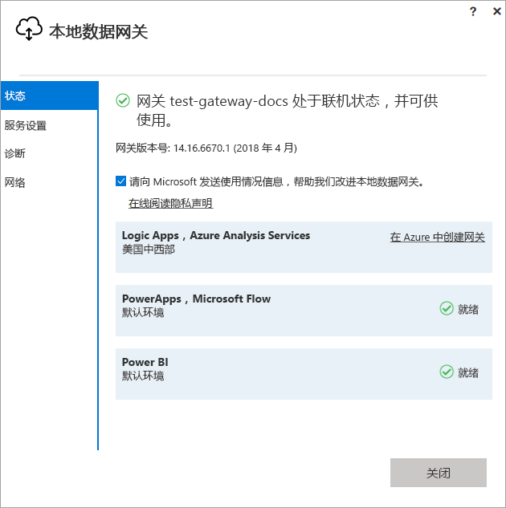
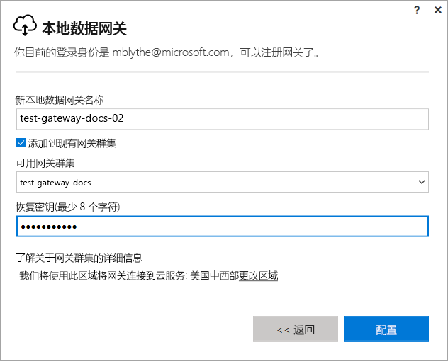

# 安装 Power BI 的网关

Power BI 网关是安装在本地网络中的软件；它便于访问该网络中的数据。 如[概述](service-gateway-getting-started.md)中所述，可以在个人模式或标准模式（推荐）下安装网关。 在标准模式下，可以安装独立的网关，也可以将网关添加到群集（推荐用于实现高可用性）。 在本文中，我们向你介绍如何安装标准网关，然后添加其他网关以创建群集。

如果未注册 Power BI，请[免费注册](https://app.powerbi.com/signupredirect?pbi_source=web)后再进行操作。

## 下载并安装网关

网关在安装它的计算机上运行，因此请确保安装在始终打开的计算机上。 为了提高性能和可靠性，我们建议计算机使用有线网络，而不是无线网络。

1. 在 Power BI 服务的右上角，选择“下载图标” > “数据网关”。

    

2. 在下载页上，选择“下载网关”按钮。

3. 选择**下一步**。     

    

4. 选择“本地数据网关(推荐)” > “下一步”。

    

5. 保留默认安装路径，并接受条款 >“安装”。

    

6. 输入用于登录到 Power BI 的帐户 >“登录”。

    

    网关与 Power BI 帐户关联，且从 Power BI 服务中管理网关。 现已登录到你的帐户。

7. 选择“在此计算机上注册一个新网关” > “下一步”。

    

8. 输入网关的名称（在租户中必须唯一）和恢复密钥。 如果要恢复或移动网关，则需要此密钥。 选择“**配置**”。

    

    请注意选项“添加到现有的网关群集”。 我们将在本文的下一部分中使用此选项。

9. 查看最终窗口中的信息。 请注意，网关可用于 Power BI、PowerApps 和 Flow，因为这三个服务使用了同一个帐户。 选择“**关闭**”。

    

现已成功安装网关，可以添加其他网关以创建群集。

## 添加其他网关以创建群集

群集使网关管理员可以避免本地数据访问的单点故障。 如果主网关不可用，数据请求将路由到已添加的第二个网关，依次类推。 计算机上只能安装一个标准网关，因此必须在不同计算机上为群集安装第二个网关。 这可以理解，因为群集中需要冗余。

高可用性网关群集要求对本地数据网关应用 2017 年 11 月更新或更高版本。

1. 将网关下载到其他计算机并进行安装。

2. 登录到 Power BI 帐户后，注册网关。 选择“添加到现有群集”。 在“可用的网关群集”下，选择已安装的第一个网关（*主网关*），然后输入该网关的恢复密钥。 选择“**配置**”。

    

## 后续步骤

[管理 Power BI 网关](service-gateway-manage.md)

更多问题？ [尝试参与 Power BI 社区](http://community.powerbi.com/)