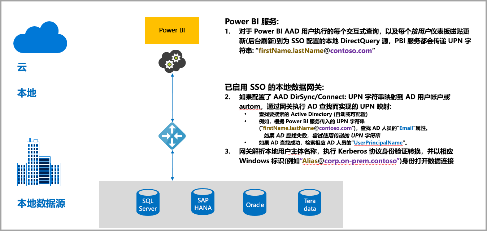
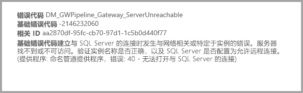
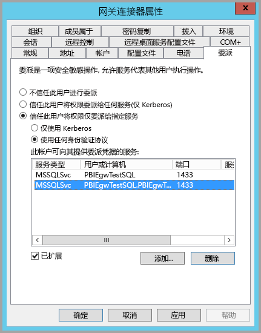
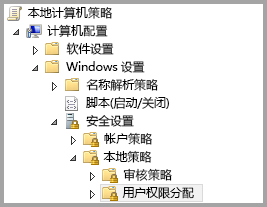
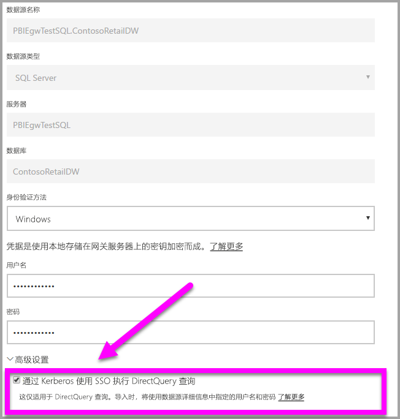
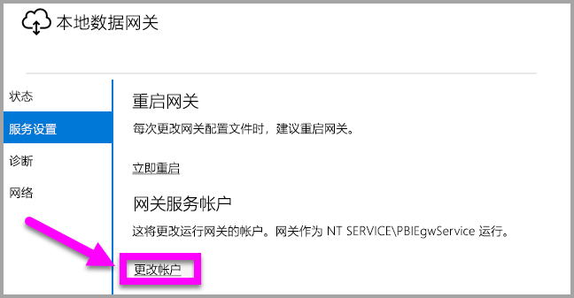

# 使用 Kerberos 进行从 Power BI 到本地数据源的 SSO（单一登录）
通过使用 Kerberos 配置本地数据网关，可以获得无缝的单一登录连接，从而使 Power BI 报表和仪表板可以从本地数据进行更新。 本地数据网关使用用于连接到本地数据源的 DirectQuery 实现单一登录 (SSO)。

目前支持以下数据源：SQL Server、SAP HANA 和 Teradata，全部基于 [Kerberos 约束委派](https://technet.microsoft.com/library/jj553400.aspx)。

* SQL Server
* SAP HANA
* Teradata

当用户与 Power BI 服务中的 DirectQuery 报表进行交互时，每个交叉筛选、切片、排序和报表编辑操作都可能会导致针对基础的本地数据源执行实时查询。  当为数据源配置单一登录时，查询将以与 Power BI 交互的用户身份（即通过 Web 体验或 Power BI 移动应用）执行。 因此，每个用户都可以精确地看到自己在基础数据源中拥有权限的数据 - 配置单一登录后，不同用户之间没有共享的数据缓存。

## 使用 SSO 运行查询 - 发生的步骤
使用 SSO 运行的查询由三个步骤组成，如下图所示。

> [!NOTE]
> 尚未启用 SSO for Oracle 功能，但正在开发此功能，该功能即将上市。
> 
> 

以下是有关这些步骤的其他详细信息：

1. 对于每个查询，当向配置的网关发送查询请求时，Power BI 服务包括用户主体名称 (UPN)。
2. 网关需要将 Azure Active Directory UPN 映射到本地 Active Directory 标识。
   
   a.  如果已配置 AAD DirSync（也称为“AAD Connect”），则会自动在网关中进行映射。
   
   b.  或者，网关可以通过在本地 Active Directory 域进行查找的方式来查找 Azure AD UPN，并将其映射到本地用户。
3. 网关服务进程模拟映射的本地用户，打开与基础数据库的连接并发送查询。 网关不需要与数据库安装在同一台计算机上。
   
   - 只有在网关服务帐户是域帐户（或服务 SID）并且已配置 Kerberos 约束委派以使数据库接受来自网关服务帐户的 Kerberos 票据时，用户模拟和数据库连接才会成功。  
   
   > [!NOTE]
   > 对于服务 SID，如果配置了 AAD DirSync / Connect 并且用户帐户已同步，则网关服务不需要在运行时执行本地 AD 查找，并且可以将本地服务 SID（而不是请求域帐户）用于网关服务。  本文档所述的 Kerberos 约束委派配置步骤完全相同（只是基于服务 SID 而不是域帐户来应用）。
   > 
   > 

> [!NOTE]
> 要为 SAP HANA 启用 SSO，需要确保以下 HANA 专属配置满足 SAP：
>    1. 确保 SAP HANA 服务器正在运行版本 2.00.022* 或更高版本。 
>    2. 在网关计算机上，安装 SAP 的最新 HANA ODBC 驱动程序。  最低版本为 2017 年 8 月发布的 HANA ODBC 版本 2.00.020.00。
>
> 以下来自 SAP 的修补和升级链接可能会有用。 请注意，必须使用 SAP 支持的帐户登录到以下资源，并且 SAP 可能会更改或更新这些链接。
> 
> * [HANA 2 SPS 01 Rev 012.03](https://launchpad.support.sap.com/#/notes/2557386) 
> * [HANA 2 SPS 02 Rev 22](https://launchpad.support.sap.com/#/notes/2547324) 
> * [HANA 1 SP 12 Rev 122.13](https://launchpad.support.sap.com/#/notes/2528439)

## Kerberos 配置不全导致的错误
如果基础数据库服务器和网关未针对 Kerberos 约束委派正确配置，则可能会收到以下错误消息：

与错误消息相关的技术详细信息可能如下所示：

结果是由于 Kerberos 配置不全，网关无法正确模拟原始用户，并且数据库连接尝试失败。

## 准备 Kerberos 约束委派
必须配置多个项才能使 Kerberos 约束委派正常工作，其中包括服务主体名称 (SPN) 和服务帐户上的委派设置。

### 先决条件 1：安装并配置本地数据网关
此版本的本地数据网关支持就地升级，以及现有网关的设置接管。

### 先决条件 2：将网关 Windows 服务作为域帐户运行
在标准安装中，网关作为计算机本地服务帐户（具体而言，NT Service\PBIEgwService）运行，如下图所示：

若要启用 Kerberos 约束委派，网关必须作为域帐户运行，除非 AAD 已与本地 Active Directory 同步（使用 AAD DirSync/Connect）。 为了使此帐户更改正常工作，有以下两个选项可供选择：

* 如果从以前版本的本地数据网关开始，请准确地按照以下文章中所述的顺序执行所有 5 个步骤（包括在步骤 3 中运行网关配置程序）：
  
  * [将网关服务帐户更改为域用户](https://powerbi.microsoft.com/documentation/powerbi-gateway-proxy/#changing-the-gateway-service-account-to-a-domain-user)
  * 如果你已经安装了本地数据网关的预览版本，则会有一个新的用户界面指导方法直接从网关的配置程序中切换服务帐户。 请参阅本文末尾处的“将本网关切换到域帐户”部分。

> [!NOTE]
> 如果配置了 AAD DirSync / Connect 并且用户帐户已同步，则网关服务不需要在运行时执行本地 AD 查找，并且可以将本地服务 SID（而不是请求域帐户）用于网关服务。 本文所述的 Kerberos 约束委派配置步骤与该配置相同（它们只需基于服务 SID 应用，而不是域帐户）。
> 
> 

### 先决条件 3：具有域管理员权限才能配置 SPN (SetSPN) 和 Kerberos 约束委派设置
虽然从技术上讲域管理员可以暂时或永久地允许其他人配置 SPN 和 Kerberos 委派，且无需域管理员权限，但这不是建议的方法。 在下一节中，将详细介绍先决条件 3 所需的配置步骤。

## 为网关和数据源配置 Kerberos 约束委派
若要正确配置系统，我们需要配置或验证以下两项：

1. 如果需要，为网关服务域帐户配置 SPN（如果尚未创建）。
2. 在网关服务域帐户上配置委派设置。

请注意，你必须是域管理员才能执行这两个配置步骤。

下列各节将依次介绍这些步骤。

### 为网关服务帐户配置 SPN
首先，确定是否已经为用作网关服务帐户的域帐户创建了 SPN，请执行以下步骤：

1. 以域管理员身份启动“Active Directory 用户和计算机”
2. 右键单击该域，选择“查找”，然后输入网关服务帐户的帐户名
3. 在搜索结果中，右键单击网关服务帐户，然后选择“属性”。
   
   * 如果 “委派” 选项卡在 “属性” 对话框中可见，则表明已创建 SPN，并且可以跳到有关配置委派设置的下一小节。

如果“属性”对话框中没有“委派”选项卡，则可以在添加“委派”选项卡的帐户上手动创建一个 SPN（这是配置委派设置的最简单的方法）。 创建 SPN 可以使用 Windows 附带的 [setspn 工具](https://technet.microsoft.com/library/cc731241.aspx)来完成（需要域管理员权限才能创建 SPN）。

例如，假设网关服务帐户为“PBIEgwTest\GatewaySvc”，并且运行网关服务的计算机名为 Machine1。 若要为本示例中计算机的网关服务帐户设置 SPN，可以运行以下命令：

完成该步骤后，我们可以继续配置委派设置。

### 在网关服务帐户上配置委派设置
第二个配置要求是网关服务帐户上的委派设置。 有多种工具可以用来执行这些步骤。 在本文中，我们将使用“Active Directory 用户和计算机” ，这是一个 Microsoft 管理控制台 (MMC) 管理单元，可用于管理和发布目录中的信息，并且默认在域控制器上可用。 也可以通过其他计算机上的“Windows 功能”配置来启用它。

我们需要通过协议转换来配置“Kerberos 约束委派”。 通过约束委派，必须显式设置要委派哪些服务 - 例如，只有 SQL Server 或 SAP HANA 服务器才能接受来自网关服务帐户的委派调用。

本节假定你已经为基础数据源（例如 SQL Server、SAP HANA、Teradata 等）配置了 SPN。 若要了解如何配置这些数据源服务器 SPN，请参阅相应数据库服务器的技术文档。 另外，也可以查看描述[*你的应用需要哪种 SPN？*](https://blogs.msdn.microsoft.com/psssql/2010/06/23/my-kerberos-checklist/)的博客文章。

在下面的步骤中，我们假定一个本地环境具有两台计算机：一台网关计算机和一台数据库服务器（SQL Server 数据库），为了此示例，我们还假定以下设置和名称：

* 网关计算机名：PBIEgwTestGW
* 网关服务帐户：PBIEgwTest\GatewaySvc（帐户显示名：网关连接器）
* SQL Server 数据源计算机名：PBIEgwTestSQL
* SQL Server 数据源服务帐户：PBIEgwTest\SQLService

给定这些示例名和设置，配置步骤如下：

1. 通过域管理员权限，启动“Active Directory用户和计算机”。
2. 右键单击网关服务帐户 (PBIEgwTest\GatewaySvc)，然后选择“属性”。
3. 选择“**委派**”选项卡。
4. 选择“仅信任此计算机来委派指定的服务”。
5. 选择“使用任何身份验证协议”。
6. 在“可以由此帐户提供委派凭据的服务:”下选择“添加”。
7. 在新对话框中，选择“用户或计算机”。
8. 输入 SQL Server 数据库服务 (PBIEgwTest\SQLService) 的服务帐户，然后选择“确定”。
9. 选择你为数据库服务器创建的 SPN。 在我们的示例中，SPN 将以 MSSQLSvc 开头。 如果你为数据库服务添加了 FQDN 和 NetBIOS SPN，请同时选择两者。 你可能只会看到其中一个。
10. 选择**确定**。 现在，列表中应该会显示 SPN。
11. 或者，你可以选择“已展开”以在以下位置同时显示 FQDN 和 NetBIOS SPN
12. 如果你选中了“已展开”，则对话框将如下所示。
    
    
13. 选择**确定**。
    
    最后，在运行网关服务（在我们的示例中为 PBIEgwTestGW）的计算机上，必须为网关服务帐户授予本地策略“身份验证后模拟客户端”。 可以使用本地组策略编辑器 (gpedit) 执行/验证此操作。
14. 在网关计算机上运行：gpedit.msc
15. 导航到“本地计算机策略”>“计算机配置”>“Windows设置”>“安全设置”>“本地策略”>“用户权限分配”，如下图所示。
    
    
16. 从“用户权限分配”下的策略列表中，选择“身份验证后模拟客户端”。
    
    
    
    右键单击并打开“身份验证后模拟客户端”的“属性”，并检查帐户列表。 其中必须包括网关服务帐户 (PBIEgwTest\GatewaySvc)。
17. 从“用户权限分配”下的策略列表中，选择“以操作系统方式执行”(SeTcbPrivilege)。 确保网关服务帐户也包括在帐户列表中。
18. 重启“本地数据网关”服务进程。

## 运行 Power BI 报表
完成本文前述的所有配置步骤后，可以使用 Power BI 中的“管理网关”页配置数据源，并在其“高级设置”下启用 SSO，然后发布绑定到该数据源的报表和数据集。

此配置将在大多数情况下有效。 但是，使用 Kerberos 时，根据你的环境可以有不同的配置。 如果报表仍无法加载，则需要联系你的域管理员进一步调查。

## 将网关切换到域帐户
在本文前面部分，我们讨论了使用本地数据网关用户界面将网关从本地服务帐户切换为作为域帐户运行。 以下是执行此操作必需的步骤。

1. 启动“本地数据网关”配置工具。
   
   
2. 选择主页上的“登录”按钮，然后使用你的 Power BI 帐户登录。
3. 登录完成后，选择“服务设置”选项卡。
4. 单击“更改帐户”以开始指导说明，如下图所示。
   
   

## 后续步骤
有关“本地数据网关”和 DirectQuery 的详细信息，请查看以下资源：

* [本地数据网关](service-gateway-onprem.md)
* [Power BI 中的 DirectQuery](desktop-directquery-about.md)
* [DirectQuery 支持的数据源](desktop-directquery-data-sources.md)
* [DirectQuery 和 SAP BW](desktop-directquery-sap-bw.md)
* [DirectQuery 和 SAP HANA](desktop-directquery-sap-hana.md)

