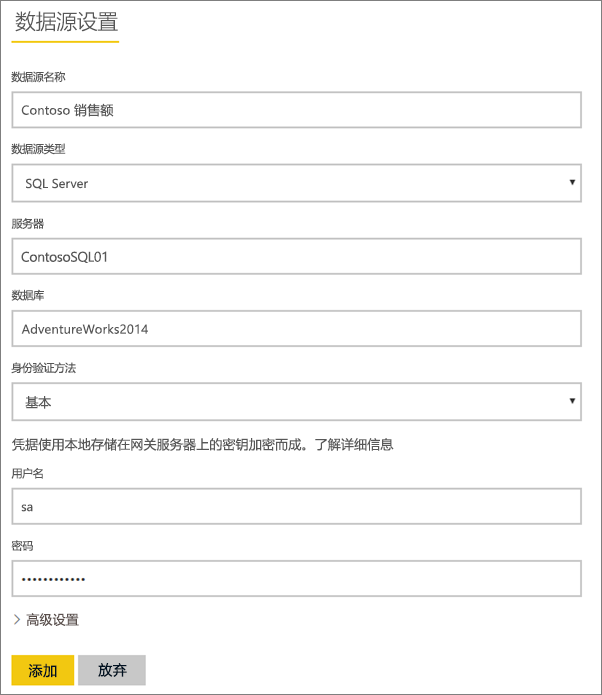
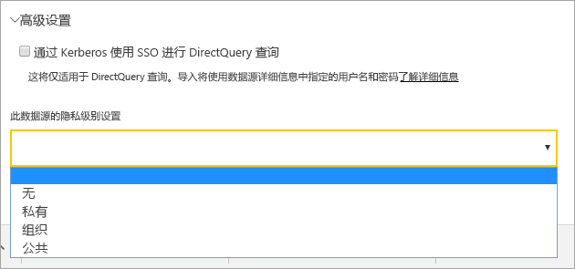
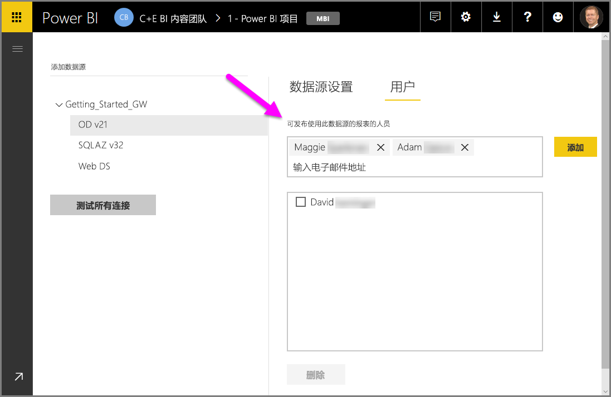
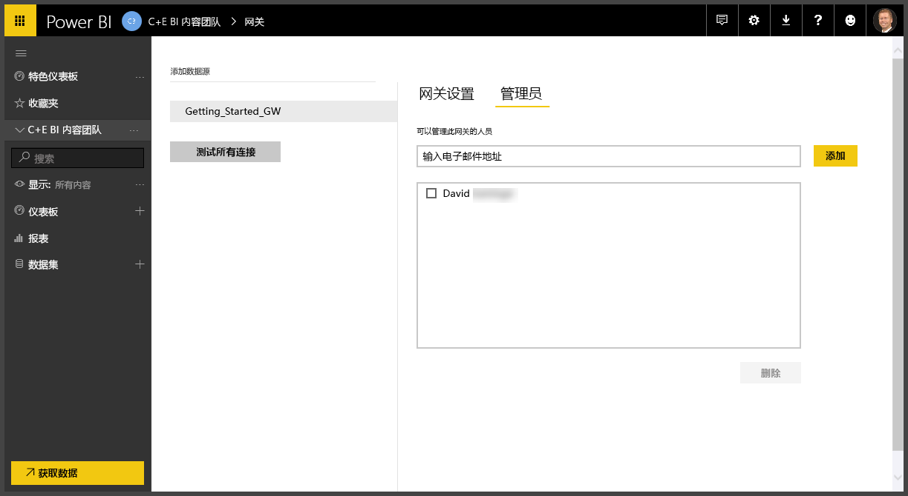
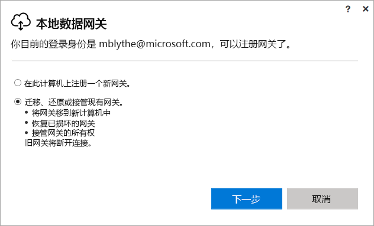
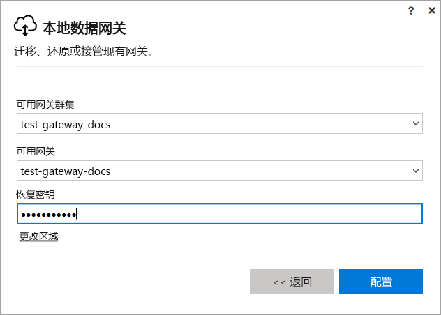

# 管理 Power BI 网关

[安装 Power BI 数据网关](service-gateway-install.md)后，根据需求管理网关。 本主题介绍了如何添加和删除数据源和用户、如何重启网关，以及如何迁移、还原、接管和删除网关。 

可以通过 Power BI 服务的“管理网关”部分、本地计算机上的网关应用和 PowerShell 脚本来管理网关。 本文重点介绍 Power BI 服务。 

如果刚安装了网关，我们建议你接下来[添加数据源](#add-a-data-source)，然后[添加用户](#add-users-to-a-data-source)，以便他们可以访问数据源。

## 管理数据源

Power BI 支持多个本地数据源，每个都具有自己的要求。 网关可用于一个数据源，也可用于多个数据源。 对于此示例，我们将向你演示如何添加 SQL Server 作为数据源，但步骤与其他数据源的步骤类似。

### 添加数据源

1. 在 Power BI 服务的右上角，选择齿轮图标 > “管理网关”。

    

2. 选择一个网关 >“添加数据源”，或转到“网关”>“添加数据源”。

    

3. 选择“数据源类型”。

    

4. 输入数据源的信息。 对于此示例，可以是“服务器”、“数据库”和其他信息。  

    

5. 对于 SQL Server，你可以选择 Windows 或“基本”的“身份验证方法”（SQL 身份验证）。  如果选择“基本”，则输入数据源的凭据。

6. 在“高级设置”下，可以选择配置数据源的[隐私级别](https://support.office.com/article/Privacy-levels-Power-Query-CC3EDE4D-359E-4B28-BC72-9BEE7900B540)（不适用于 [DirectQuery](desktop-directquery-about.md)）。

    

7. 选择**添加**。 如果过程成功，会看到“连接成功”。

    

现在可以使用此数据源在 Power BI 仪表板和报表中包含来自 SQL Server 的数据。

### 删除数据源

如果不再使用数据源，则可以将其删除。 请注意，删除数据源将中断依赖于该数据源的所有仪表板和报表。

若要删除数据源，请转到“数据源”，然后选择“删除”。

## 管理角色和管理员

将数据源添加到网关后，将为用户和安全组提供对特定数据源（不是整个网关）的访问权限。 数据源用户列表仅控制有权发布包含来自数据源的数据的报表的用户。 报表所有者可以创建仪表板、内容包和应用，然后与其他用户共享它们。

还可以为用户和安全组提供对网关的管理访问权限。

### 将用户添加到数据源

1. 在 Power BI 服务的右上角，选择齿轮图标 > “管理网关”。

2. 选择要添加用户的数据源。

3. 选择“用户”，然后输入组织中想要授予对所选数据源的访问权限的用户。 在下面的屏幕中，你可以看到我添加的 Maggie 和 Adam。

    

4. 选择“添加”，此时框中将显示添加的成员。

    

以上就是步骤的全部内容。 请注意，需要将用户添加到你希望向其授予访问权限的每个数据源。 每个数据源具有一个单独的用户列表，必须分别将用户添加到每个数据源。

### 从数据源中删除用户

在数据源的“用户”选项卡上，可以删除使用此数据源的用户和安全组。

### 添加和删除管理员

在网关的“管理员”选项卡上，可以添加和删除能够管理网关的用户（或安全组）。

## 管理网关群集

在创建包含两个或更多个网关的群集后，所有网关管理操作（例如添加数据源或授予对网关的管理权限）都将应用到该群集所属的所有网关。 

当管理员使用“Power BI 服务”中齿轮图标下面的“管理网关”菜单项时，会看到已注册群集或各个网关的列表，但看不到属于群集的单个网关实例。

所有新的“计划刷新”请求和 DirectQuery 操作都将自动路由到给定网关群集的主实例。 如果主网关实例不处于联机状态，则请求将路由到群集中的另一个网关实例。

## 共享网关

不得共享网关本身，但可以将管理员添加到网关中，并能将用户添加到网关的数据源中。 

安装网关后，你默认就是此网关的管理员。 如前所述，可以将其他人添加为管理员。 这些管理员可以添加数据源、配置和删除网关。

还可以将用户分配到你在每个网关下创建的数据源。 然后，用户可以使用这些数据源刷新 Power BI 报表。 不过，用户无法更改任何数据源或网关设置。

## 迁移、还原或接管网关

在要迁移、还原或接管网关的计算机上运行网关安装程序。

1. 下载并安装网关。

2. 登录到 Power BI 帐户后，注册网关。 选择“迁移、还原或接管现有网关” > “下一步”。

    

3. 从可用群集和网关中选择，然后输入所选网关的恢复密钥。 选择“**配置**”。

    

## 重新启动网关

网关作为一项 Windows 服务运行。 像任何 Windows 服务一样，有多种方法可以启动和停止它。 下面是你可以如何从命令提示符执行此操作。

1. 在运行网关的计算机上，使用管理员特权启动命令提示符

2. 输入 `net stop PBIEgwService` 停止服务。

3. 输入 `net start PBIEgwService` 重新启动服务。

## 删除网关

如果不再使用网关，则可以将其删除。 但请注意，删除网关会删除其下的所有数据源， 进而中断依赖于这些数据源的所有仪表板和报表。

1. 在 Power BI 服务的右上角，选择齿轮图标 > “管理网关”。

2. 选择网关 >“删除”
   
   

## 后续步骤

[部署数据网关指南](service-gateway-deployment-guidance.md)

更多问题？ [尝试参与 Power BI 社区](http://community.powerbi.com/)
