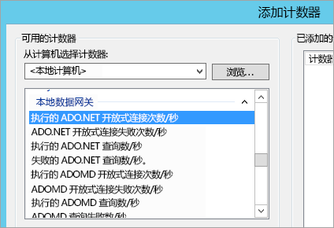
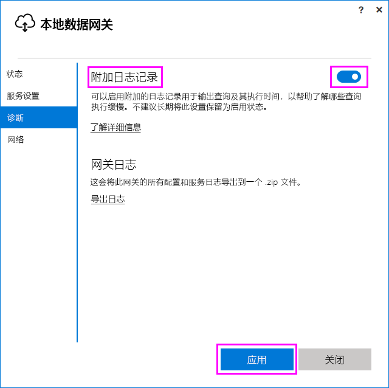
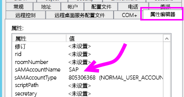
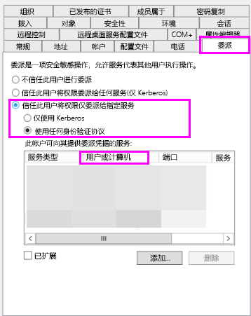
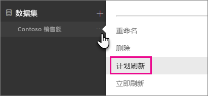
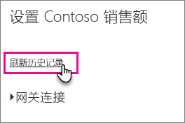

# <a name="troubleshooting-the-on-premises-data-gateway"></a>本地数据网关故障排除

本文介绍使用本地数据网关时的一些常见问题。

<!-- Shared Community & support links Include -->
[!INCLUDE [gateway-onprem-tshoot-support-links-include](./includes/gateway-onprem-tshoot-support-links-include.md)]

<!-- Shared Troubleshooting Install Include -->
[!INCLUDE [gateway-onprem-tshoot-install-include](./includes/gateway-onprem-tshoot-install-include.md)]

## <a name="configuration"></a>配置

### <a name="how-to-restart-the-gateway"></a>如何重启网关

由于网关作为 Windows 服务运行，因此可通过多种方式启动和停止。 例如，可以在网关正在运行的计算机上使用提升权限打开命令提示符，然后运行以下命令之一：

* 若要停止服务，则运行该命令：

    '''   net stop PBIEgwService   '''

* 若要启动服务，则运行该命令：

    '''   net start PBIEgwService   '''

### <a name="error-failed-to-create-a-gateway-try-again"></a>错误：无法创建网关。 请重试

所有详细信息均可用，但对 Power BI 服务的调用返回了一个错误。 显示错误和一个活动 ID。 这可能是不同的原因导致的。 你可以收集并查看以下所述的日志，获取更多详细信息。

这也可能是由于代理配置问题导致的。 用户界面现在允许代理配置。 你可以了解有关进行[代理服务器配置更改](service-gateway-proxy.md)的详细信息

### <a name="error-failed-to-update-gateway-details-please-try-again"></a>错误：未能更新网关详细信息。 请重试

从 Power BI 服务到网关收到了信息。 信息已传递到本地 Windows 服务，但它无法返回值。 或者，对称密钥生成失败。 内部异常显示在“显示详细信息”下。 若要获取更多详细信息，可以收集并查看以下所述的日志。

### <a name="error-power-bi-service-reported-local-gateway-as-unreachable-restart-the-gateway-and-try-again"></a>错误：Power BI 服务报告本地网关无法访问。 请重启网关，然后重试

配置结束时，将再次调用 Power BI 服务以验证网关。 Power BI 服务没有将网关报告为动态。 重启 Windows 服务可能会使通信成功。 你可以收集并查看以下所述的日志，获取更多详细信息。

### <a name="script-error-during-sign-into-power-bi"></a>登录 Power BI 时出现的脚本错误

在执行本地数据网关配置期间登录 Power BI 可能会收到脚本错误。 安装以下安全更新应可解决该问题。 这可以通过 Windows 更新进行安装。

[MS16-051：Internet Explorer 的安全更新：2016 年 5 月 10 日 (KB 3154070)](https://support.microsoft.com/kb/3154070)

### <a name="gateway-configuration-failed-with-a-null-reference-exception"></a>网关配置失败，出现 null 引用异常

你可能会遇到以下类似错误。

        Failed to update gateway details.  Please try again.
        Error updating gateway configuration.

这包括堆栈跟踪，并且该堆栈跟踪可能包括以下消息。

        Microsoft.PowerBI.DataMovement.Pipeline.Diagnostics.CouldNotUpdateGatewayConfigurationException: Error updating gateway configuration. ----> System.ArgumentNullException: Value cannot be null.
        Parameter name: serviceSection

如果你正从旧网关中升级，我们会保存配置文件。 可能存在缺失的部分。 当网关尝试读取它时，我们可获取上述 null 引用异常。

要纠正这一错误，请执行以下步骤。

1. 卸载网关。
2. 删除以下文件夹。

        c:\Program Files\On-premises data gateway
3. 重新安装网关。
4. 酌情应用恢复密钥以还原现有网关。

### <a name="support-for-tls-1112"></a>对 TLS 1.1/1.2 的支持

自 2017 年 8 月更新起，本地数据网关默认使用传输层安全 (TLS) 1.1 或 1.2 与 Power BI 服务进行通信。 以前版本的本地数据网关默认使用 TLS 1.0。 必须将本地数据网关安装升级到 2017 年 8 月版本或更新版本，以确保网关继续运行。

>[!NOTE]
>对 TLS 1.0 的支持已于 2017 年 11 月 1 日结束。

值得注意的是，TLS 1.0 在 2017 年 11 月 1 日之前仍受本地数据网关支持，并由网关用作回退机制。 要确保所有网关流量使用 TLS 1.1 或 1.2（并防止在网关上使用 TLS 1.0），必须在运行网关服务的计算机上添加或修改以下注册表项：

        [HKEY_LOCAL_MACHINE\SOFTWARE\Microsoft\.NETFramework\v4.0.30319]"SchUseStrongCrypto"=dword:00000001
        [HKEY_LOCAL_MACHINE\SOFTWARE\Wow6432Node\Microsoft\.NETFramework\v4.0.30319]"SchUseStrongCrypto"=dword:00000001

> [!NOTE]
> 添加或修改这些注册表项会将更改应用于所有 .NET 应用程序。 有关影响其他应用程序的 TLS 的注册表更改的信息，请参阅[传输层安全性 (TLS) 注册表设置](https://docs.microsoft.com/windows-server/security/tls/tls-registry-settings)。

## <a name="data-sources"></a>数据源

### <a name="error-unable-to-connect-details-invalid-connection-credentials"></a>错误：无法连接。 详细信息：“无效的连接凭据”

在“显示详细信息”中，显示从数据源收到的错误消息。 对于 SQL Server，可看到如下所示的内容。

    Login failed for user 'username'.

验证你具有正确的用户名和密码。 另外，验证这些凭据是否可以成功地连接到数据源。 请确保所使用的帐户与**身份验证方法**匹配。

### <a name="error-unable-to-connect-details-cannot-connect-to-the-database"></a>错误：无法连接。 详细信息：“无法连接到数据库”

我们可以连接到服务器，但不能连接所提供的数据库。 验证该数据库的名称以及该用户凭据有适当的权限来访问该数据库。

在“显示详细信息”中，显示从数据源收到的错误消息。 对于 SQL Server，可看到如下所示的内容。

    Cannot open database "AdventureWorks" requested by the login. The login failed. Login failed for user 'username'.

### <a name="error-unable-to-connect-details-unknown-error-in-data-gateway"></a>错误：无法连接。 详细信息：“数据网关中的未知错误”

此错误可能会由于不同的原因发生。 请务必验证你可以从承载网关的计算机连接到数据源。 这可能是不可访问的服务器的结果。

在“显示详细信息”中，可以看到错误代码 DM_GWPipeline_UnknownError。

还可以查看“事件日志”>“应用程序和服务日志” > “本地数据网关服务”，了解更多详细信息。

### <a name="error-we-encountered-an-error-while-trying-to-connect-to-server-details-we-reached-the-data-gateway-but-the-gateway-cant-access-the-on-premises-data-source"></a>错误：我们在尝试连接到<server>时遇到错误。 详细信息：“我们已连接到数据网关，但此网关无法访问本地数据源。”

我们无法连接指定的数据源。 请务必验证为该数据源所提供的信息。

在“显示详细信息”中，可以看到错误代码 DM_GWPipeline_Gateway_DataSourceAccessError。

如果基础错误消息类似于以下内容，这意味着你正在对数据源使用的帐户不是该 Analysis Services 实例的服务器管理员。 [了解详细信息](https://docs.microsoft.com/sql/analysis-services/instances/grant-server-admin-rights-to-an-analysis-services-instance)

    The 'CONTOSO\account' value of the 'EffectiveUserName' XML for Analysis property is not valid.

如果基础错误消息类似以下消息，则可能意味着 Analysis Services 的服务帐户可能缺少 [token-groups-global-and-universal](https://msdn.microsoft.com/library/windows/desktop/ms680300.aspx) (TGGAU) 目录属性。

    The username or password is incorrect.

具有 Windows 2000 以前版本兼容访问权限的域启用了 TGGAU 属性。 但是，最新创建的域不会默认启用此属性。 你可以在[此处](https://support.microsoft.com/kb/331951)了解更多相关信息。

通过执行以下操作对此进行确认。

1. 连接 SQL Server Management Studio 中的 Analysis Services 计算机。 在高级连接属性中，输入问题用户的 EffectiveUserName，并检查是否会产生错误。
2. 可以使用 dsacls Active Directory 工具来验证是否列出了属性。 此工具可在域控制器上找到。 你需要知道帐户的可分辨域名是什么，并将其传递给该工具。

        dsacls "CN=John Doe,CN=UserAccounts,DC=contoso,DC=com"

    你应该在结果中看到与以下类似的内容。

            Allow BUILTIN\Windows Authorization Access Group
                                          SPECIAL ACCESS for tokenGroupsGlobalAndUniversal
                                          READ PROPERTY

若要更正此问题，需要启用用于 Analysis Services Windows 服务的帐户上的 TGGAU。

#### <a name="another-possibility-for-username-or-password-incorrect"></a>用户名或密码错误的另一种可能

如果 Analysis Services 服务器与用户位于不同的域，并且没有建立双向信任，则也可能导致此错误。

需要通过域管理员来验证域间的信任关系。

#### <a name="unable-to-see-the-data-gateway-data-sources-in-the-get-data-experience-for-analysis-services-from-the-power-bi-service"></a>在 Power BI 服务中使用 Analysis Services 的“获取数据”功能时，无法查看数据网关数据源

确保你的帐户列于网关配置中数据源的**用户**选项卡。 如果你没有权限访问网关，请与网关管理员核对，并请他们进行验证。 仅用户列表中的帐户可查看列于 Analysis Services 列表中的数据源。

### <a name="error-you-dont-have-any-gateway-installed-or-configured-for-the-data-sources-in-this-dataset"></a>错误：没有为此数据集中的数据源安装或配置任何网关

请确保已按[添加数据源](service-gateway-manage.md#add-a-data-source)中所述，向网关添加一个或多个数据源。 如果“管理网关”下的管理门户中未显示网关，请尝试清除浏览器缓存或注销服务然后重新登录。

## <a name="datasets"></a>数据集

### <a name="error-there-is-not-enough-space-for-this-row"></a>错误：对于此行没有足够的空间

如果有大于 4 MB 大小的单个行，则会出现此错误。 需要从数据源确定该行，并尝试将其筛除或减少该行的大小。

### <a name="error-the-server-name-provided-doesnt-match-the-server-name-on-the-sql-server-ssl-certificate"></a>错误：提供的服务器名称与 SQL Server SSL 证书上的服务器名称不一致

如果证书 CN 针对的是服务器完全限定的域名 (FQDN)，而你只提供了服务器 NetBIOS 名称，则会出现此错误。 这会导致证书不匹配。 若要解决此问题，需要将网关数据源和 PBIX 文件内的服务器名称设置为使用服务器的 FQDN。

### <a name="i-dont-see-the-on-premises-data-gateway-present-when-configuring-scheduled-refresh"></a>我在配置计划的刷新时看不到本地数据网关

这可能是由几种不同的原因所致。

1. 你在 Power BI Desktop 中输入的服务器和数据库名称和网关数据源中的名称不一致。 值必须相同。 不区分大小写。
2. 网关配置中数据源的**用户**选项卡上未列出你的帐户。 需要与要添加到相应列表的网关的管理员联系。
3. Power BI Desktop 文件中有多个数据源，并不是所有这些数据源都配置为网关数据源。 需要定义每个网关数据源，这样相应网关才能在计划的刷新内显示。

### <a name="error-the-received-uncompressed-data-on-the-gateway-client-has-exceeded-the-limit"></a>错误：网关客户端上收到的未压缩数据已超出限制

每个表的未压缩数据量的确切限制为 10GB。 如果遇到此问题，可以使用实用选项来优化和避免此类问题发生。 具体而言，减少使用高度恒定、过长的字符串值，并改用规范化的键或删除列（如果不使用）会有所帮助。

## <a name="reports"></a>报表

### <a name="report-could-not-access-the-data-source-because-you-do-not-have-access-to-our-data-source-via-an-on-premises-data-gateway"></a>报表无法访问数据源，因为你没有权限通过本地数据网关访问我们的数据源

这通常是由于以下原因之一导致的。

1. 数据源信息与基础数据集中的内容不匹配。 为本地数据网关定义的数据源和为 Power BI Desktop 提供的内容之间的服务器和数据库名称需要匹配。 如果在 Power BI Desktop 中使用 IP 地址，则用于本地数据网关的数据源也需要使用 IP 地址。
2. 你的组织内的任何网关上均没有可用的数据源。 可以在新的或现有的本地数据网关上配置数据源。

### <a name="error-data-source-access-error-please-contact-the-gateway-administrator"></a>错误：数据源访问错误。 请联系网关管理员

如果此报表正在使用实时 Analysis Services 连接，你可能遇到的问题是值被传入无效或无权访问 Analysis Services 计算机的 EffectiveUserName 中。 通常来说，出现身份验证问题是由于传给 EffectiveUserName 的值与本地用户主体名称 (UPN) 不匹配。

若要对此进行确认，可执行以下操作。

1. 在[网关日志](#logs)中查找有效的用户名。
2. 传递值后，验证其是否正确。 如果它是你的用户，可以从命令提示符下使用以下命令，查看 UPN。 UPN 外观类似电子邮件地址。

        whoami /upn

或者，你可以查看 Power BI 从 Azure Active Directory 获取的内容。

1. 浏览到 [https://developer.microsoft.com/graph/graph-explorer](https://developer.microsoft.com/graph/graph-explorer)。
2. 选择右上角的“登录”。
3. 运行以下查询。 你将看到相当大的 JSON 响应。

        https://graph.windows.net/me?api-version=1.5
4. 查找 **userPrincipalName**。

如果你的 Azure Active Directory UPN 与本地 Active Directory UPN 不匹配，则可以使用[映射用户名](service-gateway-enterprise-manage-ssas.md#map-user-names)功能将其替换为有效的值。 或者，可以通过租户管理员或本地 Active Directory 管理员更改 UPN。

<!-- Shared Troubleshooting Firewall/Proxy Include -->
[!INCLUDE [gateway-onprem-tshoot-firewall-include](./includes/gateway-onprem-tshoot-firewall-include.md)]

通过执行以下操作，可以找到你所在的数据中心区域：

1. 选择 Power BI 服务右上角方的 **?** 。
2. 选择“关于 Power BI”。
3. 你的数据区域将列入“你的数据存储于”。

    

如果你仍未前往任何位置，则可以尝试使用 [fiddler](#fiddler) 或 netsh 一类的工具来获取网络跟踪，不过这些都是高级收集方法，并且你在分析所收集的数据时可能需要帮助。 可以联系[支持人员](https://support.microsoft.com)以获得帮助。

## <a name="performance"></a>性能

<iframe width="560" height="315" src="https://www.youtube.com/embed/IJ_DJ30VNk4?showinfo=0" frameborder="0" allowfullscreen></iframe>

### <a name="performance-counters"></a>性能计数器

有多个性能计数器可用于度量网关的活动。 这些计数器有助于你判断是否出现高活动负载，以及是否需要新建网关。 这些计数器不反映某个活动所花的时间。

可以通过 Windows 性能监视器工具访问这些计数器。



以下是这些计数器的一般分组。

| 计数器类型 | 说明 |
| --- | --- |
| ADO.NET |适用于任何 DirectQuery 连接。 |
| ADOMD |适用于 Analysis Services 2014 和更早版本。 |
| OLEDB |供某些数据源使用。 包括 SAP HANA 和 Analysis Service 2016 及更高版本。 |
| Mashup |包括任何导入的数据源。 如果要执行计划刷新或按需刷新，则该刷新通过 mashup 引擎进行。 |

以下是可用的性能计数器的列表。

| 计数器 | 说明 |
| --- | --- |
| 执行的 ADO.NET 开放式连接次数/秒 |每秒执行的 ADO.NET 开放式连接操作数量（成功或失败）。 |
| ADO.NET 开放式连接失败次数/秒 |每秒 ADO.NET 开放式连接操作失败次数。 |
| 执行的 ADO.NET 查询数/秒 |每秒执行的 ADO.NET 查询数量（成功或失败）。 |
| ADO.NET 查询失败数/秒 |每秒执行的 ADO.NET 查询失败数。 |
| 执行的 ADOMD 开放式连接次数/秒 |每秒执行的 ADOMD 开放式连接操作数量（成功或失败）。 |
| ADOMD 开放式连接失败次数/秒 |每秒 ADOMD 开放式连接操作失败次数。 |
| 执行的 ADOMD 查询数/秒 |每秒执行的 ADOMD 查询数量（成功或失败）。 |
| ADOMD 查询失败数/秒 |每秒执行的 ADOMD 查询失败数。 |
| 执行的所有开放式连接次数/秒 |每秒执行的开放式连接操作数量（成功或失败）。 |
| 开放式连接失败总数/秒 |每秒执行的开放式连接操作失败数量。 |
| 执行的查询总数/秒 |每秒执行的查询数量（成功或失败）。 |
| ADO.NET 连接池中的项目数 |ADO.NET 连接池中的项目数 |
| OLEDB 连接池中的项目数 |OLEDB 连接池中的项目数 |
| 服务总线池中的项目数 |服务总线池中的项目数 |
| 执行的 Mashup 开放式连接次数/秒 |每秒执行的 Mashup 开放式连接操作数量（成功或失败）。 |
| Mashup 开放式连接失败数/秒 |每秒 Mashup 开放式连接操作失败次数。 |
| 执行的 Mashup 查询数/秒 |每秒执行的 Mashup 查询数量（成功或失败）。 |
| Mashup 查询失败数/秒 |每秒执行的 Mashup 查询失败数。 |
| OLEDB 多结果集查询失败数/秒 |每秒执行的多结果集 OLEDB 查询失败数。 |
| 执行的 OLEDB 多结果集查询数/秒 |每秒执行的 OLEDB 多结果集查询数（成功或失败）。 |
| 执行的 OLEDB 开放式连接次数/秒 |每秒执行的 OLEDB 开放式连接操作数量（成功或失败）。 |
| OLEDB 开放式连接失败数/秒 |每秒 OLEDB 开放式连接操作失败次数。 |
| 执行的 OLEDB 查询数/秒 |每秒执行的 OLEDB 多结果集查询数（成功或失败）。 |
| OLEDB 查询失败数/秒 |每秒执行的 OLEDB 多结果集查询失败数。 |
| 执行的 OLEDB 单结果集查询数/秒 |每秒执行的 OLEDB 单结果集查询数（成功或失败）。 |
| 查询失败数/秒 |每秒执行的查询失败数。 |
| 单结果集 OLEDB 查询失败数/秒 |每秒执行的单结果集 OLEDB 查询失败数。 |

## <a name="reviewing-slow-performing-queries"></a>查看低性能查询

可能会发现通过网关的响应较比较慢。 这可能发生在执行 DirectQuery 查询或在刷新导入数据集时。 可以启用附加的日志记录用于输出查询及其执行时间，以帮助了解哪些查询执行缓慢。 找到长时间运行的查询后，可能需要对数据源进行额外修改才能优化查询性能。 例如，调整 SQL Server 查询的索引。

需要修改两个配置文件才能确定查询的持续时间。

### <a name="microsoftpowerbidatamovementpipelinegatewaycoredllconfig"></a>Microsoft.PowerBI.DataMovement.Pipeline.GatewayCore.dll.config

在 Microsoft.PowerBI.DataMovement.Pipeline.GatewayCore.dll.config 文件中将 `EmitQueryTraces` 的值从 `False` 更改为 `True`。 默认情况下，此文件位于 C:\Program Files\On-premises data gateway。 启用 `EmitQueryTraces` 可开始对从网关发送到数据源的查询进行日志记录。

> [!IMPORTANT]
> 启用 EmitQueryTraces 可能会根据网关使用情况显著增加日志大小。 完成日志审阅后，需要将 EmitQueryTraces 设置为 False。 不建议长期将此设置保留为启用状态。

```
<setting name="EmitQueryTraces" serializeAs="String">
    <value>True</value>
</setting>
```

**示例查询条目**

```
DM.EnterpriseGateway Information: 0 : 2016-09-15T16:09:27.2664967Z DM.EnterpriseGateway    4af2c279-1f91-4c33-ae5e-b3c863946c41    d1c77e9e-3858-4b21-3e62-1b6eaf28b176    MGEQ    c32f15e3-699c-4360-9e61-2cc03e8c8f4c    FF59BC20 [DM.GatewayCore] Executing query (timeout=224) "<pi>
SELECT
TOP (1000001) [t0].[ProductCategoryName],[t0].[FiscalYear],SUM([t0].[Amount])
 AS [a0]
FROM
(
(select [$Table].[ProductCategoryName] as [ProductCategoryName],
    [$Table].[ProductSubcategory] as [ProductSubcategory],
    [$Table].[Product] as [Product],
    [$Table].[CustomerKey] as [CustomerKey],
    [$Table].[Region] as [Region],
    [$Table].[Age] as [Age],
    [$Table].[IncomeGroup] as [IncomeGroup],
    [$Table].[CalendarYear] as [CalendarYear],
    [$Table].[FiscalYear] as [FiscalYear],
    [$Table].[Month] as [Month],
    [$Table].[OrderNumber] as [OrderNumber],
    [$Table].[LineNumber] as [LineNumber],
    [$Table].[Quantity] as [Quantity],
    [$Table].[Amount] as [Amount]
from [dbo].[V_CustomerOrders] as [$Table])
)
 AS [t0]
GROUP BY [t0].[ProductCategoryName],[t0].[FiscalYear] </pi>"
```

### <a name="microsoftpowerbidatamovementpipelinediagnosticsdllconfig"></a>Microsoft.PowerBI.DataMovement.Pipeline.Diagnostics.dll.config

在 Microsoft.PowerBI.DataMovement.Pipeline.Diagnostics.dll.config 文件中将 `TracingVerbosity` 的值从 `4` 更改为 `5`。 默认情况下，此文件位于 C:\Program Files\On-premises data gateway。 更改此设置可将详细条目写入网关日志。 其中包括显示持续时间的条目。 此外，还可以通过启用本地网关应用程序中的“附加日志记录”按钮来启用详细条目。

   

> [!IMPORTANT]
> 将 TracingVerbosity 设置为 `5` 可能会大大增加日志大小，具体视网关使用情况而定。 完成日志审阅后，需要将 TraceVerbosity 设置为 `4`。 不建议长期将此设置保留为启用状态。

```
<setting name="TracingVerbosity" serializeAs="String">
    <value>5</value>
</setting>
```

<a name="activities"></a>

### <a name="activity-types"></a>活动类型

| 活动类型 | 说明 |
| --- | --- |
| MGEQ |通过 ADO.NET 执行的查询。 包括 DirectQuery 数据源。 |
| MGEO |通过 OLEDB 执行的查询。 这包括 SAP HANA 和 Analysis Services 2016。 |
| MGEM |从 Mashup 引擎执行的查询。 适用于使用计划刷新或按需刷新的导入数据集。 |

### <a name="determine-the-duration-of-a-query"></a>确定查询的持续时间
若要确定查询数据源所花的时间，可以执行以下操作。

1. 打开网关日志。
2. 搜索[活动类型](#activities)来查找查询。 此处的示例为 MGEQ。
3. 记下次要 GUID，因为这是请求 ID。
4. 继续搜索 MGEQ，直到找到具有持续时间的 FireActivityCompletedSuccessfullyEvent 条目。 确认该条目具有相同请求 id。持续时间以毫秒为单位。

        DM.EnterpriseGateway Verbose: 0 : 2016-09-26T23:08:56.7940067Z DM.EnterpriseGateway    baf40f21-2eb4-4af1-9c59-0950ef11ec4a    5f99f566-106d-c8ac-c864-c0808c41a606    MGEQ    21f96cc4-7496-bfdd-748c-b4915cb4b70c    B8DFCF12 [DM.Pipeline.Common.TracingTelemetryService] Event: FireActivityCompletedSuccessfullyEvent (duration=5004)

   > [!NOTE]
   > FireActivityCompletedSuccessfullyEvent 是一个详细条目。 除非 TraceVerbosity 处于级别 5，否则不会记录此条目。

## <a name="firewall-or-proxy"></a>防火墙或代理

有关为你的网关提供代理信息的信息，请参阅[为 Power BI Gateway 配置代理设置](service-gateway-proxy.md)。

可以在 PowerShell 提示符处运行 [Test-NetConnection](https://docs.microsoft.com/powershell/module/nettcpip/test-netconnection) 以进行测试，从而确定防火墙或代理是否可能会阻止连接。 它将测试与 Azure 服务总线的连接。 这仅测试网络连接，与云服务器服务或网关没有任何关系。 它有助于确定你的计算机是否可以实际连接到互联网。

    Test-NetConnection -ComputerName watchdog.servicebus.windows.net -Port 9350

> [!NOTE]
> Test-NetConnection 仅适用于 Windows Server 2012 R2 及更高版本。 还适用于 Windows 8.1 及更高版本。 在旧版操作系统中，可以使用 Telnet 测试端口连接性。

结果应与以下所示类似。 不同之处在于 TcpTestSucceeded。 如果 **TcpTestSucceeded** 不为 *true*，则你可能会被防火墙阻止。

    ComputerName           : watchdog.servicebus.windows.net
    RemoteAddress          : 70.37.104.240
    RemotePort             : 5672
    InterfaceAlias         : vEthernet (Broadcom NetXtreme Gigabit Ethernet - Virtual Switch)
    SourceAddress          : 10.120.60.105
    PingSucceeded          : False
    PingReplyDetails (RTT) : 0 ms
    TcpTestSucceeded       : True

如果你想做到面面俱到，请将 **ComputerName** 和 **Port** 值替换为对[端口](https://docs.microsoft.com/power-bi/service-gateway-onprem#ports)列出的相应项

防火墙可能也会阻止 Azure 服务总线与 Azure 数据中心之间的连接。 如果是这种情况，那么需要将这些数据中心中你所在区域的 IP 地址列入允许列表（取消阻止）。 你可以在[此处](https://www.microsoft.com/download/details.aspx?id=41653)获得 Azure IP 地址列表。

### <a name="network-ports-test"></a>网络端口测试

网络端口测试工具用于检查网关是否可以访问网关传输数据所需的所有远程服务器的正确端口。 如果网络端口测试未能连接任何端口，则网关可能遇到网络问题。 如果网关当前遇到网络问题，请运行网络端口测试，以确保网络环境最佳。  

#### <a name="start-a-new-test"></a>开始新测试

在本地数据网关用户界面运行新的网络端口测试。


执行网络端口测试时，网关从 Azure 服务总线检索端口和服务器列表，然后尝试连接所有服务器和端口。 如果再次出现“开始新测试”链接，则表示网络端口测试已完成执行。  

#### <a name="test-results"></a>测试结果

可在“开始新测试”链接下的“最近的测试结果”中查看测试总结。 两个结果为“已完成(成功)”和“已完成(失败，请查看最近的测试结果)”。 如果测试成功，则网关已成功连接到所需的所有端口。 如果测试失败，则网络环境可能在阻止这些所需的端口和服务器。 


若要查看最近完成的测试结果，请选择“打开最近完成的测试结果”链接，如下所示。 测试结果在 Windows 的默认文本编辑器中打开。  

测试结果将列出网关所需的所有服务器、端口和 IP 地址。 如果测试结果中有任何端口显示为“已关闭”（如下所示），请确保网络环境不会阻止连接。 可能需要与网络管理员联系，以打开所需端口。


## <a name="kerberos"></a>Kerberos

如果基础数据库服务器和本地数据网关未针对 [Kerberos 约束委派](service-gateway-kerberos-for-sso-pbi-to-on-premises-data.md)进行适当配置，则在网关上启用[详细日志记录](#microsoftpowerbidatamovementpipelinediagnosticsdllconfig)，并基于网关日志文件中的错误/跟踪进行调查，作为故障排除的起始点。

### <a name="impersonationlevel"></a>ImpersonationLevel

ImpersonationLevel 与 SPN 设置或本地策略设置相关。

```
[DataMovement.PipeLine.GatewayDataAccess] About to impersonate user DOMAIN\User (IsAuthenticated: True, ImpersonationLevel: Identification)
```

**解决方案**

请按照下列步骤操作，解决该问题：
1. 为本地网关设置 SPN
2. 在 Active Directory (AD) 中设置约束委派

### <a name="failedtoimpersonateuserexception-failed-to-create-windows-identity-for-user-userid"></a>FailedToImpersonateUserException: 未能为用户 userid 创建 Windows 标识

如果无法代表其他用户进行模拟，将出现 FailedToImpersonateUserException。 如果尝试模拟的帐户来自另一个域，而不是网关服务域所在的域（这是一个限制），也可能会发生这种情况。

**解决方案**

* 按照上面 ImpersonationLevel 部分中的步骤操作，验证配置是否正确
* 请确保它尝试模拟的 userid 是一个有效的 AD 帐户

### <a name="general-error-1033-error-while-parsing-the-protocol"></a>常规错误；分析协议时出现的 1033 错误

如果使用 UPN (alias@domain.com) 模拟用户，那么在 SAP HANA 中配置的外部 ID 与登录名不匹配时，就会收到 1033 错误。 在日志中，可看到“原始 UPN 'alias@domain.com 在错误日志顶部替换为新 UPN 'alias@domain.com'”，如下所示。

```
[DM.GatewayCore] SingleSignOn Required. Original UPN 'alias@domain.com' replaced with new UPN 'alias@domain.com.'
```

**解决方案**

* SAP HANA 要求模拟的用户在 AD（用户别名）中使用 sAMAccountName 属性。 如果不正确，将看到 1033 错误。

    

* 可在日志中看到 sAMAccountName（别名）而不是 UPN，它是后跟域的别名 (alias@doimain.com)

    

```
      <setting name="ADUserNameReplacementProperty" serializeAs="String">
        <value>sAMAccount</value>
      </setting>
      <setting name="ADServerPath" serializeAs="String">
        <value />
      </setting>
      <setting name="CustomASDataSource" serializeAs="String">
        <value />
      </setting>
      <setting name="ADUserNameLookupProperty" serializeAs="String">
        <value>AADEmail</value>
```

### <a name="sap-aglibodbchdb-dllhdbodbc-communication-link-failure-10709-connection-failed-rte-1-kerberos-error-major-miscellaneous-failure-851968-minor-no-credentials-are-available-in-the-security-package"></a>[SAP AG][LIBODBCHDB DLL][HDBODBC] 通讯链接失败;-10709 连接失败 (RTE:[-1] Kerberos 错误。 主要:“其他故障 [851968]”，次要:“安全包中没有可用的凭据

如果未在 AD 中正确配置委派，将收到 -10709 连接失败错误消息。

**解决方案**

* 确保在网关服务帐户 AD 中的“委派”选项卡上拥有 SAP Hana 服务器

   

<!-- Shared Troubleshooting tools Include -->
[!INCLUDE [gateway-onprem-tshoot-tools-include](./includes/gateway-onprem-tshoot-tools-include.md)]

### <a name="refresh-history"></a>刷新历史记录

在计划刷新中使用网关时，如果需要创建一个支持请求，刷新历史记录可帮助查看发生了什么错误，以及提供有用的数据。 可以查看计划刷新和按需刷新。 下面是有关如何**刷新历史记录**的说明。

1. 在 Power BI 导航窗格中的**数据集**中，选择一个数据集&gt;打开菜单&gt;**计划刷新**。

    
2. 在**设置...**&gt;**计划刷新**中，选择**刷新历史记录**。

    

    

若要详细了解如何对刷新方案进行故障排除，请参阅[对刷新方案进行故障排除](refresh-troubleshooting-refresh-scenarios.md)一文。

## <a name="next-steps"></a>后续步骤
[为 Power BI Gateway 配置代理设置](service-gateway-proxy.md)  
[本地数据网关](service-gateway-onprem.md)  
[本地数据网关 - 深入了解](service-gateway-onprem-indepth.md)  
[管理数据源 - Analysis Services](service-gateway-enterprise-manage-ssas.md)  
[管理数据源 - SAP HANA](service-gateway-enterprise-manage-sap.md)  
[管理数据源 - SQL Server](service-gateway-enterprise-manage-sql.md)  
[管理数据源 - 导入/计划刷新](service-gateway-enterprise-manage-scheduled-refresh.md)  
更多问题？ [尝试参与 Power BI 社区](http://community.powerbi.com/)
