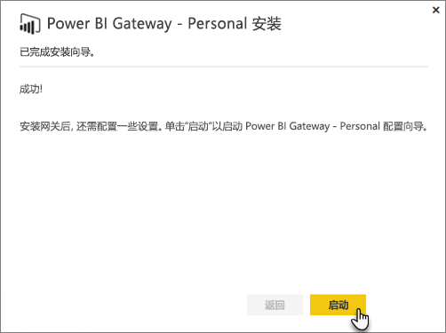
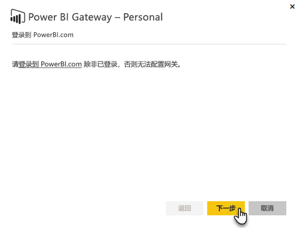
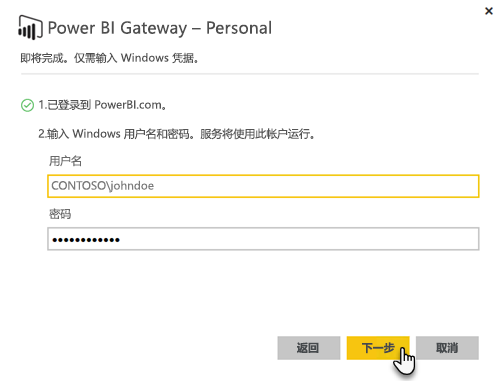

# 本地数据网关

本地数据网关的作用好似一架桥，提供本地数据（不在云中的数据）与 Power BI、Microsoft Flow、逻辑应用以及 PowerApps 服务之间快速且安全的数据传输。

你可以同时将单个网关与不同的服务一起使用。 如果使用的是 Power BI 和 PowerApps，可以对它们使用同一个网关。 它依赖于你登录的帐户。

> [!NOTE]
> 本地数据网关在所有模式下实现数据压缩和传输加密。

<!-- Shared Requirements Include -->
[!INCLUDE [gateway-onprem-requirements-include](./includes/gateway-onprem-requirements-include.md)]

### Analysis Services 实时连接限制

你可以使用针对表格或多维实例的实时连接。

| **服务器版本** | **所需的 SKU** |
| --- | --- |
| 2012 SP1 CU4 或更高版本 |商业智能和企业版 SKU |
| 2014 |商业智能和企业版 SKU |
| 2016 |标准 SKU 或更高版本 |

* 不支持单元格级别格式和转译功能。
* 操作和命名集不会公开到 Power BI，但你仍然可以连接到包含操作或命名集的多维数据集，并创建视觉对象和报表。

<!-- Shared Install steps Include -->
[!INCLUDE [gateway-onprem-datasources-include](./includes/gateway-onprem-datasources-include.md)]

## 下载并安装本地数据网关

若要下载网关，请选择“下载”菜单下的“数据网关”。 下载[本地数据网关](http://go.microsoft.com/fwlink/?LinkID=820925)。 

请注意：通过重新安装网关来更新本地数据网关，如本部分中所述。 更新网关（通过重新安装）时，会保留现有的网关设置。

<!-- Shared Install steps Include -->
[!INCLUDE [gateway-onprem-install-include](./includes/gateway-onprem-install-include.md)]

## 在个人模式下安装网关

> [!NOTE]
> 网关的个人版本仅适用于 Power BI。

安装个人网关后，你将需要启动 **Power BI Gateway - Personal 配置向导**。

然后你需要登录到 Power BI 以使用云服务注册网关。

你还需要提供 Windows 服务运行需要的 Windows 用户名和密码。 你可以自己指定一个不同的 Windows 帐户。 网关服务将使用此帐户运行。

安装完成后，将需要转到 Power BI 中的数据集并确保已为本地数据源输入了凭据。

## 在云中存储加密凭据

将数据源添加到网关时，需要为该数据源提供凭据。 将使用这些凭据运行对数据源的所有查询。 云中存储凭据之前，使用非对称加密安全地加密凭据，以阻止在云中对其进行解密。 将凭据发送到运行网关的计算机，以便在访问数据源时对其进行本机解密。

<!-- Account and Port information -->
[!INCLUDE [gateway-onprem-accounts-ports-more](./includes/gateway-onprem-accounts-ports-more.md)]

<!-- How the gateway works -->
[!INCLUDE [gateway-onprem-how-it-works-include](./includes/gateway-onprem-how-it-works-include.md)]

## 限制和注意事项

* 暂不支持 [Azure 信息保护](https://docs.microsoft.com/microsoft-365/enterprise/protect-files-with-aip
)
* 暂不支持 [Access Online](https://products.office.com/en-us/access)

## 租户级别管理

目前没有一个集中位置供租户管理员在其中管理其他用户已安装并配置的所有网关。  如果你是租户管理员，建议你请求组织中的用户将你添加为他们所安装的每个网关的管理员。 这样你便可以通过“网关设置”页或通过 [PowerShell 命令](https://docs.microsoft.com/power-bi/service-gateway-high-availability-clusters#powershell-support-for-gateway-clusters)管理组织中的所有网关。 

## 启用出站 Azure 连接

本地数据网关依赖 Azure 服务总线提供云连接，并相应地建立到其关联 Azure 区域的出站连接。 默认情况下，这是你的 Power BI 租户的位置。 查看我的 [Power BI 租户位于何处？](https://powerbi.microsoft.com/en-us/documentation/powerbi-admin-where-is-my-tenant-located/)
如果防火墙阻止出站连接，则必须配置防火墙，使其允许从本地数据网关到其关联 Azure 区域的出站连接。 请参阅 [Microsoft Azure 数据中心 IP 范围](https://www.microsoft.com/en-us/download/details.aspx?id=41653)详细了解每个 Azure 数据中心 IP 地址范围。
> [!NOTE]
> IP 地址范围可能随时间而变化，因此请确保定期下载最新信息。 

## 故障排除

如果在安装和配置网关时遇到问题，请务必参阅[本地数据网关疑难解答](service-gateway-onprem-tshoot.md)。 如果你认为你的防火墙有问题，请参阅故障排除文章中的[防火墙或代理](service-gateway-onprem-tshoot.md#firewall-or-proxy)部分。

如果你认为网关遇到代理问题，请参阅[为 Power BI Gateway 配置代理服务器设置](service-gateway-proxy.md)。

## 后续步骤

[管理数据源 - Analysis Services](service-gateway-enterprise-manage-ssas.md)  
[管理数据源 - SAP HANA](service-gateway-enterprise-manage-sap.md)  
[管理数据源 - SQL Server](service-gateway-enterprise-manage-sql.md)  
[管理数据源 - Oracle](service-gateway-onprem-manage-oracle.md)  
[管理数据源 - 导入/计划刷新](service-gateway-enterprise-manage-scheduled-refresh.md)  
[深入了解本地数据网关](service-gateway-onprem-indepth.md)  
[本地数据网关（个人模式） - 新版本的个人网关](service-gateway-personal-mode.md)
[为本地数据网关配置代理设置](service-gateway-proxy.md)  

更多问题？ [尝试参与 Power BI 社区](http://community.powerbi.com/)