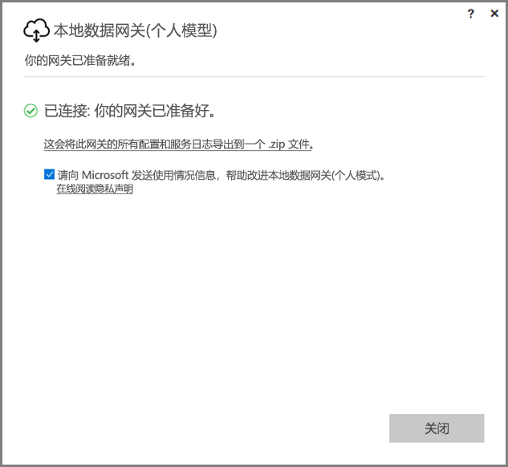
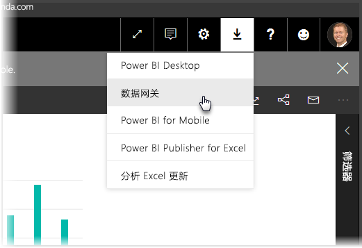
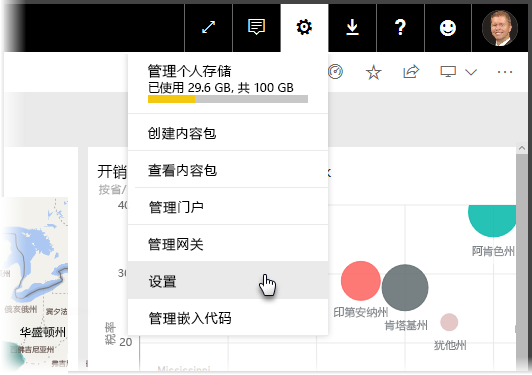
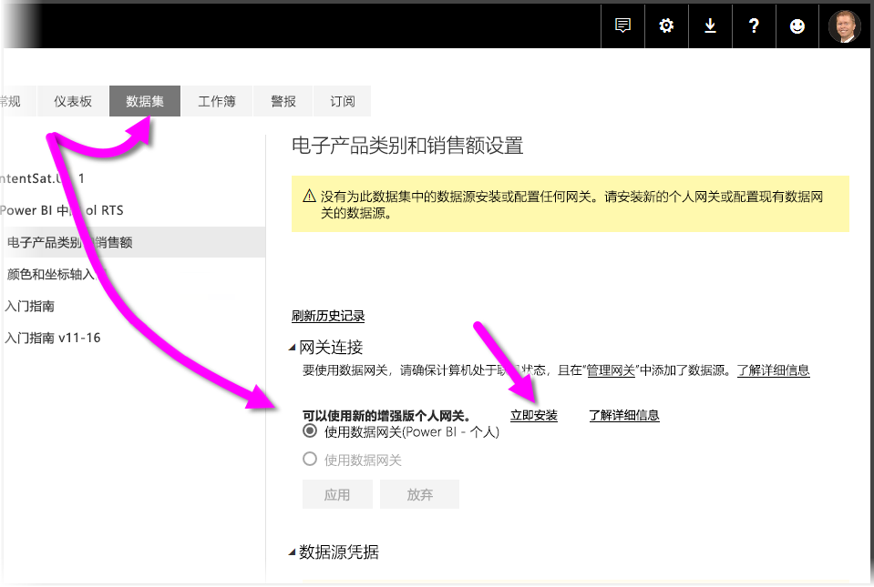
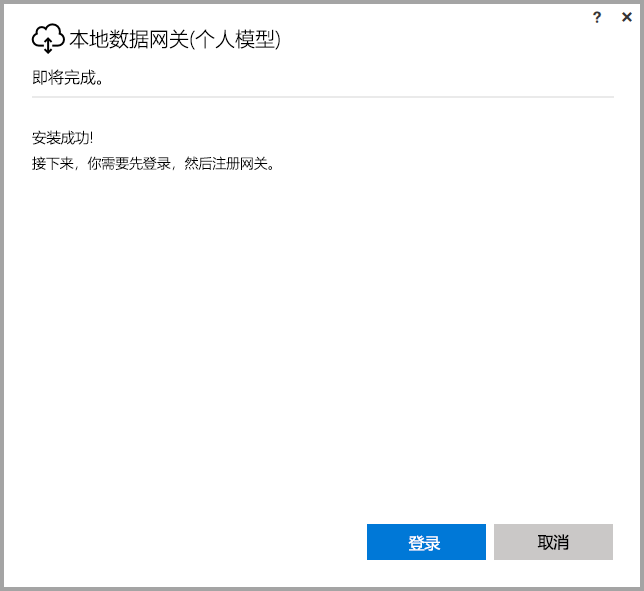
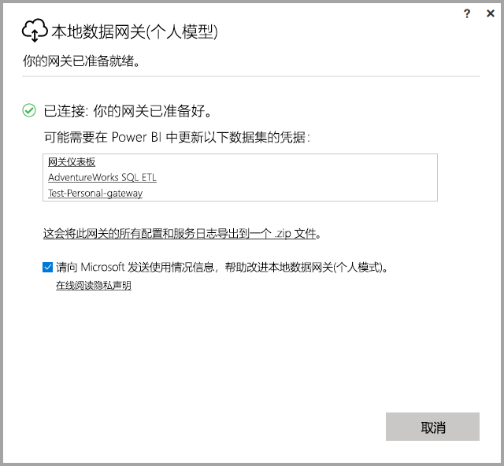

# <a name="on-premises-data-gateway-personal-mode"></a>本地数据网关（个人模型）
可以通过网关使用本地数据源以及创建 Power BI 报表和仪表板。 网关是一种软件，不仅有助于用户访问存储在专用、本地网络的数据，还使用户能够使用联机服务（如 Power BI 服务）中的数据。 本地数据网关（个人模式）是最新发布的对 Power BI 网关的更新，它允许个人在自己的计算机上安装网关并获取对本地数据的访问权限。



> [!NOTE]
> 本地数据网关（个人模式）将替代之前支持的个人网关版本（称为“Power BI Gateway - Personal”。 以前的个人网关仅可在 2017 年 7 月 31 日之前可用。 请参阅以下部分，了解有关如何更新到新版本的信息。
> 
> 

## <a name="features-of-the-on-premises-data-gateway-personal-mode"></a>本地数据网关（个人模式）的功能
随着本地数据网关（个人模式）的发布，将提供一系列改进和功能。 以前版本的个人网关（名为“Power BI 网关 - 个人版”）在实现时存在一些限制。 与许多 Power BI 产品一样，我们了解了客户需求、诉求及其使用产品的方式。 因此，本地数据网关（个人模式）经过完全重新设计，现包括以下功能和改进：

* 可靠性提高 - 新版个人网关改进了代码和结构化软件，因而比以前的版本可靠性更高。
* 扩展性增强 - 发布其他功能时，可将其轻松添加到个人网关，从而改进结构化软件。
* 从 Power BI 服务中删除个人网关 - 在新版本中，用户现在可以删除 Power BI 服务内的个人网关。
* 配置和服务日志 - 在新版本中，用户仅需单击即可将配置和服务日志轻松导出到 .zip 文件。

## <a name="installing-on-premises-data-gateway-personal-mode"></a>安装本地数据网关（个人模式）
若要在未安装以前版本网关的情况下安装本地数据网关（个人模式），请选择 Power BI 服务中的齿轮图标，然后选择“数据网关”。



也可以从[此位置](https://go.microsoft.com/fwlink/?LinkId=820925&clcid=0x409)下载网关。 可以按照安装步骤进行安装，由于安装过程允许安装任一网关版本（可与他人共享的标准网关或个人模式），因此当系统提示你希望安装哪一种版本网关时，请确保选择本地数据网关（个人模式）。

### <a name="updating-from-the-previous-personal-gateway"></a>从以前版本的个人网关进行更新
如果已安装“Power BI 网关 - 个人版”网关，当在“Power BI 服务”中查看“设置”下的“数据集”时，系统将提示安装新的增强版个人网关。



选择数据集并选择“网关连接”后，系统将通知有可用的新增强版个人网关。 执行此操作后，选择“立即安装”。



> [!NOTE]
> 如果正在以提升的进程运行以前版本的“Power BI Gateway - personal”，请确保同样以提升的方式启动新网关安装进程，使数据集凭据自动更新。 否则将必须手动更新数据集凭据。
> 
> 

将执行更新过程，随后将显示安装已成功。 此时请勿关闭页面，因为还有最后一步。



下面是最后一步。 新的个人网关安装后（最后的安装屏幕仍显示），请登录 Power BI 服务，等待显示网关处于联机状态，如下图所示。



如果已在安装以前版本网关的同一台计算机上更新个人网关，凭据将自动更新，所有刷新活动都将在新网关上进行。 如果以前版本网关安装在另一台计算机上，系统会提示你更新某些数据集上的凭据。 请注意上图窗口中的数据集列表；此列表将显示可能需要更新凭据的数据集。 列出的每个数据集都是直接链接，只需单击即可轻松更新凭据。

就是这样简单。 安装新网关后，计算机上不再需要已安装的以前版本网关，因此应将其卸载。 为此，可在计算机上搜索“Power BI 网关 - 个人版”并将其卸载。

### <a name="determining-which-version-of-the-personal-gateway-you-have-installed"></a>确定已安装的个人网关版本
若要确定当前已安装的个人网关版本，可执行以下操作：

* 以前版本个人网关名为“Power BI 网关 - 个人版”并且在其安装对话框中使用 Power BI 图标。
* 新版个人网关名为“本地数据网关（个人模式）”并且使用网关图标（云形，底部有上下箭头）。

可以转到“添加/删除程序”，查看“Power BI 网关 - 个人版”是否出现在列表中，如果是，则说明安装的是以前版本个人网关。

## <a name="using-fast-combine-with-the-personal-gateway"></a>将快速合并用于个人网关
如果之前对以前版本网关使用了快速合并，则需要执行以下步骤重新启用快速合并，使其适用于本地数据网关（个人模式）：

1. 使用文件资源管理器，打开以下文件：
   
   ```
   %localappdata%\Microsoft\On-premises data gateway (personal mode)\Microsoft.PowerBI.DataMovement.Pipeline.GatewayCore.dll.config
   ```
2. 在文件底部添加下列文本：
   
       ```
       <setting name="EnableFastCombine" serializeAs="String">```
       <value>true</value>
       </setting>
       ```
3. 完成后，该设置将在大约一分钟后生效。 若要检查设置是否有效，请尝试在 Power BI 服务中执行按需刷新，确认快速合并是否正常工作。

## <a name="limitations-and-considerations"></a>限制和注意事项
使用本地数据网关（个人模式）有几点注意事项，如以下列表所述。

* 如果使用 Windows Hello 或 PIN 登录 Windows，可能遇到以下错误： 
  * 你选择的用户帐户不符合应用程序的要求。请使用其他帐户。*
  * 若要更正该错误，请选择“使用其他帐户”并再次登录。 

本地数据网关（个人模式）目前不支持下列数据源：

* ADO.NET 
* CurrentWorkbook
* FTP
* HDFS
* SAP BusinessObjects         
* Spark

已规划 2017 日历年下半年对 Spark 的支持。

## <a name="frequently-asked-questions-faq"></a>常见问题解答 (FAQ)
* 是否可以同时运行本地数据网关（个人模式）和本地数据网关（以前称为“企业版网关”）？
  
  * 回答：可以，使用新版本时二者可以同时运行。
* 是否可以将本地数据网关（个人模式）作为服务运行？
  
  * 回答：不能。 本地数据网关（个人模式）只能作为应用程序运行。 如果需要将网关作为服务并/或在管理模式下运行，请考虑使用[本地数据网关](service-gateway-onprem.md)（以前称为“企业网关”）。
* 本地数据网关（个人模式）多久更新一次？
  
  * 回答：我们计划每月更新一次个人网关。
* 为什么要求我更新凭据？
  
  * 回答：很多情况都会触发对凭据的请求。 安装本地数据网关（个人模式）的计算机与已安装“Power BI - 个人版”网关的计算机不同是最常见的情况。 还可能是数据源问题、Power BI 未能执行测试连接，或是出现超时或系统错误。 可以在 Power BI 服务中更新凭据，方法是转到齿轮图标，依次选择“设置”、“数据集”，找到有问题的数据集，然后单击“更新凭据”。
* 升级期间，以前版本个人网关会有多长时间处于脱机状态？
  
  * 回答：将个人网关升级到新版本应该仅需几分钟。 
* 如果 2017 年 7 月 31 日前未迁移到新版个人网关，会出现什么状况？
  
  * 回答：如果使用当前网关刷新报表，则刷新将停止。 设置新刷新计划的唯一方式是安装并配置新网关。
* 我使用的是 R 脚本。 它受支持吗？
  
  * 回答： 我们预计会很快添加对 R 脚本的支持。
* 为什么在 Power BI 服务中看不到更新网关的消息？
  
  * 回答：很可能是因为你的一个或多个数据集中包含一个目前不受支持的数据源。

## <a name="next-steps"></a>后续步骤
[为 Power BI Gateway 配置代理设置](service-gateway-proxy.md)  
更多问题？ [尝试参与 Power BI 社区](http://community.powerbi.com/)

