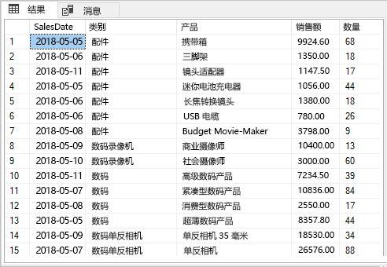
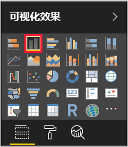
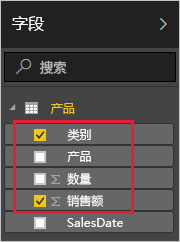
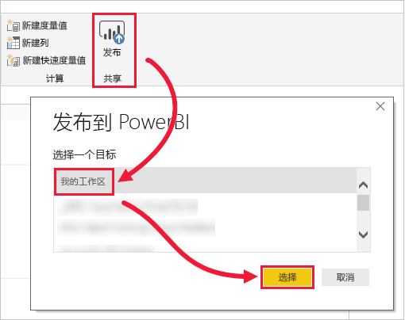
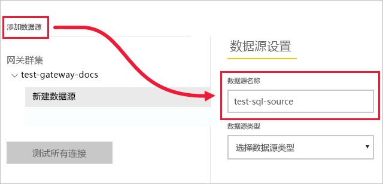
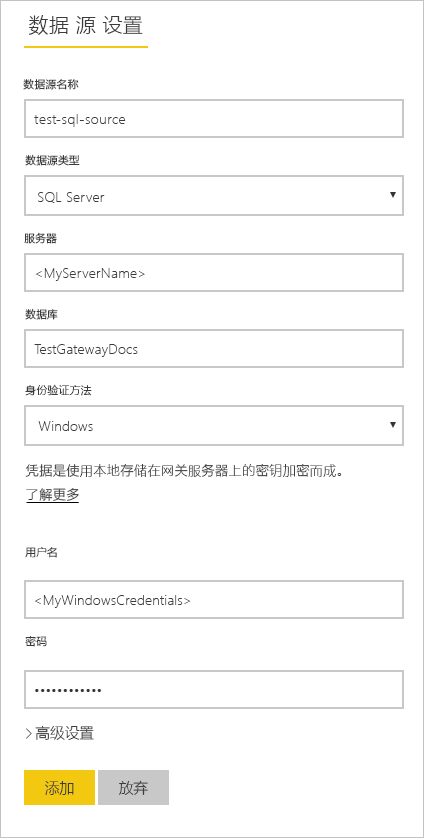
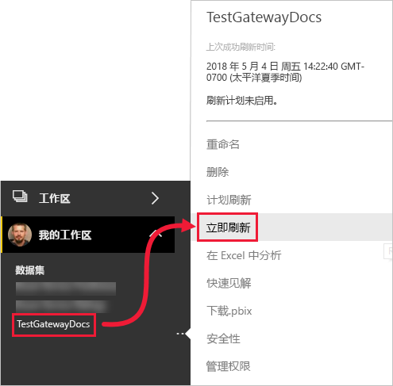
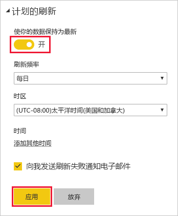

# <a name="tutorial-connect-to-on-premises-data-in-sql-server"></a>教程：连接到 SQL Server 中的本地数据

本地数据网关是安装在本地网络中的软件；它便于访问该网络中的数据。 在本教程中，将基于从 SQL Server 导入的示例数据生成 Power BI Desktop 报表。 然后将报表发布到 Power BI 服务中，并配置网关，以便服务可以访问本地数据。 此访问权限意味着该服务可以刷新数据保持报表最新。

在本教程中，了解如何：
> [!div class="checklist"]
> * 通过 SQL Server 中的数据创建报表
> * 将报表发布到 Power BI 服务
> * 添加 SQL Server 作为网关数据源
> * 刷新报表中的数据

如果未注册 Power BI，请[免费注册](https://app.powerbi.com/signupredirect?pbi_source=web)后再进行操作。


## <a name="prerequisites"></a>先决条件

* [安装 Power BI Desktop](https://powerbi.microsoft.com/desktop/)
* 在本地计算机上[安装 SQL Server](https://docs.microsoft.com/sql/database-engine/install-windows/install-sql-server) 
* 在相同的本地计算机上[安装本地数据网关](service-gateway-install.md)（在生产环境中，通常为另一台计算机）


## <a name="set-up-sample-data"></a>设置示例数据

首先通过将示例数据添加到 SQL Server，以此可以在本教程的其余部分使用该数据。

1. 在 SQL Server Management Studio (SSMS)，连接到 SQL Server 实例，并创建一个测试数据库。

    ```sql
    CREATE DATABASE TestGatewayDocs
    ```

2. 在创建的数据库中，添加表并插入数据。

    ```sql
    USE TestGatewayDocs

    CREATE TABLE Product (
        SalesDate DATE,
        Category  VARCHAR(100),
        Product VARCHAR(100),
        Sales MONEY,
        Quantity INT
    )

    INSERT INTO Product VALUES('2018-05-05','Accessories','Carrying Case',9924.60,68)
    INSERT INTO Product VALUES('2018-05-06','Accessories','Tripod',1350.00,18)
    INSERT INTO Product VALUES('2018-05-11','Accessories','Lens Adapter',1147.50,17)
    INSERT INTO Product VALUES('2018-05-05','Accessories','Mini Battery Charger',1056.00,44)
    INSERT INTO Product VALUES('2018-05-06','Accessories','Telephoto Conversion Lens',1380.00,18)
    INSERT INTO Product VALUES('2018-05-06','Accessories','USB Cable',780.00,26)
    INSERT INTO Product VALUES('2018-05-08','Accessories','Budget Movie-Maker',3798.00,9)
    INSERT INTO Product VALUES('2018-05-09','Digital video recorder','Business Videographer',10400.00,13)
    INSERT INTO Product VALUES('2018-05-10','Digital video recorder','Social Videographer',3000.00,60)
    INSERT INTO Product VALUES('2018-05-11','Digital','Advanced Digital',7234.50,39)
    INSERT INTO Product VALUES('2018-05-07','Digital','Compact Digital',10836.00,84)
    INSERT INTO Product VALUES('2018-05-08','Digital','Consumer Digital',2550.00,17)
    INSERT INTO Product VALUES('2018-05-05','Digital','Slim Digital',8357.80,44)
    INSERT INTO Product VALUES('2018-05-09','Digital SLR','SLR Camera 35mm',18530.00,34)
    INSERT INTO Product VALUES('2018-05-07','Digital SLR','SLR Camera',26576.00,88)
    ```

3. 从表中选择数据以进行验证。

    ```sql
    SELECT * FROM Product
    ```

    


## <a name="build-and-publish-a-report"></a>生成并发布报表

现在，你已经有要使用的示例数据，连接到 Power BI Desktop 中的 SQL Server 并生成基于该数据的报表。 然后将报表发布到 Power BI 服务。

1. 在 Power BI Desktop 的“主页”选项卡上，选择“获取数据” > “SQL Server”。

2. 在“服务器”下输入服务器名称，并在“数据库”下输入“TestGatewayDocs”。 选择**确定**。 

    

3. 验证凭据，然后选择“连接”。

4. 在“导航器”下，选择“产品”表，然后选择“负载”。

    

5. 在 Power BI Desktop“报表”视图的“可视化效果”窗格中，选择“堆积柱形图”。

        

6. 在报表画布中选择柱形图后，在“字段”窗格中选择“类别”和“销售”字段。  

    

    此时，图表应如下所示。

    

    请注意，“SLR 相机”是当前的销量领跑者。 在本教程后面更新数据和刷新报表时，将发生更改。

7. 使用名称“TestGatewayDocs.pbix”保存报表。

8. 在“主页”选项卡上，选择“发布” > “我的工作区” > “选择”。 如果系统要求你登录到 Power BI 服务，请登录。 

    

9. 在“成功”屏幕上，选择“在 Power BI 中打开‘TestGatewayDocs.pbix’”。


## <a name="add-sql-server-as-a-gateway-data-source"></a>添加 SQL Server 作为网关数据源

在 Power BI Desktop 中直接连接到 SQL Server，但 Power BI 服务需要一个网关来充当网桥。 现在，将 SQL Server 实例作为在前一个项目中创建的网关数据源（在[先决条件](#prereqisites)下列出）。 

1. 在 Power BI 服务的右上角，选择齿轮图标 > “管理网关”。

    

2. 选择“添加数据源”，并为“数据源名称”输入“test-sql-source”。

    

3. 选择“SQL Server”的“数据源类型”，然后输入其他值，如下所示。

    

    | 选项 | 值 |
    | ---    | ---   |
    | **数据源名称**       | test-sql-source      |
    | **数据源类型**       | SQL Server      |
    | **服务器**       |  SQL Server 实例名称（必须与你在 Power BI Desktop 中指定的名称相同）    |
    | **数据库**       | TestGatewayDocs      |
    | **身份验证方法**       | Windows      |
    | **用户名**        |  用于连接到 SQL Server 的帐户，如 michael@contoso.com     |
    | **密码**       |  用于连接到 SQL Server 的帐户密码    |

4. 选择**添加**。 此过程成功时，会看到“连接成功”。

    

    现在可以使用此数据源在 Power BI 仪表板和报表中包含来自 SQL Server 的数据。


## <a name="configure-and-use-data-refresh"></a>配置和使用数据刷新

你已将报表发布到 Power BI 服务，并已配置 SQL Server 数据源。 准备就绪后，现在在“产品”表中进行更改，此更改将通过网关应用到已发布的报表。 还可以配置计划刷新，以处理任何在将来进行的更改。

1. 在 SSMS 中，更新“产品”表中的数据。

    ```sql
    UPDATE Product
    SET Sales = 32508, Quantity = 252
    WHERE Product='Compact Digital'     

    ```

2. 在 Power BI 服务的左侧导航窗格中，选择“我的工作区”。

3. 在“数据集”下，为“TestGatewayDocs”数据集选择“更多”(...)>“立即刷新”。

    

4. 选择“我的工作区” > “报表” > “TestGatewayDocs”。 了解更新如何同步，且现在的销量领跑者是“Compact Digital”。 

    

5. 选择“我的工作区” > “报表” > “TestGatewayDocs”。 选择“更多”(. . .)>“计划刷新”。

6. 在“计划刷新”下，将刷新设置为“启用”，然后选择“应用”。 默认情况下，每天都会刷新数据集。

    

## <a name="clean-up-resources"></a>清理资源
如果不想再使用示例数据，请在 SSMS 中运行 `DROP DATABASE TestGatewayDocs`。 如果不想要使用 SQL Server 数据源，请[删除数据源](service-gateway-manage.md#remove-a-data-source)。 


## <a name="next-steps"></a>后续步骤
在本教程中，了解如何：
> [!div class="checklist"]
> * 通过 SQL Server 中的数据创建报表
> * 将报表发布到 Power BI 服务
> * 添加 SQL Server 作为网关数据源
> * 刷新报表中的数据

前进到下一篇文章了解详细信息
> [!div class="nextstepaction"]
> [管理 Power BI 网关](service-gateway-manage.md)

