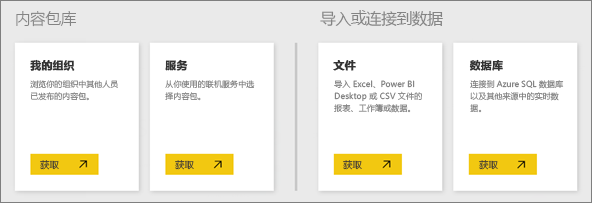
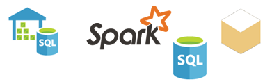

# Power BI 服务数据源
数据是 Power BI 的核心。 当研究数据、创建图表和仪表板，以及使用问答进行提问时，所看到上述全部可视化效果和答案实际上均是从数据集获得其基础数据的。 但是，数据集来自何处呢？ 它来自数据源。

在本文中，我们将重温可以从 Power BI 服务连接到的不同类型的数据源。 请记住，你还可以从很多其他类型的数据源获取数据。 但是，可能需要先使用 Power BI Desktop 或 Excel 的高级数据查询和建模功能才能使用这些数据源。 稍后我们将详细了解有关内容。 现在，让我们看一下可直接从 Power BI 服务站点连接到的不同类型的数据源。

你可以通过单击**我的工作区** > **获取数据**，获取来自 Power BI 中的任何这些数据源的数据。

## 文件

**Excel** (.xlsx, xlxm) Excel 的与众不同之处在于，工作薄可拥有你自行输入到工作表的数据，而你可通过使用 Power Query（Excel 2016 中的“获取和转换”）或 Power Pivot 从外部数据源查询和加载数据。 你可以导入工作表的表中的数据（数据必须在表中），或导入加载到数据模型中的数据。 若要了解详细信息，请参阅[从 Excel 中获取数据](service-get-data-from-files.md)。

**Power BI Desktop** (.pbix) - 可以使用 Power BI Desktop 查询和加载外部数据源中的数据，还可以扩展数据模型的度量值和关系，并创建报表。 你可以将你的 Power BI Desktop 文件导入 Power BI 站点。 Power BI Desktop 最适合于非常了解其数据源、数据查询和转换，以及数据建模概念的更高级的用户。 若要了解详细信息，请参阅[连接到 Power BI Desktop 中的数据](desktop-connect-to-data.md)。

**逗号分隔值** (.csv) - 文件是具有数据行的简单文本文件。 每行可能包含一个或多个值，每个值被逗号分隔开。 例如，一个包含名称和地址数据的 .csv 可以具有许多行，其中每行都有名字、姓氏、街道地址、市/县、州等的值。 不能将数据导入 .csv 文件，但许多应用程序（如 Excel）可将简单的表格数据另存为 .csv 文件。

对于其他文件类型（如 XML 表 (.xml) 或文本 (.txt) 文件），可以使用“获取和转换”来首先查询、转换数据并将该数据加载到 Excel 或 Power BI Desktop 文件。 然后，你可以将 Excel 或 Power BI Desktop 文件导入 Power BI。

存储文件的位置也将产生很大的影响。 OneDrive for Business 提供了最大程度的灵活性以及与 Power BI 的集成。 可将文件保留在本地驱动器上，但是如果需要刷新数据，则还需执行一些步骤。 链接的文章中提供了更多详细信息。

## 内容包

内容包包含为你准备好的所有所需数据和报表。 在 Power BI 中，有两种类型的内容包；来自 Google Analytics、Marketo 或 Salesforce 等服务的内容包以及你的组织中的其他用户创建和共享的内容包。

服务 - 差不多有数十个具有适用于 Power BI 内容包的服务，而且随时都有更多服务添加进来。 大多数服务要求你拥有一个帐户。 若要了解详细信息，请参阅[连接到服务](service-connect-to-services.md)。

组织 - 如果你和组织中的其他用户拥有 Power BI Pro 帐户，则可以创建、共享和使用内容包。 若要了解详细信息，请参阅[组织内容包](service-organizational-content-pack-introduction.md)。

## 数据库

云中的数据库 - 从 Power BI 服务中，你可以实时连接到 Azure SQL 数据库、Azure SQL 数据仓库、Azure HD Insight 上的 Spark，以及使用 DirectQuery 的 SQL Server Analysis Services。 从 Power BI 实时连接到这些数据库，这表示当连接到数据库（如 Azure SQL 数据库）时，你通过在 Power BI 中创建报表来浏览其数据，且每次你进行数据切片或将其他字段添加到可视化效果时，都直接查询数据库。 若要了解详细信息，请参阅 [Azure 和 Power BI](service-azure-and-power-bi.md)。

本地数据库 - 从 Power BI 服务中，可以直接连接到 SQL Server Analysis Services 表格模型数据库。 Power BI Enterprise Gateway 是必需的。 如果不确定如何连接到你的组织的表格模型数据库，请联系你的管理员或 IT 部门。 若要了解详细信息，请参阅[Power BI 中的 SQL Server Analysis Services 表格数据](sql-server-analysis-services-tabular-data.md)。

对于你的组织中的其他类型的数据库，需要先使用 Power BI Desktop 或 Excel 连接到数据模型，并在数据模型中查询和加载数据。 然后，可以将文件导入在其中创建数据集的 Power BI。 如果设置了计划刷新，Power BI 将使用来自文件的连接信息和你所配置的刷新设置，以直接连接到数据源，并查询更新。 然后，这些更新将加载到 Power BI 中的数据集。 若要了解详细信息，请参阅[连接到 Power BI Desktop 中的数据](desktop-connect-to-data.md)。

## 如果我的数据来自不同源怎么办？
差不多有数百个可与 Power BI 配合使用的不同数据源。 但是，无论从何处获取数据，这些数据的格式必须满足如下要求：Power BI 服务可用其来创建报表和仪表板，以及通过问答回答问题等等。

一些数据源的数据已具有准备好用于 Power BI 服务的格式，例如 Google Analytics 和 Twilio 之类的服务提供商提供的内容包。 SQL Server Analysis Services 表格模型数据库也准备就绪了。 并且可以实时连接到云中的数据库，如 Azure SQL 数据库和 HDInsight 上的 Spark。

在其他情况下，可能需要查询并加载你希望添加到某个文件中的数据。 例如，假设在组织中的服务器上的数据仓库数据库中有物流数据。 在 Power BI 服务中，你不能直接连接到该数据库并开始浏览其数据（除非它是表格模型数据库）。 但是，你可以使用 Power BI Desktop 或 Excel 查询该物流数据，并将其加载到你稍后要保存为文件的数据模型中。 然后，可以将文件导入在其中创建数据集的 Power BI。

你可能会想：但是，数据库上的物流数据每天都会改变。 我如何确保我在 Power BI 中的数据集已被刷新？来自 Power BI Desktop 或 Excel 文件的连接信息将随数据导入到数据集中。 如果设置了计划刷新或在数据集上执行手动刷新，Power BI 将使用来自数据集的连接信息和一些其他设置，直接连接到数据库、查询更新并将更新加载到数据集。 可能需要 Power BI Gateway 以保护本地服务器和 Power BI 之间的任何数据传输。 报表和仪表板中的所有可视化效果都将自动刷新。

可以看出，不能直接从 Power BI 服务连接到数据源并不意味着无法将该数据导入 Power BI。 只是可能需要几个更多的步骤，以及来自 IT 部门的一些帮助。 若要了解详细信息，请参阅 [Power BI Desktop 中的数据源](desktop-data-sources.md)。

## 更多详细信息
你会发现术语数据集和数据源在 Power BI 中得到广泛使用。 虽然它们通常用作同义词，但实际上是两个相关却不同的事物。

使用“获取数据”连接到数据以及从内容包、文件导入数据或是连接到实时数据源时，会自动在 Power BI 中创建***数据集***。 数据集包含有关数据源的信息、数据源凭据以及（在许多情况下）从数据源复制的数据的子集。 大多数情况下，在报表和仪表板中创建可视化效果时，看到的就是数据集中的数据。

***数据源***是指数据集中的数据的实际来源。 例如，联机服务（如 Google Analytics 或 QuickBooks）、云中的数据库（如 Azure SQL 数据库）或者自己组织中的本地计算机或服务器上的数据库或文件。

### 数据刷新
如果你将文件存储在本地驱动器或位于组织中的某个位置的驱动器上，可能需要 Power BI Gateway 以刷新 Power BI 中的数据集。 并且，进行刷新时，保存文件的计算机必须处于开机状态。 你还可以重新导入你的文件，或使用 Excel 或 Power BI Desktop 中的“发布”，但这些均不是自动的过程。

如果你将文件保存在 OneDrive for Business 或 SharePoint - 团队网站上，然后连接到 Power BI，或将文件导入 Power BI，则你的数据集、报表和仪表板将始终保持最新。 由于 OneDrive 和 Power BI 均位于云中，Power BI 可直接连接到你所保存的文件（约每隔一小时一次），并检查是否有更新。 如果发现任何更新，将自动刷新数据集和任何可视化效果。

来自服务的内容包将自动更新。 在大多数情况下，一天自动更新一次。 可以手动刷新，但是能否看到更新的数据将取决于服务提供商。 来自你的组织中的其他人的内容包将取决于所使用的数据源，以及创建内容包的人员如何设置刷新。

Azure SQL 数据库、Azure SQL 数据仓库和 Azure HDInsight 上的 Spark 的独特之处在于，它们都是云中的数据源。 因为 Power BI 服务也位于云中，Power BI 可使用 DirectQuery，实时地与它们进行连接。 在 Power BI 中显示的内容始终是同步内容，无需设置刷新。

SQL Server Analysis Services 的独特之处在于，当从 Power BI 连接到它时，此连接类似于云中的 Azure 数据库的实时连接，但数据库本身位于你的组织中的服务器上。 此类型的连接需要 Power BI Gateway，其通常由 IT 部门配置。

数据刷新是 Power BI 中非常重要的一部分，十分深奥，因此在本文中无法一一介绍。 如果你想要全面地了解数据刷新，则请务必查看[Power BI 中的数据刷新](refresh-data.md)。

## 注意事项和限制
以下注意事项和限制适用于在 Power BI 服务中使用的所有数据源。 还有其他限制适用于特定的功能，但下面的列表适用于全面的 Power BI 服务：

* **数据集大小限制**Power BI 服务中每个数据集的大小限制为 1 GB。
* **行限制** - 数据集（在不使用 DirectQuery 的情况下）的最大行数为 20 亿，保留其中三个行（从而使最大可用行数为 1,999,999,997）；在使用 DirectQuery 的情况下，最大行数为 100 万。
* **列限制** - 数据集中允许的最大列数，在数据集的所有表中，允许的最大列数为 16,000。 这适用于 Power BI 服务以及在 Power BI Desktop 中使用的数据集。 Power BI 使用每个包含在数据集中的表的内部行号列，这意味着数据集中所使用的每个表的最大列数为 16,000 减去 1。

