# 教程：Power BI 服务入门 (app.powerbi.com)
本教程将帮助你开启使用 ***Power BI 服务*** 之旅。 若要了解 Power BI 服务如何适应其他 Power BI 产品/服务，我们强烈建议你先阅读[什么是 Power BI](power-bi-overview.md)。

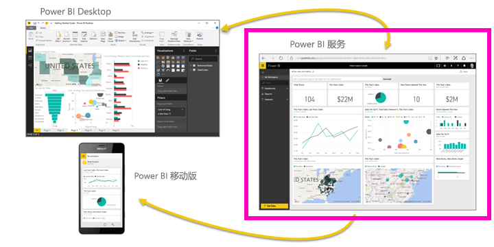

在本教程中，将完成以下步骤：

> [!div class="checklist"]
> * 查找 Power BI 服务的其他入门内容
> * 登录 Power BI 在线版帐户或进行注册（如果还没有帐户）
> * 打开 Power BI 服务
> * 获取一些数据并在报表视图中打开
> * 使用该数据创建可视化效果并将其另存为报表
> * 从该报表固定磁贴，创建仪表板
> * 使用问答自然语言工具将另一个可视化效果添加到仪表板
> * 删除数据集、报表和仪表板，清理资源

## 注册 Power BI 服务
如果未注册 Power BI，请先[注册一个 Power BI Pro 免费试用版](https://app.powerbi.com/signupredirect?pbi_source=web)，再进行操作。

如果已创建帐户，则只需打开浏览器并键入 app.powerbi.com 即可打开 Power BI 服务。 

如果你需要有关使用 Power BI Desktop 的帮助，请参阅 [Desktop 入门](desktop-getting-started.md)。 如果正在寻找有关 Power BI 移动端的帮助，请参阅[适用于移动设备的 Power BI 应用](consumer/mobile/mobile-apps-for-mobile-devices.md)。

> [!TIP]
> 更喜欢可以自主掌控进度的免费培训课程？ [在 EdX 上注册学习我们的“数据分析和可视化”课程](http://aka.ms/edxpbi)。

请在 YouTube 上观看我们的[播放列表](https://www.youtube.com/playlist?list=PL1N57mwBHtN0JFoKSR0n-tBkUJHeMP2cP)。 不妨先从观看“Power BI 服务简介”视频入手：
> 
> <iframe width="560" height="315" src="https://www.youtube.com/embed/B2vd4MQrz4M" frameborder="0" allowfullscreen></iframe>
> 

## 什么是 Power BI 服务？
Microsoft Power BI 服务有时也称为 Power BI 在线版或 app.powerbi.com。 Power BI 可帮助你及时掌握对你重要的信息。  借助 Power BI 服务，***仪表板***可帮助你对企业状况了如指掌。  你的仪表板显示各种***磁贴***，你可单击这些磁贴打开***报表***来进一步了解详情。  连接到多个***数据集***将所有相关数据组合在一起。 是否需要了解构成 Power BI 的构建块的帮助？  请参阅 [Power BI - 基本概念](service-basic-concepts.md)。

如果你在 Excel 或 CSV 文件中具有重要数据，你可以创建 Power BI 仪表板以便随时随地掌握最新信息，并与他人分享自己的见解。  你是否订阅了 SaaS 应用程序（如 Salesforce）？  从连接到 Salesforce 开始，基于该数据自动创建仪表板，或[查看可以连接到的所有其他 SaaS 应用](service-get-data.md)。 如果你是组织成员，请查看是否已向你发布任何[应用](service-create-distribute-apps.md)。

了解所有其他[获取 Power BI 数据](service-get-data.md)的方式。

## 步骤 1：获取数据
下面举例说明如何从 CSV 文件中获取数据。 想要学习此教程吗？ [下载此示例 CSV 文件](http://go.microsoft.com/fwlink/?LinkID=521962)。

1. [登录 Power BI](http://www.powerbi.com/)。 还没有帐户？ 别担心，可以注册一个免费试用版。
2. Power BI 将在浏览器中打开。 在左侧导航栏底部选择“获取数据”。
   
   
3. 然后，选择“文件”。 
   
   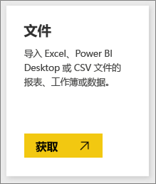
4. 浏览到计算机上的该文件，然后选择“打开”。 如果已将文件保存在 OneDrive for Business 中，请选择相应的选项。 如果已将文件保存在本地，请选择“本地文件”。 
   
   
5. 在本教程中，我们将选择“导入”，以将 Excel 文件添加为数据集，然后就可以使用它来创建报表和仪表板。 如果选择“上传”，则整个 Excel 工作簿将上传至 Power BI，然后可以在 Excel Online 中打开它并进行编辑。
   
   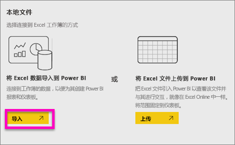
6. 数据集准备就绪后，选择“查看数据集”在报表编辑器中打开它。 

    

    由于我们尚未创建任何可视化效果，报表画布是空白的。

    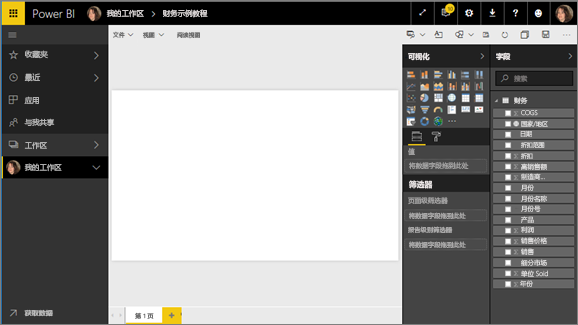

6. 在顶部菜单栏中可以看到，有一个“阅读视图”选项。 出现“阅读视图”选项意味着当前在“编辑视图”中操作。 

    

    同时，在“编辑视图”中，可以创建和修改报表，因为你是报表的所有者，也是创建者。 与同事共享报表时，他们只能在“阅读视图”中与报表交互，因为他们是使用者。 详细了解[阅读视图和编辑视图](service-reading-view-and-editing-view.md)。
    
    进行[简要了解](service-the-report-editor-take-a-tour.md)是熟悉报表编辑器的一个不错的方法
   > 
 

## 步骤 2 ：着手了解你的数据集
连接到数据后，请开始浏览数据。  发现有趣的内容后，可以创建仪表板来监视内容，并查看内容在不同时间的变化。 我们来看看具体的工作方式。
    
1. 在报表编辑器中，使用页面右侧的“字段”窗格生成可视化对象。  选中“**销售总额**”和“**日期**”旁边的复选框。
   
   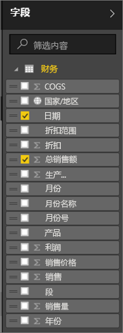

2. Power BI 会分析数据并创建可视化对象。  如果先选择“日期”，你将看到一个表格。  如果先选择“销售总额”，你将看到一个图表。 切换到不同的数据显示方式。 让我们在折线图中查看此数据。 从**可视化对象窗格**中选择折线图图标（也称为模板）。
   
   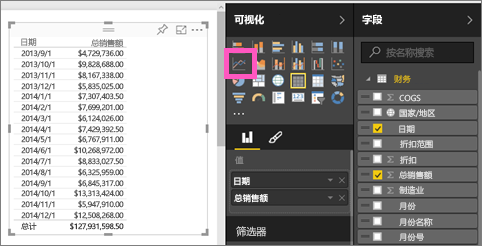

3. 看起来不错，让我们将它固定到仪表板。 将鼠标悬停在可视化对象上，并选择“固定”图标。  固定此可视化对象时，它将存储在仪表板上并会不断更新，由此你可以大致跟踪最新值。
   
   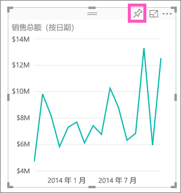

4. 由于这是新报表，因此在将可视化对象固定到仪表板之前，系统会提示保存。 为报表命名（例如“按时间的销售额”），然后选择“保存并继续”。 
   
   
   
5. 我们将折线图固定到新仪表板并将其命名为“用于教程的财务示例”。 
   
   
   
1. 选择“固定”。
   
    会显示一条成功消息（右上角附近），告知你可视化效果已作为磁贴添加到你的仪表板中。
   
    

6. 选择“转至仪表板”，查看以磁贴形式固定到新仪表板的折线图。 通过添加更多可视化对象磁贴和[重命名、调整大小、链接和重新定位磁贴](service-dashboard-edit-tile.md)来优化仪表板。
   
   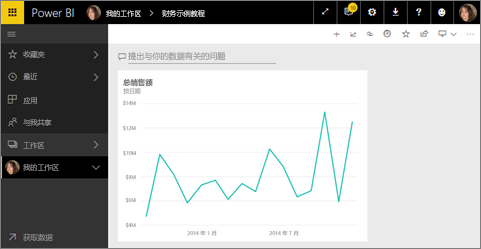
   
   在仪表板上选择新的磁贴，以便随时返回到报表。 Power BI 会将你返回到报表编辑器的“阅读视图”。 若要切换回“编辑视图”，请从顶部菜单栏中选择“编辑报表”。 进入“编辑视图”后，请继续浏览和固定磁贴。 

## 步骤 3：使用“问答”继续探索（自然语言查询）
1. 要快速浏览数据，请尝试在问题解答框中进行询问。 “问答”问题框位于仪表板顶部（“提出有关数据的问题”），以及报表的顶部菜单栏中“提问”）。 例如，尝试键入“哪个市场的收入最高”。
   
   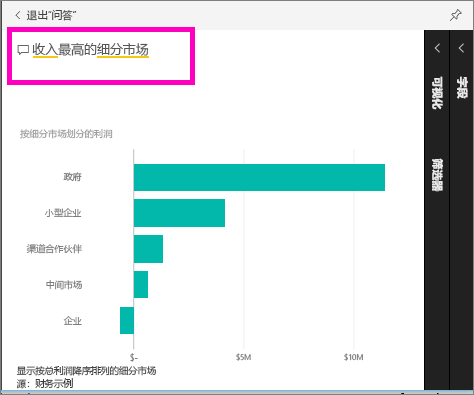

2. “问答”会搜索答案，并以可视化形式显示答案。 选择“固定”图标  还可在仪表板上显示此可视化效果。
3. 将可视化对象固定到“用于教程的财务示例”仪表板。
   
    

4. 返回到仪表板，将会看到新磁贴。

   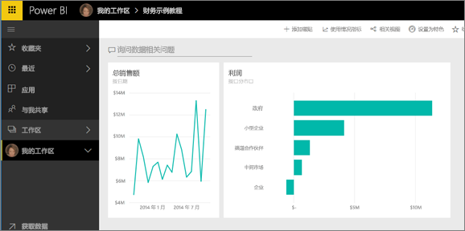

## 清理资源
完成本教程后，现可删除数据集、报表和仪表板。 

1. 在左侧导航栏中，选择“我的工作区”。
2. 选择“数据集”选项卡并找到本教程导入的数据集。  
3. 选择省略号 (...)，再选择“删除”。

    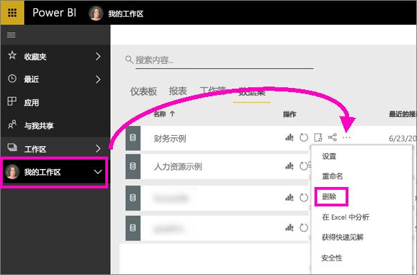

    删除数据集也将删除报表和仪表板。 

## 后续步骤
准备好尝试了解更多内容？  可以参考以下主题来了解 Power BI。

> [!div class="nextstepaction"]
> [连接到所使用的联机服务](./service-connect-to-services.md)

