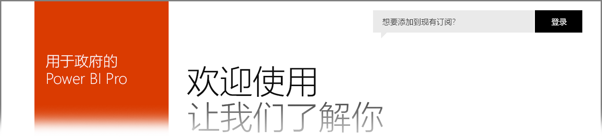

# 适用于美国政府客户的 Power BI
**Power BI 服务**有一个可供美国政府客户使用的版本，作为 **Office 365 美国政府社区**订阅的一部分。 本文中讨论的 **Power BI 服务**版本是为美国政府客户专门设计的，独立且不同于 **Power BI 服务**的商业版本。

以下各节介绍了 **Power BI 服务**的美国政府版本可用的功能，阐明了一些限制，列出了常见问题 (**FAQ**) 和解答（包括如何注册），并提供了有关更多信息的链接。

## Power BI 美国政府版功能
请务必注意，**Power BI 美国政府版**仅可用作 **Pro 许可证**，不能用作免费版许可证。 Power BI 服务的某些功能适用于该服务的 **Power BI 美国政府版**。

以下功能适用于 **Power BI 美国政府版**客户，因为它们适用于 **Pro** 许可证功能：

* 创建和查看仪表板和报表
* [数据容量限制](service-admin-manage-your-data-storage-in-power-bi.md)
* [计划的数据刷新](refresh-data.md)
* 可刷新的团队仪表板
* 用于共享和管理访问控制的 Active Directory 组
* 从 Excel、CSV 和 Power BI Desktop 文件中[导入数据](service-get-data.md)和报表
* 数据管理网关
* 所有数据都在 Azure SQL 和 Blob 存储中为 Power BI 加密
* 连接到包含[内容包](service-connect-to-services.md)的服务

## 政府版本和公共 Azure 云服务之间的连接 

Azure 分布在多个云中。 默认情况下，租户可以打开对云专属实例的防火墙规则。不过，跨云网络则不同，必须打开特定防火墙规则，才能在服务之间进行通信。 如果是 Power BI 客户，并且公有云中有需要访问的现有 SQL 实例，必须在 SQL 中为以下数据中心打开对 Azure 政府云 IP 空间的特定防火墙规则：

* USGov Iowa
* USGov Virginia
* USGov Texas
* USGov Arizona

虽然公有云中有 IP 空间，但对于政府云，必须提交 Azure 支持票证，以请求获取上面列出的数据中心的 IP 范围。 

## Power BI 美国政府版限制
**Power BI 服务**的商业版本中提供的某些功能在适用于美国政府客户的 **Power BI 服务**中不可用。 Power BI 团队正在积极致力于使这些功能适用于美国政府客户，并将在这些功能变为可用时更新本文。

* 在 SharePoint Online 中嵌入 - 不能使用 Power BI Web 部件在 SharePoint Online 中嵌入内容。
* **Power BI 美国政府版**仅可用作 **Pro** 许可证。 在管理门户中（或作为用户）对 Power BI（免费版）许可证的所有引用均在商业版 Power BI 服务云中运行。
* **审核** - 自 2018 年 6 月起，可通过 Office 365 安全与合规门户进行审核。
* **Cortana 中的 Power BI 内容** - Power BI 结果不会显示在 Cortana 搜索结果中，包括 Power BI 内容（仪表板、报表、应用）结果，以及显示特定关键字的 Cortana 优化报表页的结果。
* **外部用户共享** - 允许在 Power BI 租户内共享；自 2018 年 6 月起，也可与 Power BI 租户外部用户共享。 请参阅[使用 Azure AD B2B 将 Power BI 内容分发给外部来宾用户](service-admin-azure-ad-b2b.md)。
* **仪表板和报表的使用情况指标** - 使用情况指标不适用于报表和仪表板。 客户可以使用审核日志数据，获取其组织内的内容的使用情况信息。

如果已将 **Power BI** 免费版许可证分配给你的帐户，则这些帐户将在 **Power BI** 服务的商业版中运行，而不属于 **Power BI 美国政府版**产品/服务的组成部分。 对于这些免费版帐户，可能会遇到以下问题：

* Power BI Gateway、Mobile 和 Desktop 无法进行身份验证
* 无法访问 Azure 商业数据源
* 必须从商业数据源手动上载 PBIX 文件
* Power BI 移动应用不可用

若要解决相关问题，请与你的客户代表联系。

## Power BI 服务的美国政府版本的常见问题 (FAQ)
下面提供的问题（和解答）可帮助你快速获取所需的有关服务的信息。

**问题：** 如何将 商业版的**Power BI** 数据迁移到适用于美国政府的 **Power BI 服务**？

**解答：** 你的管理员必须在单独的美国政府特定的订阅下创建 **Power BI** 的新实例。 然后，你可以在适用于美国政府的 **Power BI 服务**中复制你的商业数据、删除你的商业许可，以及将你的现有域关联到新的美国政府特定的服务。

**问题：** 为什么无法连接到特定的内容包？

**解答：** 你需要确保在连接到该内容包之前启用你的订阅。

**问题：** 我有兴趣为我的美国政府组织获得 **Power BI**。 如何开始？

**解答：** 根据你的现有许可证和订阅，注册（通常称为载入）过程可能会有所不同。 有关更多信息，请参阅[注册适用于美国政府的 Power BI](service-govus-signup.md) 一文。

**问题：** 用于连接到适用于美国政府的 **Power BI** 的 URL 是否与商业 **Power BI** URL 有所不同？

**解答：** 是的，URL 是不同的。 下表显示了每个 URL：

| 商业版本 URL | 美国政府版本 URL |
| --- | --- |
| https://app.powerbi.com/ |[https://app.powerbigov.us](https://app.powerbigov.us) |

问：我的帐户在多个主权云中预配。 使用 **Power BI Desktop** 时，如何选择连接到什么云？

答：从 Power BI Desktop 2018 年 7 月版开始，可在登录 Power BI Desktop 时选择要使用的云。

## 后续步骤
你可以使用 Power BI 执行各种操作。 有关更多信息和学习资料（包括介绍如何注册服务的文章），请查看以下资源：

* [注册适用于美国政府的 Power BI](service-govus-signup.md)
* <a href="https://channel9.msdn.com/Blogs/Azure/Cognitive-Services-HDInsight-and-Power-BI-on-Azure-Government">Power BI 美国政府版演示</a>
* [Power BI 的引导学习](guided-learning/gettingstarted.yml?tutorial-step=1)
* [Power BI 服务入门](service-get-started.md)
* [什么是 Power BI Desktop？](desktop-what-is-desktop.md)

